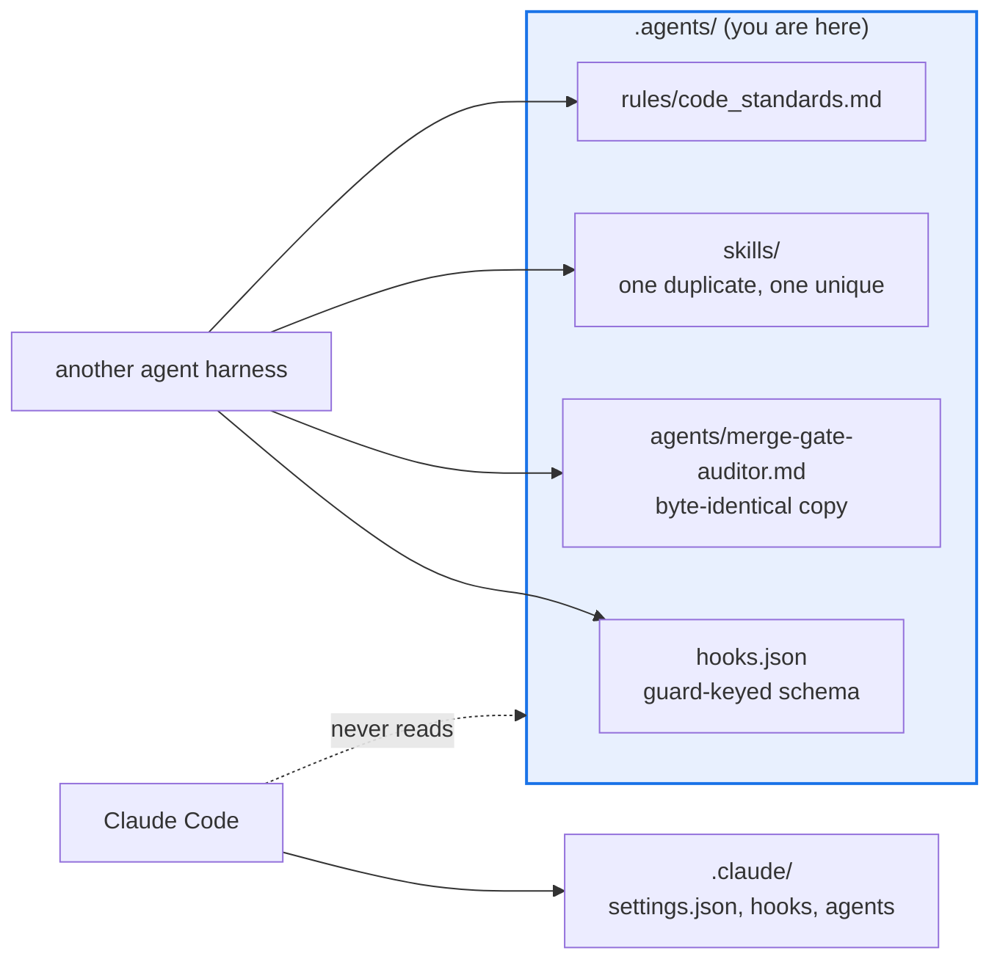

# AGENTS.md — .agents

> Claude Code never reads anything under this directory. That is documented behavior, not a bug.

Nothing here loads in a Claude Code session: not `hooks.json`, not `agents/`, not
`skills/`, not `rules/`, and not this file. The tree exists for *other* agent harnesses.
`../.claude/` is the authoritative configuration for Claude Code, and when the two disagree
the `.claude/` copy is the one that runs.

## Map

| Path | Role |
|---|---|
| `hooks.json` | A different schema: a top-level object keyed by named guard, each holding its own event blocks |
| `agents/merge-gate-auditor.md` | Byte-identical to the `.claude/agents/` copy (verified with `diff`) |
| `skills/update-executive-report/` | Identical to the `.claude/skills/` copy (verified with `diff -r`) |
| `skills/merge-gate-auditor/SKILL.md` | Exists only here; no `.claude/skills/` counterpart |
| `rules/code_standards.md` | Exists only here |

## Diagram



## Rules that bite here

- **Editing a file here changes nothing about a Claude Code session.** If you meant to change
  Claude Code's behaviour, the file you want is under `../.claude/`. This is the single most
  expensive mistake available in this directory, because the edit looks successful.
- **The duplicates are real duplicates and there is no drift guard.** `agents/merge-gate-auditor.md`
  is byte-identical to its `.claude/` twin and `skills/update-executive-report/` matches its
  `.claude/` twin exactly, but nothing in CI keeps them that way. Change one and you must
  change the other by hand, or the two harnesses quietly diverge.
- **`hooks.json` is not `settings.json` in a different place.** It is keyed by guard name
  rather than by event, and its matchers name tool identifiers that Claude Code does not
  use. Copying wiring between the two files without translating it produces a hook that
  never fires, in either harness.
- **Some content here has no `.claude/` counterpart.** `rules/code_standards.md` and
  `skills/merge-gate-auditor/SKILL.md` exist only in this tree, so a Claude Code session has
  never seen them. Promote anything that should apply into `../.claude/` or the repo root.

## Verify

```bash
diff -r .agents/skills/update-executive-report .claude/skills/update-executive-report
```

## Subagents

| Task in this directory | Agent | Why |
|---|---|---|
| Find every reference to a `.agents/` path elsewhere in the repo | `explorer` | Read-only; stale prose pointing here is the usual source of the confusion |
| Diff the duplicated pairs and report which drifted | `test-runner` | Has `Bash`; `diff` is the only check there is, and nothing in CI runs it |
| Review a change that promotes a rule into `.claude/` | `narrow-critic` | Content written for another harness can assume tools this one does not have |

## See also

| Doc | Read it when |
|---|---|
| [`../.claude/README.md`](../.claude/README.md) | You want to change what a Claude Code session actually does |
| [`../AGENTS.md`](../AGENTS.md) | You need the repo-wide orientation that every session does load |
| [`../docs/plans/agents-md-directory-docs/PLAN.md`](../docs/plans/agents-md-directory-docs/PLAN.md) | You want the evidence for the claim that this directory is never read |
| [`agents/merge-gate-auditor.md`](agents/merge-gate-auditor.md) | You are editing the merge-gate auditor role and must update both copies |
| [`../docs/runbooks/merge-gate-audit-triage.md`](../docs/runbooks/merge-gate-audit-triage.md) | You are actually running a merge-gate audit rather than editing its description |
