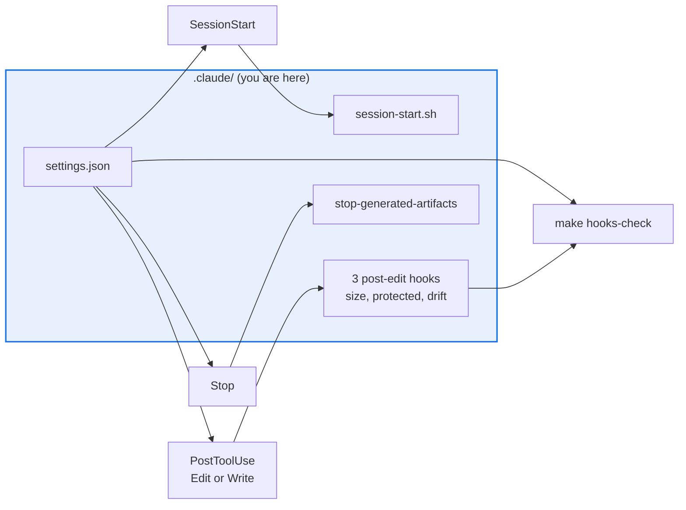

# .claude

> The directory Claude Code actually reads: agents, hooks, skills and settings.

This is a `README.md`, deliberately. Claude Code loads `.claude/AGENTS.md` **eagerly**, at
session start, as a second root-level instruction file — so directory documentation placed
there would be charged to every session in the repo whether or not anyone touches `.claude/`.
The reason is recorded in `COVERED_BY_PARENT` in `scripts/_agents_md_lib.py`.

The authoritative harness configuration: the subagent roster, five hooks, one skill, and the
`settings.json` that wires them. The sibling `../.agents/` tree is never read by Claude Code.

## Map

| Path | Role |
|---|---|
| `settings.json` | Binds hooks to events. A hook not named here does not run |
| `agents/explorer.md`, `agents/narrow-critic.md` | Read, Grep, Glob only. `maxTurns: 5`. No Bash |
| `agents/test-runner.md` | Bash, Read, Grep, Glob. `maxTurns: 8` |
| `agents/merge-gate-auditor.md` | Prose role, no frontmatter; not a dispatch target |
| `hooks/session-start.sh` | Installs siblings and extras so a session matches CI |
| `hooks/post-edit-*.py`, `hooks/stop-generated-artifacts.py` | Four advisory checks, all fail-open |

## Diagram



## Rules that bite here

- **Every hook is advisory and fails open, deliberately.** All four exit 0 and return a
  finding as context; the Stop hook reports stale generated artifacts without using Stop's
  blocking form. A blocking protected-path hook would make legitimate labeled work
  impossible from a session that holds the label. CI stays the enforcement point.
- **A hook in the tree is not a hook that runs.** `settings.json` is the wiring and
  `make hooks-check` fails when the two disagree either way. Invoke hooks as `python3`
  against a `$CLAUDE_PROJECT_DIR`-anchored path, or a session started elsewhere breaks.
- **Hooks import the real guard, never restate it.** The protected-path hook imports
  `scripts/eval_protected_paths.py`; a second copy of that glob list drifts.
- **Route a subagent against its real tools.** `explorer` and `narrow-critic` cannot run
  anything, and `merge-gate-auditor.md` is a description rather than a config.

## Verify

```bash
make hooks-check
```

## Subagents

| Task in this directory | Agent | Why |
|---|---|---|
| Confirm a hook is wired and find its callers | `explorer` | Wiring is one file, references are several; read-only is enough |
| Run the hooks test after editing a hook | `test-runner` | Has `Bash`; the test asserts wiring and advisory behaviour together |
| Review a hook change before pushing | `narrow-critic` | A hook that stops failing open breaks sessions and lints clean |

## See also

| Doc | Read it when |
|---|---|
| [`../.agents/AGENTS.md`](../.agents/AGENTS.md) | You found a near-duplicate of a file here and need to know which copy is read |
| [`../scripts/eval_protected_paths.py`](../scripts/eval_protected_paths.py) | You are changing what the protected-path hook reports |
| [`../docs/decisions/0019-size-budget-gate.md`](../docs/decisions/0019-size-budget-gate.md) | The size-budget hook fired and you need the rule behind it |
| [`../docs/plans/agents-md-directory-docs/TEMPLATE.md`](../docs/plans/agents-md-directory-docs/TEMPLATE.md) | You are writing an `AGENTS.md` and need the skeleton and the agent roster |
