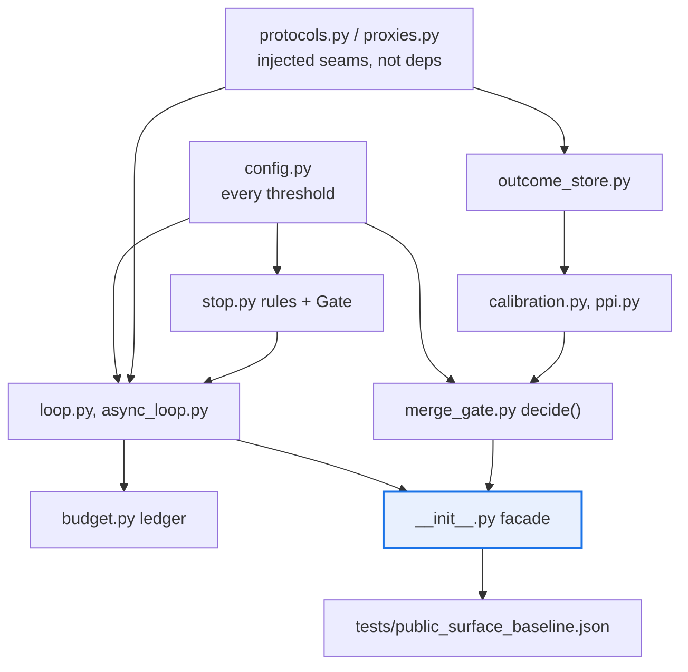

# AGENTS.md — agent-core

> A pure leaf with zero runtime dependencies and the widest facade in the repo. Both are load-bearing.

This directory owns the deterministic control and calibration core: the verifier loop, the cost
ledger, the calibration stack and the merge gate. It imports nothing from this monorepo and
nothing from PyPI at runtime — every I/O-bound node arrives through an injected seam instead.

## Map

| Path | Role |
|---|---|
| `agent_core/__init__.py` | The facade: about 100 exports, frozen against a committed baseline |
| `agent_core/config.py` | Every threshold in the package, as a documented dataclass field |
| `agent_core/protocols.py`, `proxies.py` | The injection seams that stand in for dependencies |
| `agent_core/merge_gate.py`, `outcome_store.py` | Calibrated gate plus the append-only outcome log |
| `agent_core/calibration.py`, `ppi.py`, `report_types.py` | Metric stack and the ADR 0026 split |
| `agent_core/store_sync/` | Git-backed outcome-store sync; byte I/O, never text mode |
| `tests/public_surface_baseline.json` | The frozen export list the facade is checked against |
| `CONTRIBUTING.md` | The repo's only package-level one — dev loop runs from this directory |

## Diagram



## Rules that bite here

- **Zero runtime dependencies is a charter invariant, checked mechanically.**
  `scripts/check_charter_invariants.py` fails hard on any `[project] dependencies` entry. If a
  feature seems to need a library, it needs a seam in `protocols.py` or `proxies.py` instead.
- **The facade is frozen, exactly.** `tests/public_surface_baseline.json` pins the export list
  with equality, so a rename or a removal fails CI. Regenerate with
  `python tests/test_public_surface.py --update` in the same change, never as a follow-up.
- **Backwards-compat shims are deliberate — deleting one needs a deprecation ADR.** The `ece`
  alias of `expected_calibration_error` stays, as do the re-exports left by the ADR 0026 split:
  PPI moved to `ppi.py` and the report to `report_types.py` plus `calibration_report_render.py`,
  yet every old name still resolves from `calibration_report`, whose `__all__` pins that promise.
- **Nothing in this repo may be imported from here.** This is a leaf; `eval_harness` reaches it
  only through `src/eval_harness/agent_core_adapter/`, and `flow_corpus` pins the version it was
  built against. A new outward edge inverts the layering the drift gate declares.
- **Run dev commands from this directory.** The dynamic version resolves against
  `agent-core/`, so an editable install from the repo root silently installs the wrong thing.
- **The 95 floor is declared twice** — `pyproject.toml` and `scripts/quality-gate.sh` — and
  both anchors are pinned by `coverage-floors.yaml`. Lowering either is a reviewed act.

## Verify

```bash
make -C agent-core check
```

## Subagents

| Task in this directory | Agent | Why |
|---|---|---|
| Find every call site of a symbol before renaming it in the facade | `explorer` | Read-only and `Grep`-scoped; the facade is wide, so the sweep matters more than the reasoning |
| Run the gate and isolate a coverage or strict-typing failure | `test-runner` | Has `Bash`; the 95 floor reports per-file misses that need reading back |
| Review a seam or shim change before pushing | `narrow-critic` | A removed re-export is invisible to the linters and obvious to a reader |

## See also

| Doc | Read it when |
|---|---|
| [`README.md`](README.md) | You need the module-by-module layout and the read-only report CLIs |
| [`CONTRIBUTING.md`](CONTRIBUTING.md) | You are setting up the dev loop or unsure what the coverage-honesty rule allows |
| [`GAP_ANALYSIS.md`](GAP_ANALYSIS.md) | You need to know whether something is built, seamed or deliberately absent |
| [`../docs/decisions/0026-proxy-correlation-and-ppi-estimator.md`](../docs/decisions/0026-proxy-correlation-and-ppi-estimator.md) | You are touching the calibration report or PPI and need why the file split happened |
| [`../docs/decisions/0005-calibrated-merge-gate.md`](../docs/decisions/0005-calibrated-merge-gate.md) | You are changing gate layering or the conditions under which auto-merge is earned |
| [`docs/sanitizer-threat-model.md`](docs/sanitizer-threat-model.md) | You are editing `sanitize.py` and need what it is defending against |
