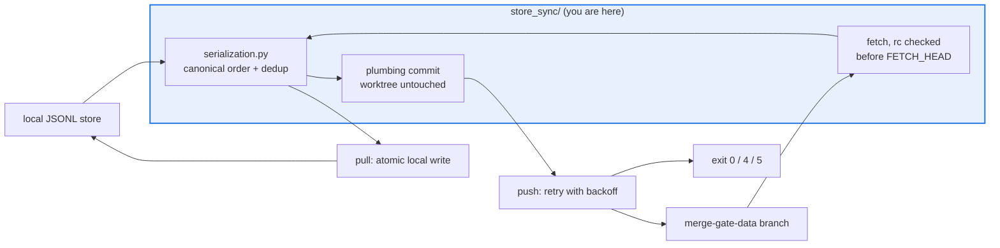

# AGENTS.md — agent-core/agent_core/store_sync

> Syncs the outcome store with a dedicated git data branch, using nothing but stdlib and git.

CI runner workspaces are ephemeral but the merge-gate outcome store has to accumulate across
runs, so this package merges a local JSONL store with one file on the `merge-gate-data`
branch (ADR 0018). It is the only part of `agent_core` that shells out to git.

## Map

| Path | Role |
|---|---|
| `__init__.py` | The public re-export surface plus the `main` CLI and its exit-code mapping |
| `__main__.py` | `python -m agent_core.store_sync {pull,push,stats}` entry point |
| `git_sync.py` | Git plumbing and the pull/push orchestration, including push retry with backoff |
| `store.py` | Local store file I/O (atomic writes) and per-domain statistics |
| `serialization.py` | The pure merge core: canonical order and dedup, no I/O |
| `models.py` | Value types, exit-code constants, and every tunable default |

## Diagram



## Rules that bite here

- **`agent_core` is a pure leaf with zero runtime dependencies.** Git access is `subprocess`
  plus stdlib on purpose; `scripts/check_charter_invariants.py` fails the build the moment a
  runtime dependency appears, so reaching for a git library is not an option here.
- **The merged store is byte-identical from any interleaving.** `OutcomeStore.resolved()`
  resolves passive labels by file position, so the canonical total order in `serialization.py`
  is correctness, not tidiness. Dedup drops only identical lines; `HUMAN_AUDIT` never goes.
- **Exit codes are a stable CI contract**: 0 for success or cold start, 4 for an unreachable
  remote with the local store untouched, 5 for exhausted push retries. Workflows branch on
  them, so a renumbering changes behaviour far outside this package.
- **Check the fetch return code before reading `FETCH_HEAD`.** CI checkouts leave a stale one
  behind, and an unguarded read silently merges the wrong commit.

## Verify

```bash
python -m pytest agent-core/tests/test_store_sync.py agent-core/tests/test_store_sync_git.py agent-core/tests/test_store_sync_concurrency.py -q
```

## Subagents

| Task in this directory | Agent | Why |
|---|---|---|
| Find every caller of an exit code or a re-exported name | `explorer` | Read-only sweep over workflows and the package surface |
| Run the three sync suites and isolate a race failure | `test-runner` | Has `Bash`; concurrency behaviour only appears when executed |
| Review a merge or ordering change before pushing | `narrow-critic` | Order bugs read as harmless in a diff and corrupt resolution |

## See also

| Doc | Read it when |
|---|---|
| [`../../../docs/decisions/0018-outcome-store-persistence.md`](../../../docs/decisions/0018-outcome-store-persistence.md) | You are changing the merge, dedup or branch strategy |
| [`../outcome_store.py`](../outcome_store.py) | You need `OutcomeRecord` fields or the position-dependent `resolved()` |
| [`../../../.github/workflows/merge-gate-audit.yml`](../../../.github/workflows/merge-gate-audit.yml) | You need how the CLI and its `--audit-floor` are actually invoked |
| [`../../AGENTS.md`](../../AGENTS.md) | You need the package-wide contract rather than this seam's |
