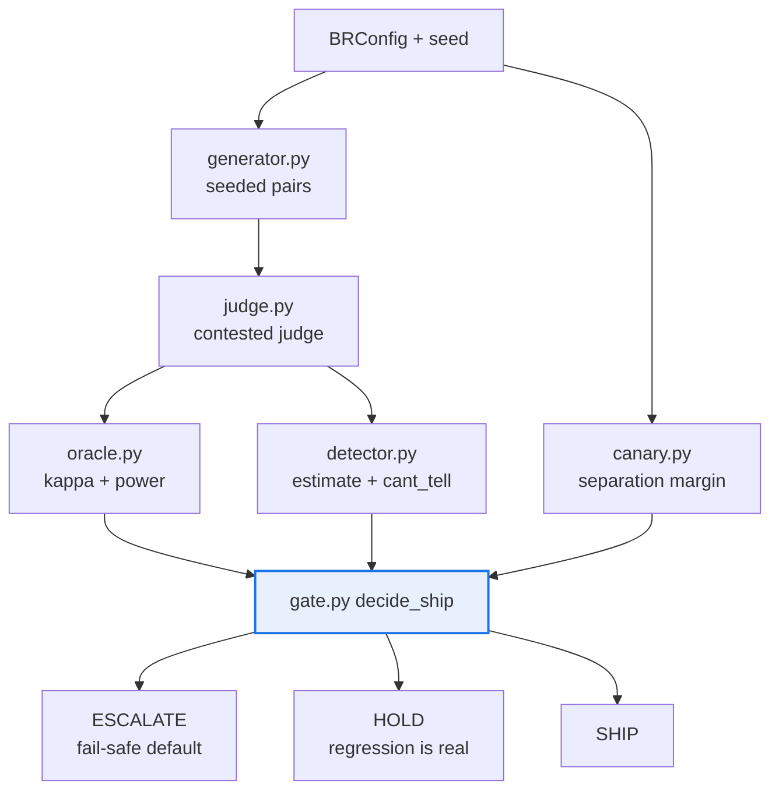

# AGENTS.md — behavioral-regression

> A terminal consumer: nothing imports it, so its only contract is the one it keeps with itself.

This directory owns the calibrated behavioural-regression detector and its ship/hold/escalate
gate. Every statistic is composed from `agent_core` and `flow_corpus` primitives rather than
re-derived here, and a whole run is byte-reproducible from a `(BRConfig, seed)` pair.

## Map

| Path | Role |
|---|---|
| `behavioral_regression/config.py` | Frozen `BRConfig` — every threshold the gate reads |
| `behavioral_regression/generator.py`, `judge.py` | Seeded synthetic v1/v2 pairs; the contested judge |
| `behavioral_regression/oracle.py` | Judge validation against human labels before it is trusted |
| `behavioral_regression/detector.py` | `p(regression)`, intervals, and the "can't tell" bucket |
| `behavioral_regression/canary.py` | Injected known regression plus known null; separation check |
| `behavioral_regression/gate.py` | `decide_ship` — the fail-safe-to-escalate layering |
| `behavioral_regression/pipeline.py`, `report.py` | The seven beats end to end; deterministic output |
| `behavioral_regression/version.py` | `SCHEMA_VERSION` plus the config migration chain |

## Diagram



## Rules that bite here

- **A stale claim lives in this package — do not propagate it.** The `__init__.py` docstring
  says this package imports `flow_protocol`, and `pyproject.toml` declares `flow-protocol` as
  a dependency, but no `flow_protocol` import exists anywhere in the source. The real edges
  are `agent_core` and `flow_corpus`, which is exactly what `architecture.yaml` declares. If
  you genuinely need the contract types, add the import *and* the manifest edge together;
  otherwise treat the docstring and the dependency entry as drift, not as permission.
- **Never import `eval_harness`.** The airgap holds for this consumer too. The optional live
  judge lives in `eval_harness.judges` and is wired in by the harness layer, from that side.
- **The gate falls safe to ESCALATE, and that is the whole design.** Any new condition that
  cannot be evaluated escalates; none of them may shortcut to SHIP. The explicit "can't tell"
  bucket is an output the gate consumes, not a gap to smooth over with a default.
- **Offline and deterministic, byte for byte.** No network, no wall clock, no unseeded
  randomness. A run must reproduce from `(BRConfig, seed)` alone or the canary means nothing.
- **No literal in the decision logic.** Every threshold is a `BRConfig` field, overridable by
  construction or `--set key=value`, and configs round-trip through the migration chain.
- **Reuse the statistics, do not re-derive them.** Wilson, Brier and reliability bins come
  from `agent_core.calibration`; bootstrap deltas and the oracle kappa gate come from
  `flow_corpus`. A second local implementation drifts from the one the gate was calibrated on.

## Verify

```bash
make -C behavioral-regression check
```

## Subagents

| Task in this directory | Agent | Why |
|---|---|---|
| Confirm whether a claimed dependency is actually imported | `explorer` | Read-only `Grep` over the package; this is how the stale `flow_protocol` claim was caught |
| Run the gate and isolate a determinism or coverage failure | `test-runner` | Has `Bash`; a reproducibility break shows up as a diff, not a stack trace |
| Review a change to `gate.py` before pushing | `narrow-critic` | A new branch that reaches SHIP instead of ESCALATE is invisible to the linters |

## See also

| Doc | Read it when |
|---|---|
| [`README.md`](README.md) | You need the seven-beat pipeline and the reused-symbol table |
| [`GAP_ANALYSIS.md`](GAP_ANALYSIS.md) | You need to know whether something is built, seamed or deliberately absent |
| [`../docs/decisions/0006-behavioral-regression-detection.md`](../docs/decisions/0006-behavioral-regression-detection.md) | You are changing what counts as a regression or how the estimate is formed |
| [`../architecture.yaml`](../architecture.yaml) | You are adding an import and need the declared component edges for this package |
| [`../flow-corpus/README.md`](../flow-corpus/README.md) | You are reaching for a corpus primitive and need to know what already exists |
| [`../coverage-floors.yaml`](../coverage-floors.yaml) | A coverage number is in your diff and you need to know which anchors must agree |
