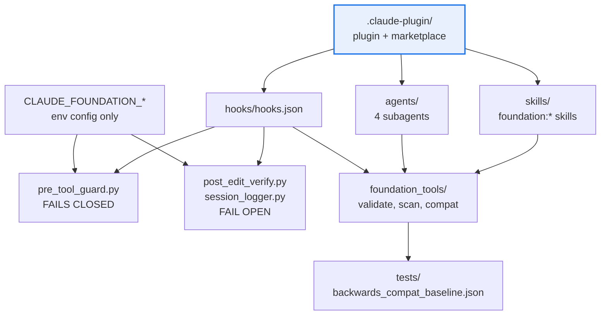

# AGENTS.md — claude-foundation

> A Claude Code plugin, not a package in the import graph. It also holds the repo's only CLAUDE.md.

This directory packages the `foundation` plugin: reusable skills, least-privilege subagents and
lifecycle hook guards, plus the `foundation_tools` validators that gate them. It is staged
in-tree pending extraction, so it behaves like its own repository while living inside this one.

## Map

| Path | Role |
|---|---|
| `.claude-plugin/plugin.json` | The plugin manifest — name `foundation`, version 1.0.0 |
| `.claude-plugin/marketplace.json` | Self-hosted marketplace entry consumers pin a ref against |
| `CLAUDE.md` | Build commands and compatibility contract — and a context trap, see below |
| `hooks/hooks.json` | Wires the three hooks to their events and matchers |
| `hooks/pre_tool_guard.py` | The security guard. Fails closed, including on its own errors |
| `hooks/post_edit_verify.py`, `session_logger.py` | Advisory. Always exit 0 |
| `agents/`, `skills/` | The four subagents and the four `foundation:*` skills, each with evals |
| `tools/foundation_tools/` | Validators: frontmatter, schemas, no-hardcode scan, compat diff |
| `tests/backwards_compat_baseline.json` | The append-only component-name surface |

## Diagram



## Rules that bite here

- **This directory holds the repo's only `CLAUDE.md`, and it decides what you can see.** Under
  Claude Code's default project-instructions setting, a `CLAUDE.md` in the working directory or
  above it makes Claude read `CLAUDE.md` files *only*, so an agent working here would otherwise
  receive none of the repo-wide contract. The single line `@AGENTS.md` at the top of
  [`CLAUDE.md`](CLAUDE.md) is what pulls this file — and through it [`../AGENTS.md`](../AGENTS.md)
  — back into context. Delete that line and every agent working here goes blind, silently.
- **The hook fail modes are asymmetric on purpose (ADR 0002).** `pre_tool_guard.py` fails
  CLOSED — a matched deny rule *and* any internal error both deny, so a crash can never let a
  tool call through. `post_edit_verify.py` and `session_logger.py` fail OPEN and always exit 0,
  so a broken config cannot paralyse every edit in a consumer repo. Never invert either one.
- **Component names are append-only within a major version.** Removing or renaming a skill,
  subagent or hook needs a major bump, then `python -m foundation_tools.backwards_compat
  --root . --update` in the same change — run after the bump, since it snapshots the current one.
- **No literals in hook behaviour.** Everything configurable comes from a `CLAUDE_FOUNDATION_*`
  environment variable, and `foundation_tools.scan` enforces that against an allowlist policy.
- **Staged in-tree, and still inside this repo's gates.** Run its own commands from here as if
  this were the repository root, but `tests/**` is a protected path and its 85 floor is
  declared in both `pyproject.toml` and `scripts/quality-gate.sh`.

## Verify

```bash
make -C claude-foundation check
```

## Subagents

| Task in this directory | Agent | Why |
|---|---|---|
| Locate where a component name is declared across manifest, skills and baseline | `explorer` | Read-only; the name appears in several files and all of them must agree |
| Run the gate and isolate a validator or compat-diff failure | `test-runner` | Has `Bash`; the compat gate reports a surface diff that needs reading back |
| Review a hook change before pushing | `narrow-critic` | A fail-mode inversion is a one-character diff and a security regression |

## See also

| Doc | Read it when |
|---|---|
| [`README.md`](README.md) | You need the component table, install flow and environment-variable contract |
| [`CLAUDE.md`](CLAUDE.md) | You need this component's own build commands and release gate |
| [`../AGENTS.md`](../AGENTS.md) | You need the repo-wide contract — reached only via the `@AGENTS.md` import |
| [`docs/adr/0002-hook-fail-modes.md`](docs/adr/0002-hook-fail-modes.md) | You are changing a hook's exit path and need the exact blocking mechanics |
| [`docs/adr/0004-backwards-compat-manifest-diff.md`](docs/adr/0004-backwards-compat-manifest-diff.md) | You are removing or renaming a component and need the bump procedure |
| [`../docs/decisions/0017-claude-foundation-reconciliation.md`](../docs/decisions/0017-claude-foundation-reconciliation.md) | The in-tree staging is in your way and you need the extraction plan |
