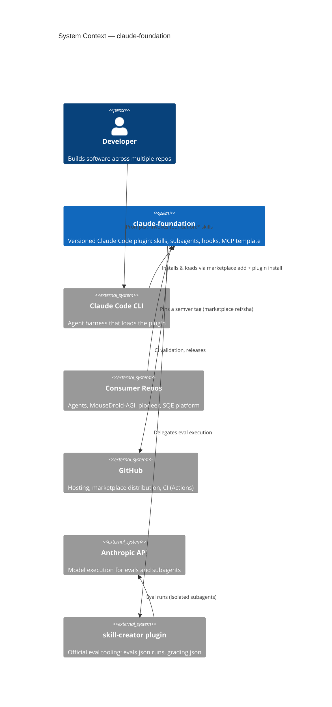
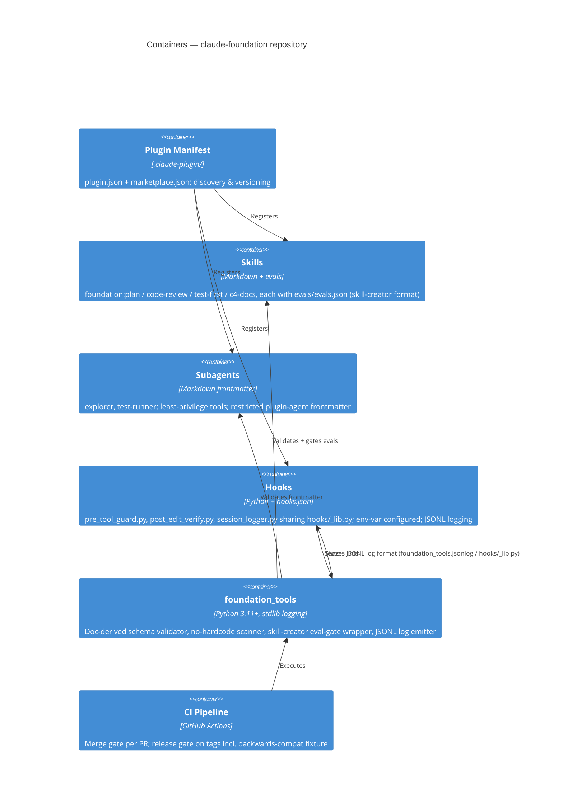
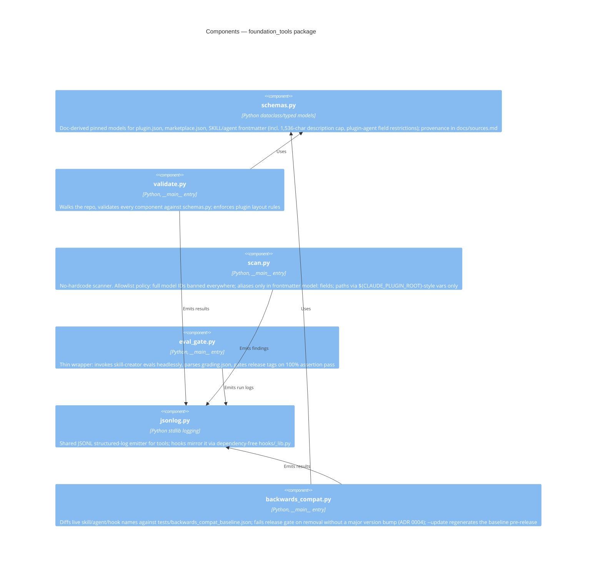

# Architecture — claude-foundation

C4 model of the `foundation` plugin, as built. Diagrams are Mermaid and render
directly on GitHub. Names below reflect the shipped code (Python package
`foundation_tools`, hook scripts under `hooks/`), which supersedes the draft names in
the original plan.

## Level 1 — System Context

## Level 2 — Containers

## Level 3 — Components (foundation_tools package)

### Hook scripts (companion to Level 3)

The three hook scripts are intentionally **not** part of `foundation_tools`: they must
run with zero third-party dependencies in arbitrary consumer environments
(see [ADR 0003](adr/0003-eval-integration-and-stdlib-logging.md)).

| Script | Event | Fail mode |
|---|---|---|
| `hooks/pre_tool_guard.py` | PreToolUse | Closed — deny on error or match ([ADR 0002](adr/0002-hook-fail-modes.md)) |
| `hooks/post_edit_verify.py` | PostToolUse | Open — advisory, never blocks |
| `hooks/session_logger.py` | Tool lifecycle | Open — advisory, never blocks |
| `hooks/_lib.py` | (shared) | stdin JSON parsing, env config, JSONL logging |
