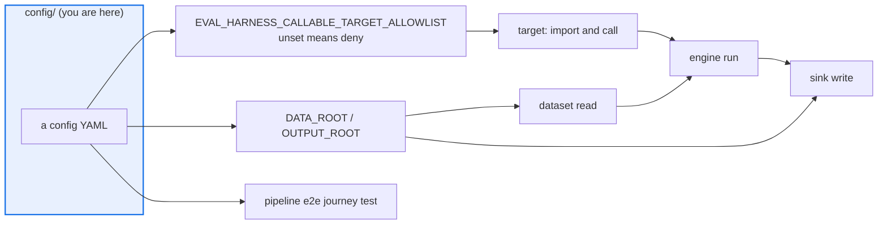

# AGENTS.md — config

> Declarative eval configs. Protected, and executable: a config is untrusted input, not data.

Every file here defines what an evaluation measures, which is why the whole directory is a
protected path. [`README.md`](README.md) lists each config and what consumes it; this file
is the security and journey contract an agent has to satisfy to add or change one.

## Map

| Path | Role |
|---|---|
| `eval.example.yaml` | The canonical offline-runnable example. `../examples/run_offline.py` loads it |
| `testgen_eval.yaml`, `rca_eval.yaml`, `requirements_eval.yaml`, `answer_quality_eval.yaml` | The four corpus evals; gate rules are advisory |
| `testgen_agent_eval.yaml`, `testgen_agent_empty_eval.yaml` | Agent-in-the-loop profile and its empty baseline |
| `model_target.yaml`, `nemotron_eval.yaml`, `lm_studio_eval.yaml` | Model-backed and live-endpoint targets |
| `merge-gate-domains.yaml`, `agent-authors.yaml`, `agent-confidence.yaml` | Calibrated merge-gate inputs |
| `legacy.v0_9.yaml` | Kept deliberately to exercise the config migration chain |
| `fixtures/` | A committed calibration fixture, covered by this file |

## Diagram



## Rules that bite here

- **The whole directory is protected.** Changes need the `eval-change-approved` label and a
  code owner, because a threshold or a dataset path edited here moves every score without
  touching a scorer.
- **A config is executable input.** The `callable` target turns `params.path` into an import
  and a call, gated by `EVAL_HARNESS_CALLABLE_TARGET_ALLOWLIST`. Unset means deny, and
  matching is on module boundaries, never a string prefix (ADR 0039). Do not add a new
  config-driven import or filesystem path without routing it through that gate or through
  `DATA_ROOT` / `OUTPUT_ROOT`.
- **A shipped config must be journeyed or explicitly excluded.** Every file here is either
  run end to end by `tests/integration/test_pipeline_e2e.py` or named in that module's
  exclusion set with a reason. A config that is neither fails the suite, which is how
  `requirements_eval.yaml` once shipped naming an empty evidence store.
- **No credentials, ever.** Endpoints and keys arrive as environment variables with
  `${VAR:-default}` expansion; `../.env.example` is the canonical set.
- **No bare numeric literal at a call site.** A threshold belongs in a validated config field
  with the default documented on the field, so it is reviewable here rather than in code.

## Verify

```bash
python -m pytest tests/integration/test_pipeline_e2e.py -q
```

## Subagents

| Task in this directory | Agent | Why |
|---|---|---|
| Find which tests and docs name a config before renaming it | `explorer` | Read-only sweep; a config is referenced from tests, docs, the Makefile and CI |
| Run a config end to end offline and read the gate verdict | `test-runner` | Has `Bash`; needs the allowlist env var set, which only a shell can do |
| Review a new config before requesting the label | `narrow-critic` | An unconfined path or a widened allowlist is a security change, not a config tweak |

## See also

| Doc | Read it when |
|---|---|
| [`README.md`](README.md) | You need to know what a specific config here is for and what runs it |
| [`../docs/decisions/0039-callable-target-allowlist.md`](../docs/decisions/0039-callable-target-allowlist.md) | Your config names a `callable` target and you need the allowlist semantics |
| [`../corpora/AGENTS.md`](../corpora/AGENTS.md) | The config points at a committed corpus and you are about to change which one |
| [`../scripts/eval_protected_paths.py`](../scripts/eval_protected_paths.py) | You want the authoritative protected-path list before starting work |
| [`../docs/gap-analysis-requirements-eval-2026-09-07.md`](../docs/gap-analysis-requirements-eval-2026-09-07.md) | You want the worked example of a shipped config that every gate passed and never ran |
