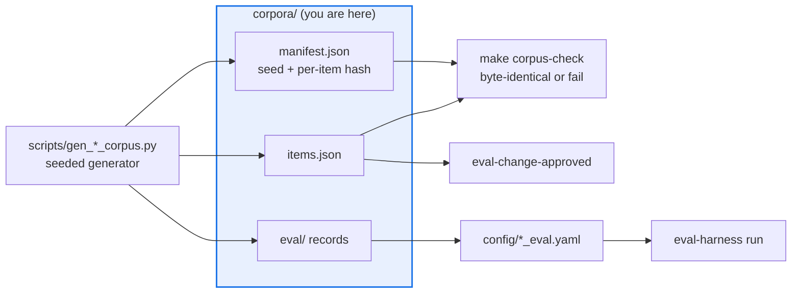

# AGENTS.md — corpora

> Frozen, generated eval data. Protected, because swapping a corpus is how you fake a pass.

Four versioned corpora the harness loads directly, each regenerable byte-for-byte from a
seeded generator. [`README.md`](README.md) documents what each corpus contains and the
properties it measures rather than asserts. This file is the handling contract: what you may
change, what regenerates, and why a human has to look.

## Map

| Path | Role |
|---|---|
| `<name>/<version>/manifest.json` | Schema version, generator seed, split counts, a hash per item |
| `<name>/<version>/items.json` | The corpus itself |
| `<name>/<version>/eval/` | The harness-loadable records a config points its dataset at |
| `testgen/v1/` | Sixty synthetic focal methods, seeded mutants, gold obligations |
| `rca/v1/` | Root-cause-analysis corpus (ADR 0046) |
| `requirements/v1/` | Twenty-five epics with gold acceptance criteria and an evidence store |
| `answer_quality/v1/` | Fourteen question and answer envelopes replayed by the `replay` target |

## Diagram



## Rules that bite here

- **Never hand-edit a corpus file.** Every item is hashed in its `manifest.json`, so a hand
  edit fails `make corpus-check` rather than quietly changing a score. Change the generator
  in `../scripts/`, regenerate with `make corpus-write`, and commit both.
- **This directory is protected, and the reason is specific.** Swapping a corpus for an
  easier one moves every number in a matrix without touching a scorer, a threshold or a gate
  rule. It is the cheapest possible way to make a failing eval pass, so it requires the
  `eval-change-approved` label and a code owner.
- **A version directory is frozen.** New material goes in `<name>/v2/`, never on top of `v1`;
  the configs and the reported numbers name a version and must stay comparable.
- **The seed is part of the data.** Regeneration is only meaningful because the seed and the
  split keying live in the manifest. Do not change a seed to make a run look better, and do
  not reshuffle a holdout: the split is keyed by hash, not shuffled.
- **Nothing host-specific or scraped belongs here.** Real internal source would collide with
  the charter invariant that nothing host-specific is committed; generation avoids the
  question and buys reproducible difficulty strata instead.

## Verify

```bash
make corpus-check
```

## Subagents

| Task in this directory | Agent | Why |
|---|---|---|
| Find which configs, scorers and docs name a corpus before adding a version | `explorer` | Read-only; a corpus path is referenced from configs, tests and prose at once |
| Regenerate and confirm the bytes still match | `test-runner` | Has `Bash`; `make corpus-check` runs four generators and names the one that drifted |
| Review a generator change before requesting the label | `narrow-critic` | A tie-break or seed change silently restates every score and is not lintable |

## See also

| Doc | Read it when |
|---|---|
| [`README.md`](README.md) | You need what a corpus contains and which properties it measures rather than asserts |
| [`../config/AGENTS.md`](../config/AGENTS.md) | You are pointing an eval config at a corpus, or changing which one it loads |
| [`../docs/decisions/0043-testgen-evaluation-seam.md`](../docs/decisions/0043-testgen-evaluation-seam.md) | You are working on `testgen/v1/` and need the seam it was built for |
| [`../docs/decisions/0047-requirements-eval-matrix.md`](../docs/decisions/0047-requirements-eval-matrix.md) | You are working on `requirements/v1/` or its evidence store |
| [`../scripts/AGENTS.md`](../scripts/AGENTS.md) | You are editing a generator and need its gate and coverage obligations |
