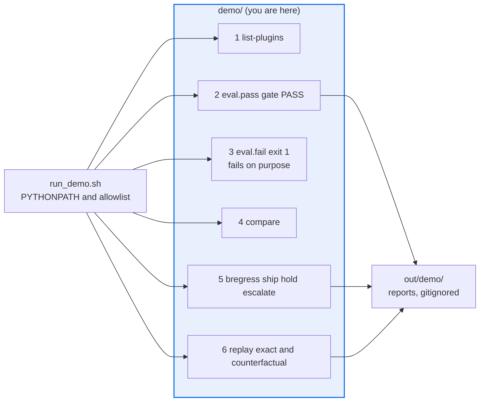

# AGENTS.md — demo

> A six-beat offline demo script. The numbers in it are spoken aloud, so they are load-bearing.

A fully offline, deterministic, six-to-eight-minute runbook for a mixed engineer and
leadership audience. [`README.md`](README.md) is the spoken script itself: what to type,
what appears, what to say. This file is what an agent must know before changing anything
the script narrates.

## Map

| Path | Role |
|---|---|
| `run_demo.sh` | One-shot orchestrator for all six beats; writes to `out/demo/` |
| `configs/eval.pass.yaml`, `configs/eval.fail.yaml` | Same eval, one stricter threshold apart |
| `configs/compare.yaml`, `configs/live.appendix.yaml` | Multi-model board; optional credentialed arm |
| `support_bot_target.py` | The deterministic offline system under test |
| `data/support_bot.jsonl` | Ten support questions |
| `replay/baseline.jsonl`, `replay_stubs.py` | Recorded envelopes and the stale-search stub for beat 6 |
| `deck.html` | Self-contained stakeholder walkthrough |

## Diagram



## Rules that bite here

- **Beat 3 fails on purpose.** `configs/eval.fail.yaml` differs from the passing config by
  one stricter threshold and must exit non-zero; `run_demo.sh` quarantines it so the strict
  shell mode does not abort. Do not "fix" it, and do not relax the threshold.
- **The quoted numbers are part of the artifact.** `README.md` states an n and a mean for
  the judged scorer. Change the target, the dataset or a scorer and those lines become false
  on stage. Re-run the beat and restamp the prose in the same change.
- **These configs are not under `../config/`, so nothing forces a reviewer to see them.**
  They are outside the protected path set by design, which puts the whole burden of keeping
  them offline and deterministic on whoever edits them.
- **The demo needs two environment variables and will not run without them.**
  `PYTHONPATH=.` so the callable target imports, and
  `EVAL_HARNESS_CALLABLE_TARGET_ALLOWLIST=demo` because a config that names a module to
  import is executable input. Scoped to `demo`, never widened.
- **Never demo the auto-fix loop.** It is deliberately disabled scaffolding (ADR 0004), and
  presenting it as working is the one claim this runbook cannot support.

## Verify

```bash
bash demo/run_demo.sh
```

## Subagents

| Task in this directory | Agent | Why |
|---|---|---|
| Find every place a quoted demo number also appears | `explorer` | Read-only; the same figure is repeated in the script, the deck and the root docs |
| Run the whole script and report which beat diverged | `test-runner` | Has `Bash`; the orchestrator is a shell script with six independent exits |
| Review a config or target edit before a live run | `narrow-critic` | A widened allowlist or a stray network call is invisible until it fails on stage |

## See also

| Doc | Read it when |
|---|---|
| [`README.md`](README.md) | You are running or rehearsing the demo and need the spoken script |
| [`../docs/decisions/0004-auto-fix-loop.md`](../docs/decisions/0004-auto-fix-loop.md) | Someone asks why the auto-fix loop is not in the demo |
| [`../docs/decisions/0049-fixture-replay-target.md`](../docs/decisions/0049-fixture-replay-target.md) | You are changing beat 6 and need why replay is a target and not a scorer |
| [`../docs/e2e-live-journey.md`](../docs/e2e-live-journey.md) | You need a live, non-mock generate-score-judge capture rather than this offline script |
| [`../config/AGENTS.md`](../config/AGENTS.md) | You are moving a demo config into the protected shipped set |
