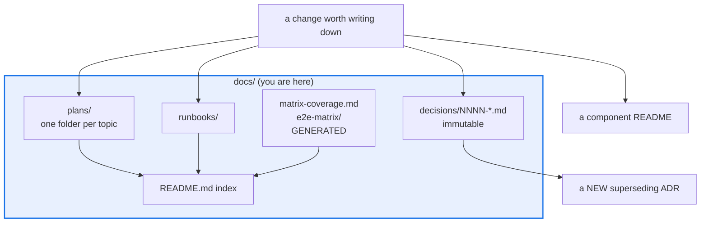

# AGENTS.md — docs

> Prose the repo guards. Some of it is immutable, some is generated, none of it is a scratch pad.

This directory holds the charter, the decision record, plans, runbooks and two generated
artifacts. [`README.md`](README.md) is the index of what lives where;
[`STYLE.md`](STYLE.md) is the taxonomy. This file is the set of rules that turn a harmless
documentation edit into a failing build.

## Map

| Path | Role |
|---|---|
| `STYLE.md` | The taxonomy: which kind of doc a change is, and where it goes |
| `CHARTER.md` | North-star scope and invariants. Links and claims are both gated |
| `decisions/` | Immutable ADRs. Numbering is not contiguous |
| `plans/` | `plans/<topic>/{PLAN.md,REVIEW.md}`; each must be listed in `README.md` |
| `runbooks/` | Operational how-to prose |
| `e2e-matrix/`, `matrix-coverage.md` | GENERATED. Regenerate, never hand-edit |
| `golden-corpus/` | Human-label contract; stays empty until a human writes rows |

## Diagram



## Rules that bite here

- **ADRs are immutable.** A decision that changed course is a *new* ADR that supersedes the
  old one, never an edit to it. Editing an accepted ADR destroys the record of why the old
  choice was made, which is the only thing an ADR is for.
- **ADR numbers are not contiguous, and `0007` is an intentional gap.** Do not backfill it
  and do not renumber later ADRs to close it. Take the next free number after the highest
  one in [`decisions/README.md`](decisions/README.md), and add your row to that index.
- **`CHARTER.md` is doubly gated.** `scripts/check_charter_drift.py` fails when its markdown
  links rot; `scripts/check_charter_invariants.py` mechanically re-checks its *claims* —
  package roles, invariants, default-off flags — against the code. A charter edit that
  states something the repo does not do fails CI, not review.
- **`e2e-matrix/` and `matrix-coverage.md` are generated and freshness-gated.** Regenerate
  with `python tests/test_matrix_coverage.py --update` and `make e2e-matrix-update`. A hand
  edit is erased and fails `make matrix-check` / `make e2e-matrix-check` in the meantime.
- **An unlisted plan is an invisible plan.** Every `plans/<topic>/` must appear in
  [`README.md`](README.md)'s plans table; eleven of them went unreachable before that index
  existed. The same applies to a new runbook.

## Verify

```bash
make invariants
```

## Subagents

| Task in this directory | Agent | Why |
|---|---|---|
| Find every doc that cites an ADR before superseding it | `explorer` | Read-only `Grep` across prose; supersession leaves stale citations behind |
| Run the charter and freshness gates after a docs change | `test-runner` | Has `Bash`; `make invariants` chains three checkers and only one will fail |
| Review a charter or ADR edit before pushing | `narrow-critic` | An overstated invariant is a correctness problem no linter reads |

## See also

| Doc | Read it when |
|---|---|
| [`STYLE.md`](STYLE.md) | You are creating a doc and must decide whether it is an ADR, runbook, plan or README |
| [`decisions/README.md`](decisions/README.md) | You need the next free ADR number or the supersession convention |
| [`README.md`](README.md) | You added a plan or runbook and have to make it reachable |
| [`CHARTER.md`](CHARTER.md) | A change might exceed the declared scope or touch an invariant and needs escalation |
| [`plans/agents-md-directory-docs/TEMPLATE.md`](plans/agents-md-directory-docs/TEMPLATE.md) | You are writing or editing an `AGENTS.md` anywhere in this repo |
