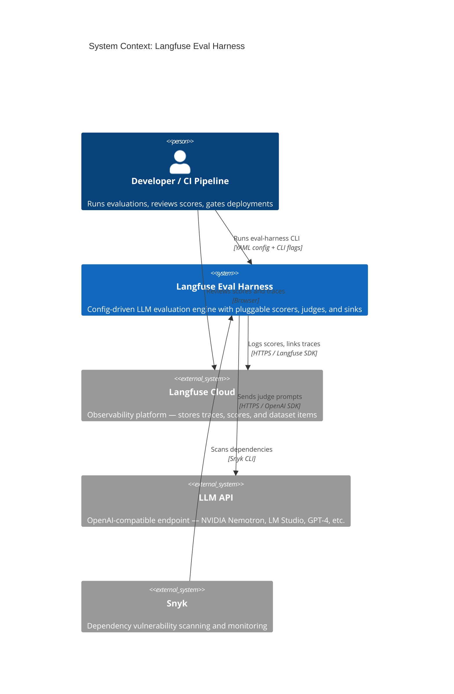
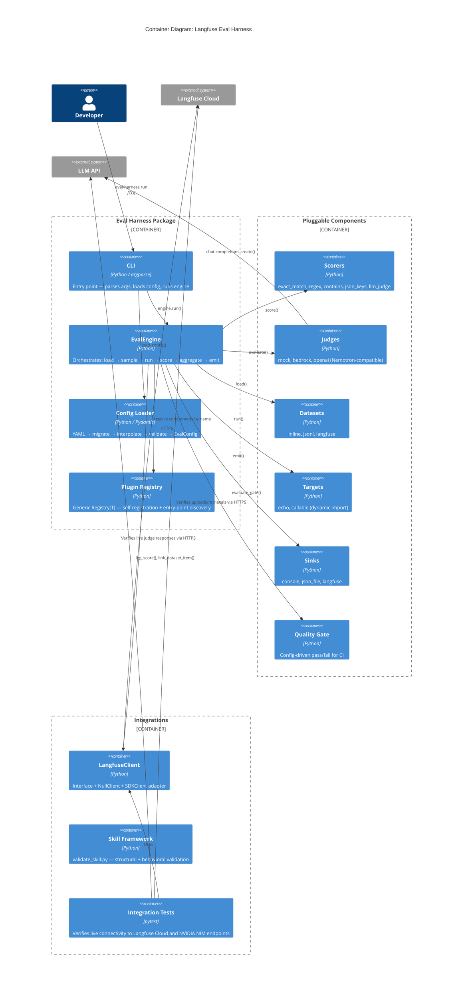
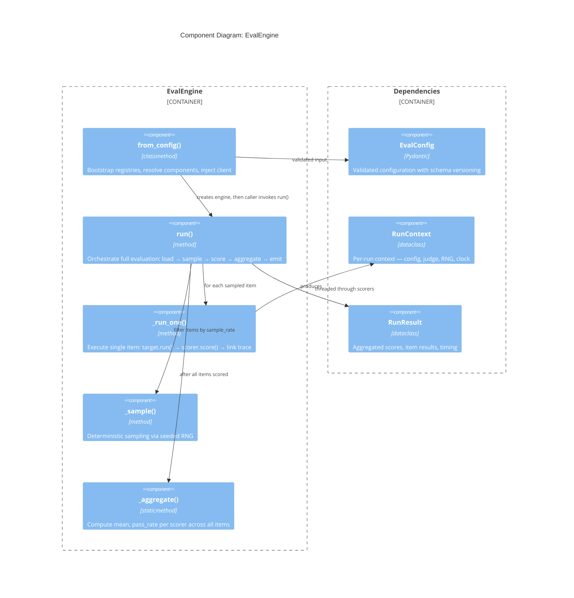
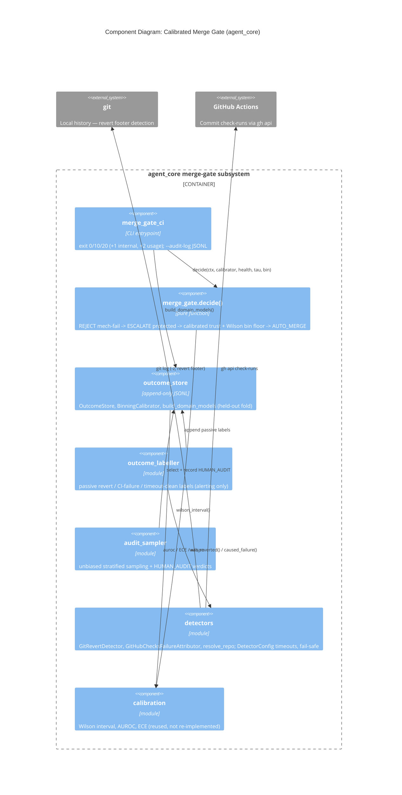
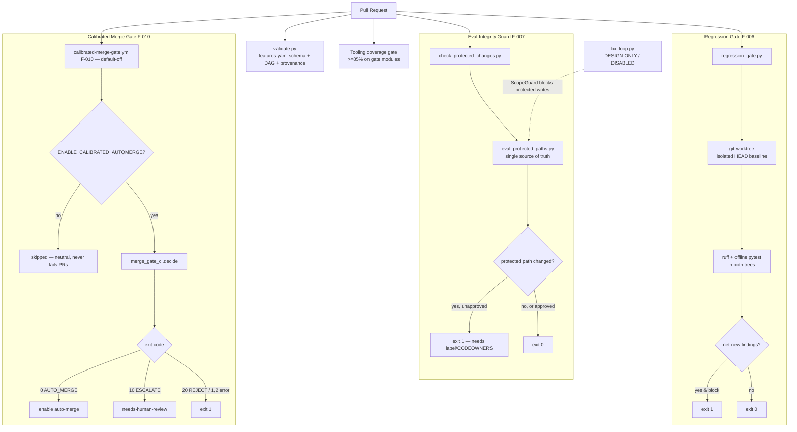
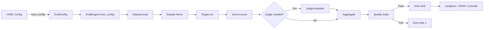

# C4 Architecture — langfuse-eval-harness

## Level 1 — System Context

## Level 2 — Container Diagram

## Level 3 — Component: EvalEngine

## Level 3 — Component: Calibrated Merge Gate (F-010, agent_core, default-off)

A pure, deterministic merge-decision subsystem under `agent_core` (ADR 0005), wired by
`.github/workflows/calibrated-merge-gate.yml`. It **auto-merges nothing** unless
`ENABLE_CALIBRATED_AUTOMERGE` is set and a populated, human-audited outcome store has earned it.
Outcomes are labelled by **real** detectors (git history + GitHub Actions check-runs), all
timeout-bounded and failing safe.

## Quality & Eval-Integrity Gates

These gates run in CI (`.github/workflows/quality-gates.yml`) and guard the harness
against the Goodhart failure mode where the cheapest path to "green" is weakening the
evaluation itself rather than fixing the code.

## Data Flow

