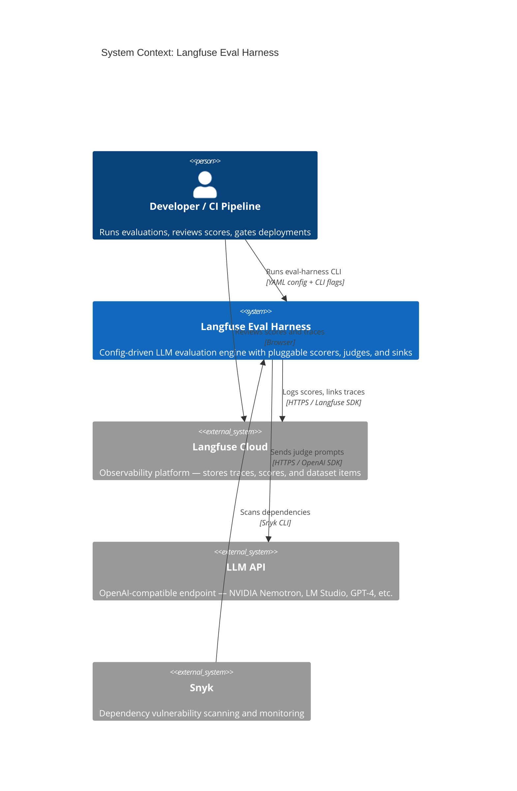
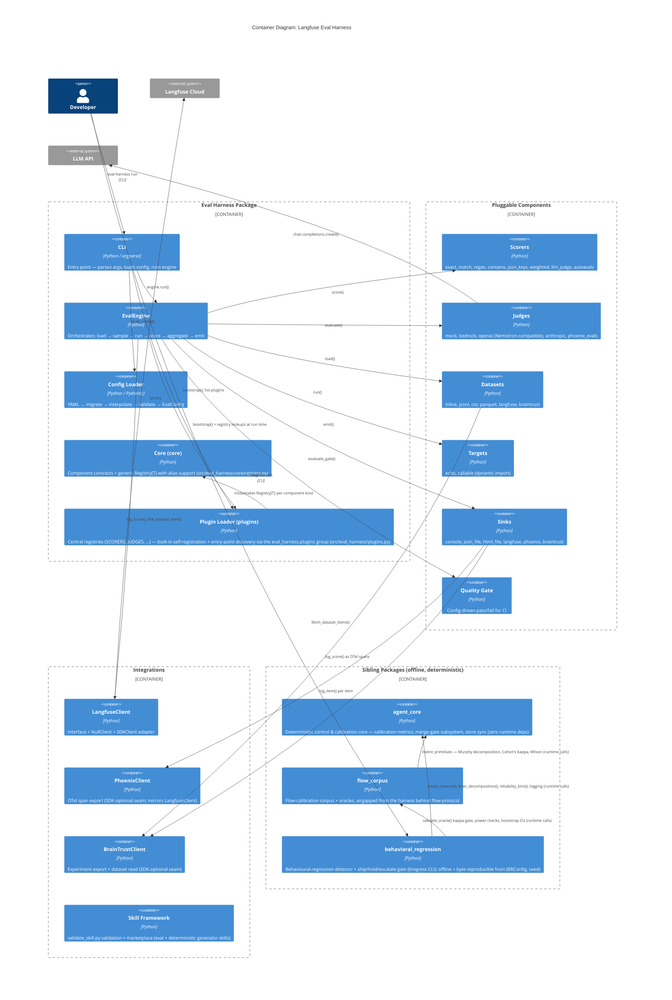
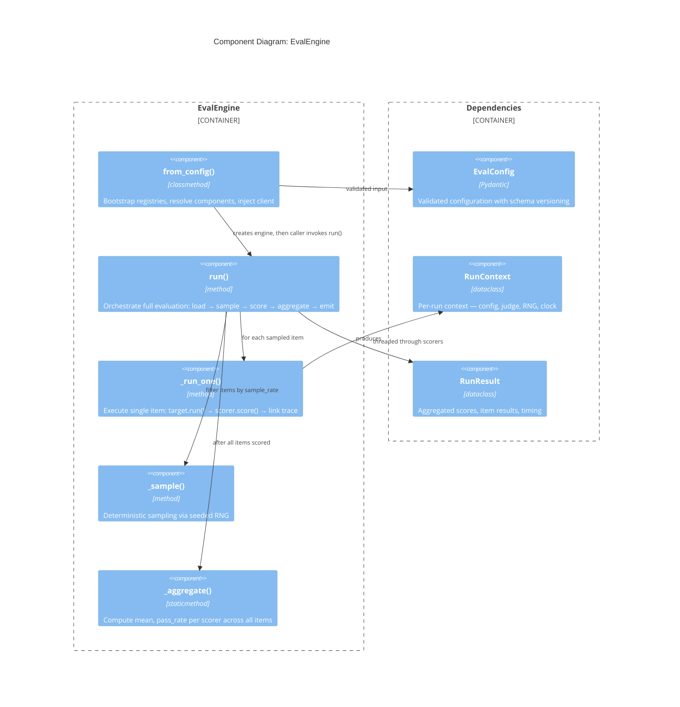
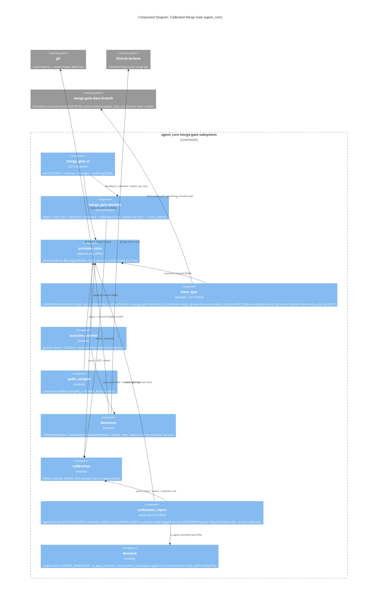
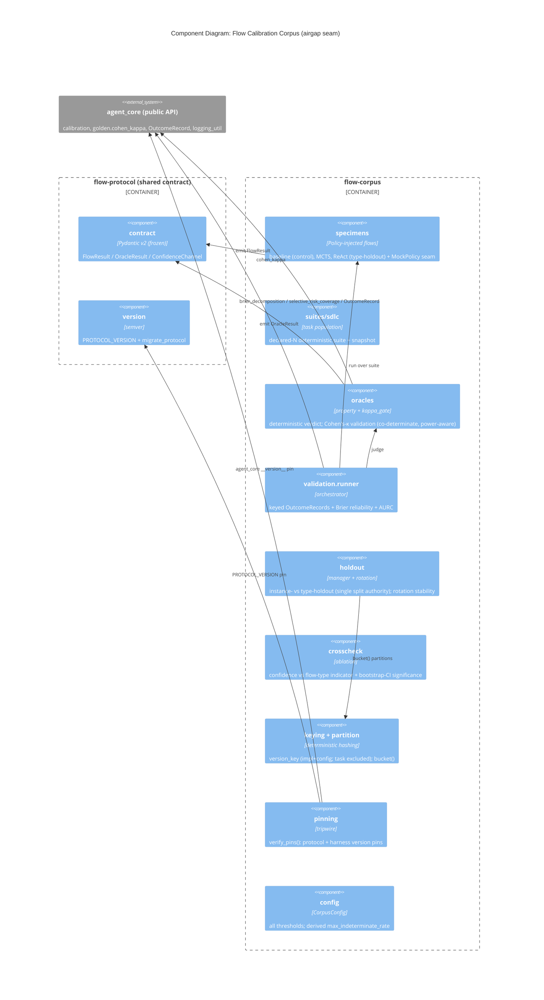
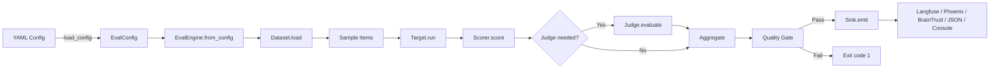

# C4 Architecture — langfuse-eval-harness

> **Provenance & edge semantics.** The diagrams in this document are
> hand-maintained and carry **runtime/call/protocol semantics**: the L1 context
> and L2 container edges describe who calls whom at run time and over which
> protocol, and the L3 sections document sub-component internals *below* the
> granularity of the architecture manifest. The **import-edge component view**
> is not maintained here — it is generated deterministically from
> [`architecture.yaml`](../architecture.yaml) into
> [`architecture.mmd`](../architecture.mmd) via
> `python skills/architecture-drift-guard/scripts/mermaid_gen.py --manifest architecture.yaml -o architecture.mmd`
> and is gated against the real import graph by
> `skills/architecture-drift-guard/scripts/drift_check.py` (plus a
> `mermaid_gen.py --check` freshness gate) in CI. **This document never
> restates package-level import edges.** Where an edge here resembles one
> there, the generated view is authoritative for imports and this document is
> authoritative for runtime behaviour.

## Level 1 — System Context



## Level 2 — Container Diagram

*Edges below are runtime/call relations, not import edges — see the
[generated import view](../architecture.mmd).*



All engine edges above (`engine → scorers/judges/datasets/targets/sinks/gating/...`)
are **runtime-call semantics** — the engine resolves those components by name
through the plugin registries and invokes them; the package-level import edges
behind this wiring live only in the generated
[import view](../architecture.mmd).

## Level 3 — Component: EvalEngine

*Edges below are runtime/call relations, not import edges — see the
[generated import view](../architecture.mmd). This diagram is sub-manifest
granularity: it documents internals of the single `engine` component.*



## Level 3 — Component: Calibrated Merge Gate (F-010 + F-032…F-035, agent_core, default-off)

A pure, deterministic merge-decision subsystem under `agent_core` (ADR 0005), wired by
`.github/workflows/calibrated-merge-gate.yml`. It **auto-merges nothing** unless
`ENABLE_CALIBRATED_AUTOMERGE` is set and a populated, human-audited outcome store has earned it.
Outcomes are labelled by **real** detectors (git history + GitHub Actions check-runs), all
timeout-bounded and failing safe.

Real data flows through the subsystem via the F-032…F-035 activation (ADR 0018): the store
persists on the dedicated `merge-gate-data` branch (`store_sync` — canonical deterministic
merge because `resolved()` is file-order dependent; plumbing commits; retry-with-backoff for
concurrent writers; unparseable lines preserved verbatim), seeded on every push to `main`,
passively labelled daily, audited weekly through GitHub issues, and observed by an always-on
**shadow** job that logs a decision on every PR without ever blocking one.

Seed routing (F-042, ADR 0023) decides each record's lane by the merged change's **PR
head-ref prefix** (`config/agent-authors.yaml`, e.g. `claude/*`): an agent change is seeded in
the un-prefixed **agent domain** with the real `agent_version` and a deterministic proxy
confidence (`scripts/agent_confidence.py`), while every human, PR-less, or unclassifiable
change — and any classifier failure, fail-safe — keeps the reserved `human/<domain>` namespace
at confidence 0.0 (human outcomes never enter agent-domain calibration). This is what makes the
agent-domain corpus non-degenerate; `agent_core.calibration_report` (F-043) reports its
calibration (ECE/Brier/AUROC/abstention, Wilson CIs, honest `DEGENERATE` guard) to the daily
labeller summary, and a one-off reversible backfill
(`scripts/migrations/agent_domain_backfill.py`, F-044) re-attributed the historical agent SHAs.



The CI surfaces around the subsystem (scripts layer + workflows): `merge_gate_context.py`
composes the ChangeContext (path→domain from `config/merge-gate-domains.yaml`,
`touches_protected` from `eval_protected_paths`, mech_pass from the regression gate) and
carries the F-042 `--confidence` seam that stamps the seed's `raw_confidence`;
`agent_confidence.py` (F-042) is the deterministic proxy scorer — a pure function of diff
size / file count / test-ratio / protected-path touches through a clamped sigmoid (no network,
no model) that classifies the agent lane and emits its `agent_version` + confidence;
`scripts/_config.py` is the shared changed-file / strict-YAML-loader helper both reuse;
`scripts/migrations/agent_domain_backfill.py` (F-044) is the one-off reversible re-attribution;
`record_audit_verdict.py` is the idempotent, SHA-validated verdict wrapper (the only
HUMAN_AUDIT writer, dispatch-triggered); `audit_issue_sync.py` plans deduped audit issues.
Workflows: `merge-gate-seed.yml` (push:main — F-042 head-ref routing, fail-safe to the human
lane), `outcome-labeller.yml` (daily, checks:read precondition guard, F-043 calibration-report
summary), `merge-gate-audit.yml` (weekly reader), `merge-gate-verdict.yml` (workflow_dispatch
only, environment-gated), and the always-on `shadow` job in `calibrated-merge-gate.yml`.

## Level 3 — Component: Flow Calibration Corpus (F-011…F-015, airgap seam)

A calibration corpus of agentic flow variants (`flow-corpus`) that emits results across a
versioned contract (`flow-protocol`) for the harness to calibrate against. The corpus reuses
`agent_core`'s metric primitives (Murphy decomposition, Cohen's κ, Wilson intervals,
selective risk-coverage, `OutcomeRecord`) but **never** imports `eval_harness`. `flow-protocol`
is the *only* shared surface; the airgap is enforced deterministically by the grimp drift gate
(`architecture.yaml` declares only `flow_corpus → {flow_protocol, agent_core}` — no
corpus↔harness edge), and a two-way version pin (`verify_pins`) trips on `flow_protocol`/
`agent_core` skew.



Reliability (the Brier/Murphy *reliability* term) is the primary, gating calibration metric;
ECE is diagnostic only. Any metric below a power-derived minimum sample is *directional only* and
cannot gate. Corpus `OutcomeRecord`s use a `"corpus_oracle"` label source (never `HUMAN_AUDIT`) so
they can never be mistaken for the harness's unbiased human-audit sample.

## Quality & Eval-Integrity Gates

These gates run in CI (`.github/workflows/quality-gates.yml`; the operational-scripts
lint/type/coverage gate, F-031, runs in `eval-harness-ci.yml`) and guard the harness
against the Goodhart failure mode where the cheapest path to "green" is weakening the
evaluation itself rather than fixing the code.

```mermaid
flowchart TB
    PR[Pull Request] --> VAL[validate.py<br/>features.yaml schema + DAG + provenance]
    PR --> COV[Tooling coverage gate<br/>>=85% on gate modules]
    PR --> SCOV[Operational-scripts gate F-031<br/>ruff + mypy + >=85% coverage on scripts/]
    PR --> REG[regression_gate.py]
    PR --> GUARD[check_protected_changes.py]
    PR --> DRIFT[check_skill_script_drift.py<br/>vendored skill copies == canonical]
    PR --> CHARTER[check_charter_drift.py<br/>docs/CHARTER.md references resolve — via test suite]
    PR --> MG[calibrated-merge-gate.yml<br/>F-010 acting job — default-off]
    PR --> SHADOW[shadow job F-035<br/>log-only, never blocks]

    subgraph Regression Gate F-006
        REG --> WT[git worktree<br/>isolated HEAD baseline]
        WT --> DIFF[ruff + offline pytest<br/>in both trees]
        DIFF --> NET{net-new findings?}
        NET -->|yes & block| FAIL1[exit 1]
        NET -->|no| PASS1[exit 0]
    end

    subgraph Eval-Integrity Guard F-007
        GUARD --> MATCH[eval_protected_paths.py<br/>single source of truth]
        MATCH --> PROT{protected path changed?}
        PROT -->|yes, unapproved| FAIL2[exit 1 — needs label/CODEOWNERS]
        PROT -->|no, or approved| PASS2[exit 0]
    end

    subgraph Calibrated Merge Gate F-010
        MG --> ENABLED{ENABLE_CALIBRATED_AUTOMERGE?}
        ENABLED -->|no| SKIP[skipped — neutral, never fails PRs]
        ENABLED -->|yes| DECIDE[merge_gate_ci.decide]
        DECIDE --> RC{exit code}
        RC -->|0 AUTO_MERGE| MERGE[enable auto-merge]
        RC -->|10 ESCALATE| HUMAN[needs-human-review]
        RC -->|20 REJECT / 1,2 error| FAIL3[exit 1]
    end

    subgraph Real-Data Activation F-032…F-035 — ADR 0018
        SHADOW -->|store_sync pull, read-only| DATA[(merge-gate-data branch<br/>merge_outcomes.jsonl)]
        SHADOW --> SUMMARY[step summary:<br/>agent + human/ decisions, store stats]
        MAIN[push: main] --> SEED[merge-gate-seed.yml<br/>F-042 head-ref routing:<br/>agent domain @ proxy conf / human/ @ 0.0]
        SEED -->|store_sync push| DATA
        CRON1[daily cron] --> LAB[outcome-labeller.yml<br/>checks:read guard<br/>+ F-043 calibration report]
        LAB -->|passive labels, push| DATA
        CRON2[weekly cron] --> AUD[merge-gate-audit.yml<br/>reader: deduped issues]
        AUD -->|store_sync pull| DATA
        AUD --> ISSUES[merge-gate-audit issues]
        ISSUES --> DISPATCH[merge-gate-verdict.yml<br/>workflow_dispatch, env-gated]
        DISPATCH -->|HUMAN_AUDIT verdict, push| DATA
    end

    FIX[fix_loop.py<br/>DESIGN-ONLY / DISABLED] -.->|ScopeGuard blocks protected writes| MATCH
```

These CI gates run per-file/per-package. For a local, whole-repo pass, `scripts/run_all_e2e.ps1`
is a **test orchestrator** (not a runtime component — it adds no edges to the import graph above):
it runs every package suite, every `features.yaml` functionality gate (Tier B calls `validate.py`),
a curated set of package CLI journeys (`eval-harness`, `bregress`, `merge_gate_ci`,
`skill_marketplace`), the skill/hook e2e tests, and credential-gated live integrations, and
aggregates one report under `artifacts/e2e-report/`. See [e2e-runbook.md](e2e-runbook.md).

## Data Flow

*Edges below are runtime/call relations, not import edges — see the
[generated import view](../architecture.mmd).*


