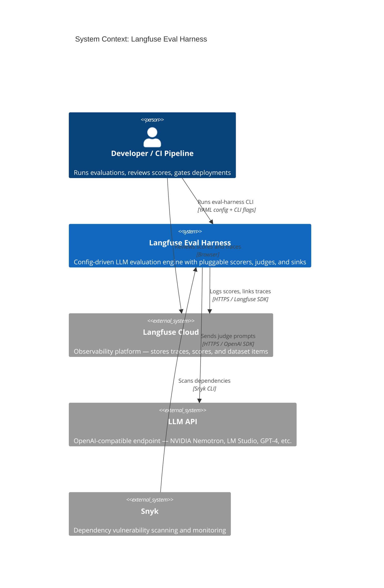
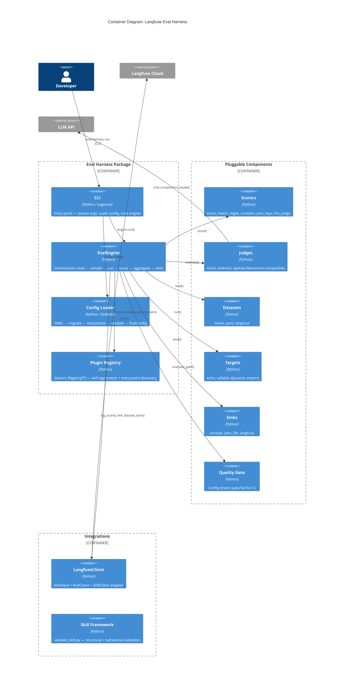
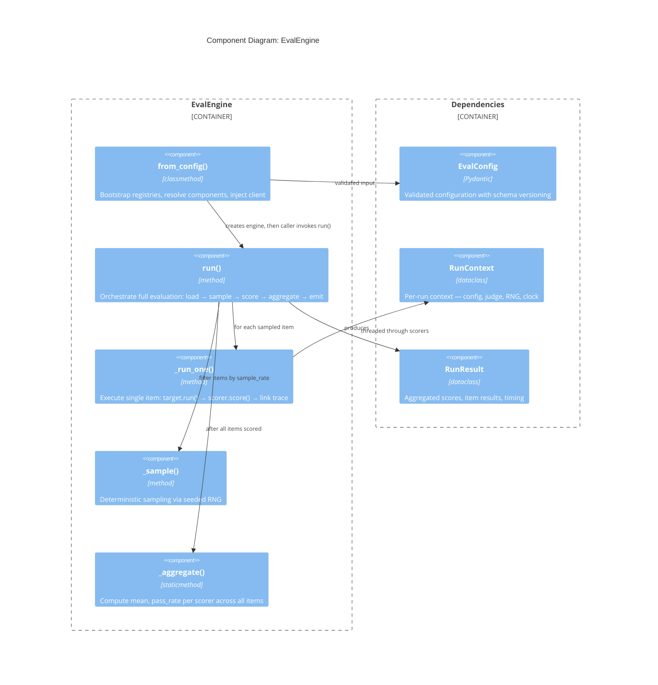
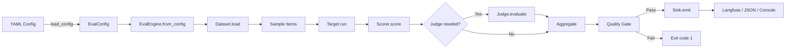

# C4 Architecture — langfuse-eval-harness

## Level 1 — System Context

```mermaid
C4Context
    title System Context: Langfuse Eval Harness

    Person(dev, "Developer / CI Pipeline", "Runs evaluations, reviews scores, gates deployments")

    System(harness, "Langfuse Eval Harness", "Config-driven LLM evaluation engine with pluggable scorers, judges, and sinks")

    System_Ext(langfuse, "Langfuse Cloud", "Observability platform — stores traces, scores, and dataset items")
    System_Ext(llm_api, "LLM API", "OpenAI-compatible endpoint — NVIDIA Nemotron, LM Studio, GPT-4, etc.")
    System_Ext(snyk, "Snyk", "Dependency vulnerability scanning and monitoring")

    Rel(dev, harness, "Runs eval-harness CLI", "YAML config + CLI flags")
    Rel(harness, langfuse, "Logs scores, links traces", "HTTPS / Langfuse SDK")
    Rel(harness, llm_api, "Sends judge prompts", "HTTPS / OpenAI SDK")
    Rel(dev, langfuse, "Reviews scores and traces", "Browser")
    Rel(snyk, harness, "Scans dependencies", "Snyk CLI")
```

## Level 2 — Container Diagram

```mermaid
C4Container
    title Container Diagram: Langfuse Eval Harness

    Person(dev, "Developer", "")

    Container_Boundary(harness, "Eval Harness Package") {
        Container(cli, "CLI", "Python / argparse", "Entry point — parses args, loads config, runs engine")
        Container(engine, "EvalEngine", "Python", "Orchestrates: load → sample → run → score → aggregate → emit")
        Container(config, "Config Loader", "Python / Pydantic", "YAML → migrate → interpolate → validate → EvalConfig")
        Container(registry, "Plugin Registry", "Python", "Generic Registry[T] — self-registration + entry-point discovery")
    }

    Container_Boundary(components, "Pluggable Components") {
        Container(scorers, "Scorers", "Python", "exact_match, regex, contains, json_keys, llm_judge")
        Container(judges, "Judges", "Python", "mock, bedrock, openai (Nemotron-compatible)")
        Container(datasets, "Datasets", "Python", "inline, jsonl, langfuse")
        Container(targets, "Targets", "Python", "echo, callable (dynamic import)")
        Container(sinks, "Sinks", "Python", "console, json_file, langfuse")
        Container(gating, "Quality Gate", "Python", "Config-driven pass/fail for CI")
    }

    Container_Boundary(integration, "Integrations") {
        Container(lf_client, "LangfuseClient", "Python", "Interface + NullClient + SDKClient adapter")
        Container(skill_fw, "Skill Framework", "Python", "validate_skill.py — structural + behavioral validation")
    }

    System_Ext(langfuse, "Langfuse Cloud", "")
    System_Ext(llm_api, "LLM API", "")

    Rel(dev, cli, "eval-harness run", "CLI")
    Rel(cli, config, "load_config()")
    Rel(cli, engine, "engine.run()")
    Rel(engine, registry, "resolve components by name")
    Rel(engine, scorers, "score()")
    Rel(engine, judges, "evaluate()")
    Rel(engine, datasets, "load()")
    Rel(engine, targets, "run()")
    Rel(engine, sinks, "emit()")
    Rel(engine, gating, "evaluate_gate()")
    Rel(engine, lf_client, "log_score(), link_dataset_item()")
    Rel(lf_client, langfuse, "HTTPS")
    Rel(judges, llm_api, "chat.completions.create()")
```

## Level 3 — Component: EvalEngine

```mermaid
C4Component
    title Component Diagram: EvalEngine

    Container_Boundary(engine_boundary, "EvalEngine") {
        Component(from_config, "from_config()", "classmethod", "Bootstrap registries, resolve components, inject client")
        Component(run_method, "run()", "method", "Orchestrate full evaluation: load → sample → score → aggregate → emit")
        Component(run_one, "_run_one()", "method", "Execute single item: target.run() → scorer.score() → link trace")
        Component(sample, "_sample()", "method", "Deterministic sampling via seeded RNG")
        Component(aggregate, "_aggregate()", "staticmethod", "Compute mean, pass_rate per scorer across all items")
    }

    Container_Boundary(deps, "Dependencies") {
        Component(config_model, "EvalConfig", "Pydantic", "Validated configuration with schema versioning")
        Component(run_context, "RunContext", "dataclass", "Per-run context — config, judge, RNG, clock")
        Component(run_result, "RunResult", "dataclass", "Aggregated scores, item results, timing")
    }

    Rel(from_config, run_method, "creates engine, then caller invokes run()")
    Rel(run_method, sample, "filter items by sample_rate")
    Rel(run_method, run_one, "for each sampled item")
    Rel(run_method, aggregate, "after all items scored")
    Rel(run_one, run_context, "threaded through scorers")
    Rel(run_method, run_result, "produces")
    Rel(from_config, config_model, "validated input")
```

## Data Flow

```mermaid
flowchart LR
    A[YAML Config] -->|load_config| B[EvalConfig]
    B --> C[EvalEngine.from_config]
    C --> D[Dataset.load]
    D --> E[Sample Items]
    E --> F[Target.run]
    F --> G[Scorer.score]
    G --> H{Judge needed?}
    H -->|Yes| I[Judge.evaluate]
    I --> J[Aggregate]
    H -->|No| J
    J --> K[Quality Gate]
    K -->|Pass| L[Sink.emit]
    K -->|Fail| M[Exit code 1]
    L --> N[Langfuse / JSON / Console]
```
