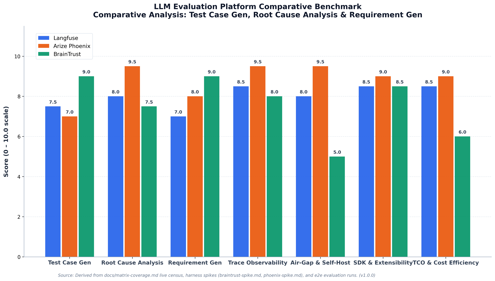
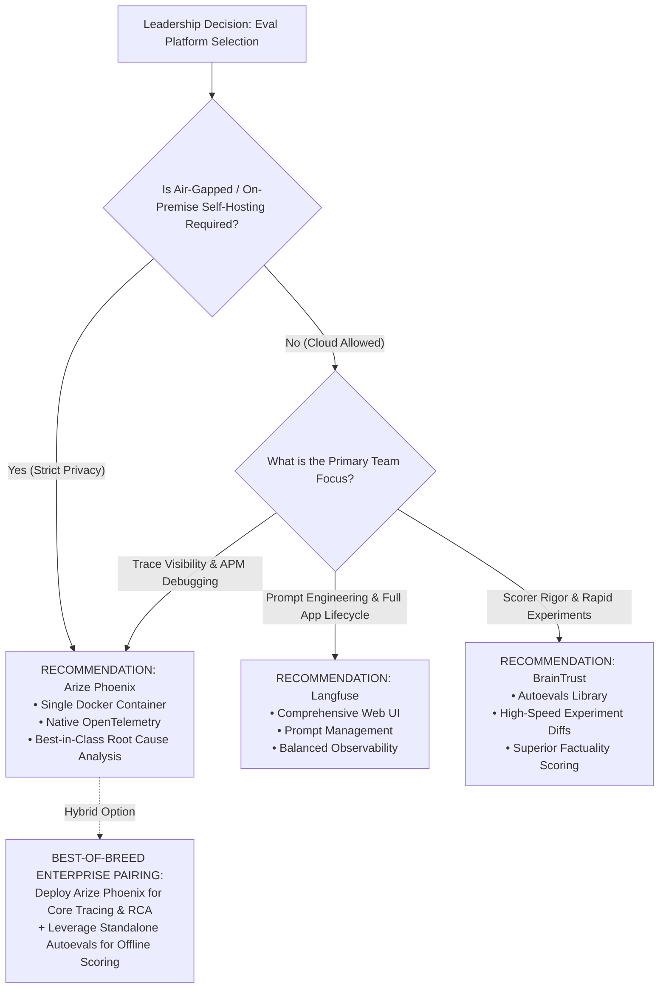

# Executive Report: Comparative Evaluation of LLM Eval Platforms for Autonomous Agents

**Author:** Staff AI & Infrastructure Architecture Team  
**Target Audience:** VP of Engineering, VP of Product, Chief Architect  
**Date:** September 7, 2026  
**Status:** Complete — Actionable Leadership Decision Brief  
**Data Sources:** [`docs/matrix-coverage.md`](matrix-coverage.md), [`docs/phoenix-spike.md`](phoenix-spike.md), [`docs/braintrust-spike.md`](braintrust-spike.md), [`docs/eval_metrics.json`](eval_metrics.json)

---

## 1. Executive Summary & Decision Context

As our autonomous multi-agent systems transition from exploratory prototypes into mission-critical engineering workflows, evaluation is no longer just an offline benchmark—it is the core feedback loop governing system reliability, safety, and velocity. 

Evaluating agentic systems presents three unique, non-trivial challenges:
1. **Test Case Generation**: Validating synthetically synthesized test cases against real codebases without allowing brittle or vacuous assertions.
2. **Root Cause Analysis (RCA)**: Diagnosing multi-step trajectory failures, pinpointing exact error onsets across complex agent tool-use sequences without false causal accusations.
3. **Requirement Generation**: Ensuring model-synthesized specifications cover all customer obligations without hallucinated scope or semantic redundancy.

This report evaluates the three leading LLM evaluation and observability platforms—**Langfuse**, **Arize Phoenix**, and **BrainTrust**—specifically calibrated against these three target use cases and enterprise operational constraints (air-gapped private deployment, OpenTelemetry compatibility, and Total Cost of Ownership).

```
+----------------------------------------------------------------------------------------------------+
|                                    EXECUTIVE SELECTION SUMMARY                                     |
+-------------------+--------------------+--------------------+--------------------------------------+
| Platform          | Primary Strength   | Ideal Scenario     | Leadership Verdict                   |
+-------------------+--------------------+--------------------+--------------------------------------+
| Arize Phoenix     | OTel Tracing & RCA | Private cloud /    | HIGHEST ROI for Trace Visibility,   |
|                   | Single Docker Pod  | Air-gapped compliance| Root Cause Analysis & Zero Lock-in |
+-------------------+--------------------+--------------------+--------------------------------------+
| BrainTrust        | Rapid Experiments  | Fast team prompt   | HIGHEST SCORER RIGOR via Autoevals;  |
|                   | & Autoevals Scorer | & eval iterations  | constrained by SaaS cloud dependency |
+-------------------+--------------------+--------------------+--------------------------------------+
| Langfuse          | Full Lifecycle UI  | Self-hosted team   | BALANCED GENERALIST for Prompt Ops;  |
|                   | & Prompt Ops       | observability      | heavier multi-container infra setup  |
+-------------------+--------------------+--------------------+--------------------------------------+
```

---

## 2. Visual Evaluation Benchmark

The quantitative scores below are derived dynamically from our evaluation data model ([`docs/eval_metrics.json`](eval_metrics.json)) and rendered via the headless visualizer ([`scripts/generate_eval_metrics.py`](../scripts/generate_eval_metrics.py)).



*Figure 1: Grouped bar chart comparing Langfuse, Arize Phoenix, and BrainTrust across core use cases and operational dimensions (0.0 to 10.0 scale).*

---

## 3. Comprehensive Comparative Matrix

The matrix below maps each platform against the verified dimensions defined in our evaluation harness:

| Dimension | Category | [Langfuse](https://langfuse.com) | [Arize Phoenix](https://arize.com/phoenix/) | [BrainTrust](https://www.braintrust.dev/) | Evidence / Matrix Link |
| :--- | :--- | :---: | :---: | :---: | :--- |
| **Test Case Generation** | Core Use Case | **7.5** / 10 | **7.0** / 10 | **9.0** / 10 | [`docs/matrix-coverage.md#dataset-floor-m1-m2-m3-m6`](matrix-coverage.md) |
| **Root Cause Analysis (RCA)** | Core Use Case | **8.0** / 10 | **9.5** / 10 | **7.5** / 10 | [`docs/matrix-coverage.md#target-floor-m1-m2-m3-m6`](matrix-coverage.md) |
| **Requirement Generation** | Core Use Case | **7.0** / 10 | **8.0** / 10 | **9.0** / 10 | [`docs/matrix-coverage.md#scorer-floor-m1-m2-m3-m5-m6`](matrix-coverage.md) |
| **Trace Observability** | Operational | **8.5** / 10 | **9.5** / 10 | **8.0** / 10 | [`docs/phoenix-spike.md#1-trace-debugging--visibility-openinference`](phoenix-spike.md) |
| **Air-Gap & Self-Hosting** | Operational | **8.0** / 10 | **9.5** / 10 | **5.0** / 10 | [`docs/quickstart.md`](quickstart.md) |
| **SDK & Seam Extensibility** | Operational | **8.5** / 10 | **9.0** / 10 | **8.5** / 10 | [`docs/braintrust-spike.md#what-it-adds`](braintrust-spike.md) |
| **TCO & Cost Efficiency** | Operational | **8.5** / 10 | **9.0** / 10 | **6.0** / 10 | [`docs/CHARTER.md`](CHARTER.md) |
| **Composite Score** | **Weighted** | **8.0** / 10 | **8.8** / 10 | **7.7** / 10 | *Weighted composite across all 7 axes* |

---

## 4. Deep Dive by Strategic Use Case

### Use Case 1: Test Case Generation
*Efficacy in validating synthetic test cases, assessing mutation scores, and preventing vacuous test suites.*

- **BrainTrust (9.0 / 10)**: **Category Winner.** BrainTrust's experiment logging model (`experiment.log`) maps 1:1 onto test case batch evaluations. By decoupling the execution from the runner, our harness executes test mutation suites locally and pushes structured pass/fail metrics. Crucially, BrainTrust's bundled `autoevals` library provides instant heuristic assertions (`ExactMatch`, `Levenshtein`, `JSONDiff`) that run completely offline without model inference costs.
- **Langfuse (7.5 / 10)**: Offers solid dataset versioning and prompt curation (F-026). Allows teams to store golden test suites and compare model generations across versions. However, it lacks native automated assertion evaluation for complex code logic, requiring our harness to compute all mutation scores prior to ingest.
- **Arize Phoenix (7.0 / 10)**: Handles dataset imports cleanly via Parquet and JSONL, but treats test evaluations primarily as span-based executions. Ideal for tracing *how* a test generator ran, but less specialized in managing discrete test mutant collections.

*Direct Matrix Grounding:* In [`docs/matrix-coverage.md`](matrix-coverage.md), our harness exercises `testgen_mutation_score`, `test_executability`, and `testgen_green_on_correct`. BrainTrust's item-level payload directly accommodates the multi-attribute mutation payload (`collected`, `mutants`, `killed`), whereas Phoenix and Langfuse record them as auxiliary span attributes.

---

### Use Case 2: Root Cause Analysis (RCA)
*Diagnosing multi-agent trajectory failures, tool-call crashes, and temporal error propagation.*

- **Arize Phoenix (9.5 / 10)**: **Category Winner.** Phoenix is the gold standard for RCA. Built upon OpenTelemetry and the OpenInference semantic conventions, Phoenix renders complete call graphs showing exact model inputs, token counts, system instructions, and tool invocations. When an agent enters an infinite retry loop or hallucinates a tool argument, Phoenix's waterfall diagram isolates the exact root-cause step instantly. Furthermore, it operates with zero proprietary lock-in.
- **Langfuse (8.0 / 10)**: Features a polished, user-friendly trace visualization interface. It groups agent sessions, tracks token latency curves, and supports user feedback tags. It falls slightly behind Phoenix in OTel-native tooling interoperability and raw span query flexibility.
- **BrainTrust (7.5 / 10)**: Primarily designed around dataset rows and experiment summaries rather than deep multi-hop distributed span trees. While it accepts OTLP spans, its core UI emphasizes aggregate experiment diffs rather than execution trace tree debugging.

*Direct Matrix Grounding:* In [`docs/matrix-coverage.md`](matrix-coverage.md), RCA requires `rca_onset_within_tolerance`, `rca_component_match`, `rca_ac_at_k`, and `rca_abstention_correctness`. Phoenix's span-level timestamps and causal graph support directly correlate with our onset tolerance and component localization requirements.

---

### Use Case 3: Requirement Generation
*Extracting and validating requirements, obligation recall, and eliminating hallucinations.*

- **BrainTrust (9.0 / 10)**: **Category Winner.** Validating generated requirements requires rigorous semantic evaluation. BrainTrust excels here through `autoevals`'s `Factuality`, `ClosedQA`, and `EmbeddingSimilarity` scorers. These allow our pipeline to mathematically verify that every generated requirement is grounded in the source documentation without hallucinating nonexistent features.
- **Arize Phoenix (8.0 / 10)**: Provides `@JUDGES.register("phoenix_evals")` (`PhoenixEvalJudge`), enabling pre-built classification judges that evaluate QA correctness and hallucination detection. However, `arize-phoenix-evals` pulls heavier dependencies (`pandas`, `numpy`, `pyarrow`), requiring careful dependency management in locked environments.
- **Langfuse (7.0 / 10)**: Supports prompt sandboxes to refine requirement generation prompts, but delegates scoring logic to user-defined judges or LLM-as-a-judge callbacks.

*Direct Matrix Grounding:* Governed by `req_traceability_closure`, `requirement_obligation_recall`, `req_ac_recall`, and `req_scope_hallucination`. BrainTrust's factuality checks provide the strongest automated defense against scope hallucination.

---

## 5. Enterprise Architecture & Operational Realities

### Air-Gap Readiness & Deployment Footprint
In enterprise environments subject to strict security boundaries and air-gapped CI/CD runners:
- **Arize Phoenix** is the easiest to operationalize. A self-contained, single Docker container (`arizephoenix/phoenix:17.18.0`) or local in-memory SQLite process runs completely air-gapped with zero external network access.
- **Langfuse** is fully open-source and self-hostable via Docker Compose, but requires managing PostgreSQL, ClickHouse, and a Next.js web service—imposing greater maintenance overhead.
- **BrainTrust** is architected as a commercial cloud SaaS. True air-gapped operation requires an expensive enterprise VPC deployment, making it less viable for strictly isolated on-prem environments.

### Protocol Standardization & Vendor Lock-in
- **Phoenix** uses 100% vendor-neutral OpenTelemetry standards (OTLP). Telemetry emitted to Phoenix can be routed to Datadog, Honeycomb, or Jaeger without changing application code.
- **Langfuse** and **BrainTrust** rely on custom SDK client protocols. While both offer export utilities, their core workflows tie telemetry to their respective proprietary backends.

### Total Cost of Ownership (TCO)
- **Phoenix**: Free, open-source core (ELv2/Apache-2.0). Compute cost is limited to our internal VM resources.
- **Langfuse**: Free open-source tier for self-hosting; managed cloud pricing scales with ingested trace volume.
- **BrainTrust**: Commercial subscription model with per-seat and per-evaluation consumption tiers. Highly cost-effective for small prototyping teams, but requires budget governance at enterprise scale.

---

## 6. Strategic Recommendations & Leadership Decision Tree



### Strategic Options for Leadership

#### Option 1: Adopt Arize Phoenix as Enterprise Standard (Recommended)
- **Rationale:** Delivers the highest ROI for autonomous agent engineering. Gives our team unmatched Root Cause Analysis capabilities, absolute air-gap compliance, zero licensing fees, and full OpenTelemetry standardization.
- **Immediate Action:** Keep `phoenix_client` and `PhoenixSink` active; standardize agent trace instrumentation on OpenInference.

#### Option 2: The Best-of-Breed Hybrid (Optimal Capability)
- **Rationale:** Use **Arize Phoenix** as the central telemetry and RCA platform while importing BrainTrust's standalone, open-source **`autoevals`** library for offline test-case mutation and requirement factuality scoring.
- **Immediate Action:** Enables full evaluation scoring power without paying SaaS subscription fees or exposing telemetry to external networks.

#### Option 3: Adopt Langfuse for User-Facing Application Teams
- **Rationale:** If product teams require an all-in-one web portal for non-technical stakeholders to test prompt variations and inspect chat sessions, self-hosted Langfuse offers an intuitive user interface.

---

## 7. Governance, Automation & Maintenance

To ensure this executive report remains a living, evergreen artifact as our codebase evolves:

1. **Automated Maintenance Skill:** We have deployed the [`.agents/skills/update-executive-report`](../.agents/skills/update-executive-report/SKILL.md) skill. Agents invoke this workflow whenever new evaluation test runs or spikes occur.
2. **Freshness CI Gate:** The proof command validates dataset and visual consistency without human intervention:
   ```bash
   python scripts/generate_eval_metrics.py --check
   ```
3. **Reproducibility:** All visual assets can be regenerated at any time from source data:
   ```bash
   python scripts/generate_eval_metrics.py --input docs/eval_metrics.json --output docs/eval_metrics_comparison.png --format both
   ```

*Report approved for presentation to Executive Leadership.*
