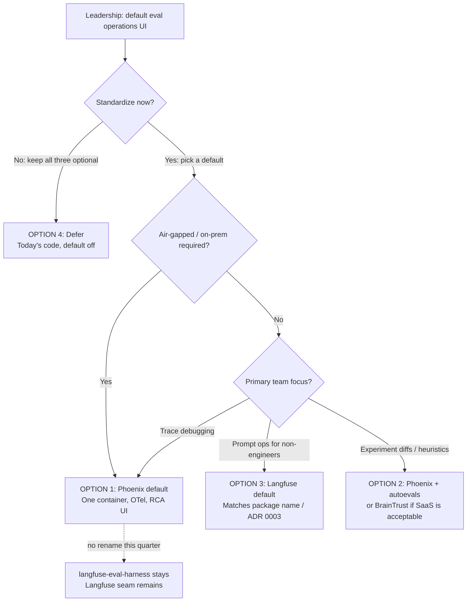

# Executive Report: Comparative Evaluation of LLM Eval Platforms for Autonomous Agents

**Author:** Staff AI & Infrastructure Architecture Team
**Target Audience:** VP of Engineering, VP of Product, Chief Architect
**Date:** September 13, 2026
**Status:** Ready for VP review — expert judgment, not a measured bake-off
**Companion deck:** [`plans/scenario-eval-matrices/VP_DECK.md`](plans/scenario-eval-matrices/VP_DECK.md)
**Data Sources:** [`docs/matrix-coverage.md`](matrix-coverage.md), [`docs/phoenix-spike.md`](phoenix-spike.md), [`docs/braintrust-spike.md`](braintrust-spike.md), [`docs/eval_metrics.json`](eval_metrics.json)

---

## 0. Decision memo (one page)

**Ask this meeting:** Choose a default eval **operations** backend — the UI and telemetry sink humans look at — not which product computes testgen, RCA, or requirements scores. Those scores are produced by **this harness** (F-065 / F-067 / F-068 / F-069) and are vendor-agnostic.

**Category correction.** BrainTrust “9.0 on testgen” means its experiment UX and `autoevals` heuristics fit how we *operate* that workflow. It does **not** mean BrainTrust ran `testgen_mutation_score`. Phoenix “9.5 on RCA” means OpenInference waterfalls, not `rca_ac_at_k`. The 8.8 / 8.0 / 7.6 composites are an unweighted mean of seven expert-assigned dimensions in [`docs/eval_metrics.json`](eval_metrics.json) (`scoring_basis: expert_judgment`). They are not a paired workload run. A later bake-off can reorder 8.8 vs 8.0 without invalidating the air-gap or OpenTelemetry arguments.

**Recommendation (Option 1):** Standardize **Arize Phoenix** as the default tracing / RCA UI (single container, OTel / OpenInference; live workflow already exists: `phoenix-live.yml`). Keep the Langfuse and BrainTrust seams. Do **not** rename `langfuse-eval-harness` this quarter. Do **not** treat this as a CHARTER expansion into a general observability platform ([`docs/CHARTER.md`](CHARTER.md) §3).

| Option | Decision | When it is the right call |
|---|---|---|
| **1 — Phoenix default (recommended)** | Default tracing UI; other seams remain | Air-gap, OTel, RCA debugging |
| **2 — Phoenix + `autoevals`** | Option 1 plus standalone offline heuristics | Testgen / requirements *operation* UX without BrainTrust SaaS |
| **3 — Langfuse default** | Prompt-ops UI for non-engineers | Matches package name and [ADR 0003](decisions/0003-langfuse-integration.md) |
| **4 — Defer** | Keep all three optional, default off | Today’s code; “no default” is a real decision |

**Not this meeting:** Opik displacement ([`experiments/backend-validation/`](../experiments/backend-validation/README.md) — unsigned, Langfuse vs Opik only); merge-gate activation; golden-corpus labeling ([`plans/vp-strategic-deep-dive/DECISIONS.md`](plans/vp-strategic-deep-dive/DECISIONS.md)).

**Not scored:** SSO, RBAC, data residency, support contracts, dollar TCO. Say Phoenix = one container; Langfuse = Compose (Postgres + ClickHouse + web); BrainTrust = seats / evals. Do not invent monthly cost.

**Package-name constraint.** Option 1 is “Phoenix as default UI,” not “drop Langfuse.” ADR 0003 stays first-class; the spike in [`docs/phoenix-spike.md`](phoenix-spike.md) was designed to run *alongside* Langfuse.

---

## 1. Executive summary and decision context

As autonomous multi-agent systems move from prototypes into engineering workflows, evaluation is the feedback loop that governs reliability, safety, and velocity. Three workloads matter here, and the **harness already scores them**:

1. **Test Case Generation (F-065, F-069, [ADR 0043](decisions/0043-testgen-evaluation-seam.md), [ADR 0048](decisions/0048-agent-in-the-loop-testgen.md))** — mutation score, executability, green-on-correct, obligation recall. Thorough 1.000 on the shipped config is the corpus grading its own reference suite (`inputs.suite` pre-supplied). F-069’s pipeline is shipped; the committed Deck B YAML has no `generator_path` — do not quote `pass^k` from that fake.
2. **Root Cause Analysis (F-067, [ADR 0046](decisions/0046-rca-eval-matrix.md))** — ranked diagnosis against a finite candidate set, including correct abstention. Frozen synthetic corpus; advisory gates. Not a live-incident bake-off.
3. **Requirement Generation (F-068, [ADR 0047](decisions/0047-requirements-eval-matrix.md))** — AC recall, scope hallucination, semantic diversity, traceability closure, provenance verification.

This report compares three **operations** platforms — **Langfuse**, **Arize Phoenix**, and **BrainTrust** — on how well their UI, tracing, deploy shape, and scorer *libraries* support operating those workloads, plus air-gap, OpenTelemetry, and TCO shape.

```
+----------------------------------------------------------------------------------------------------+
|                         OPERATIONS-UI SELECTION (expert judgment, not a bake-off)                    |
+-------------------+--------------------+--------------------+--------------------------------------+
| Platform          | Primary strength   | Ideal scenario     | Verdict                              |
+-------------------+--------------------+--------------------+--------------------------------------+
| Arize Phoenix     | OTel tracing UI    | Private cloud /    | Recommended default tracing / RCA UI |
|                   | Single Docker pod  | air-gapped         | Keep other seams                     |
+-------------------+--------------------+--------------------+--------------------------------------+
| BrainTrust        | Experiment diffs & | Fast eval          | Strongest experiment UX; SaaS        |
|                   | autoevals heuristics| iteration         | air-gap is the constraint            |
+-------------------+--------------------+--------------------+--------------------------------------+
| Langfuse          | Prompt-ops UI      | Self-hosted team   | Balanced generalist; heavier Compose |
|                   | Dataset versioning | observability      | Matches package name / ADR 0003      |
+-------------------+--------------------+--------------------+--------------------------------------+
```

---

## 2. Visual evaluation benchmark

Scores are expert-assigned in [`docs/eval_metrics.json`](eval_metrics.json) (`scoring_basis: expert_judgment`) and rendered by [`scripts/generate_eval_metrics.py`](../scripts/generate_eval_metrics.py). They are **not** a head-to-head run of the same workload through all three backends.


*Figure 1: Grouped bar chart comparing Langfuse, Arize Phoenix, and BrainTrust across use-case **operations** fit and operational dimensions (0.0 to 10.0). Caption on the chart: expert judgment from spike reports — not a live bake-off.*

---

## 3. Comparative matrix

Use-case cells score **how well the vendor’s UI/API supports operating that workflow**, not which vendor produces better tests, diagnoses, or requirements. Evidence links are spike/ADR grounding for the *operations* claim, not a measured bake-off.

| Dimension | Category | [Langfuse](https://langfuse.com) | [Arize Phoenix](https://arize.com/phoenix/) | [BrainTrust](https://www.braintrust.dev/) | Evidence |
| :--- | :--- | :---: | :---: | :---: | :--- |
| **Test Case Generation** (ops UX) | Use case | **7.5** / 10 | **7.0** / 10 | **9.0** / 10 | [ADR 0043](decisions/0043-testgen-evaluation-seam.md) |
| **Root Cause Analysis** (trace UX) | Use case | **8.0** / 10 | **9.5** / 10 | **7.5** / 10 | [phoenix-spike — seams](phoenix-spike.md#two-deliberately-separate-seams) |
| **Requirement Generation** (ops UX) | Use case | **7.0** / 10 | **8.0** / 10 | **9.0** / 10 | [braintrust-spike — what it adds](braintrust-spike.md#what-it-adds) |
| **Trace Observability** | Operational | **8.5** / 10 | **9.5** / 10 | **8.0** / 10 | [phoenix-spike — OpenInference](phoenix-spike.md#1-trace-debugging--visibility-openinference) |
| **Air-Gap & Self-Hosting** | Operational | **8.0** / 10 | **9.5** / 10 | **5.0** / 10 | [quickstart](quickstart.md) |
| **SDK & Seam Extensibility** | Operational | **8.5** / 10 | **9.0** / 10 | **8.5** / 10 | [braintrust-spike — what it adds](braintrust-spike.md#what-it-adds) |
| **TCO & Cost Efficiency** | Operational | **8.5** / 10 | **9.0** / 10 | **6.0** / 10 | [phoenix-spike — rollback](phoenix-spike.md#rollback) |
| **Composite** | Unweighted mean | **8.0** / 10 | **8.8** / 10 | **7.6** / 10 | *Langfuse 56.0/7=8.0, Phoenix 61.5/7=8.8, BrainTrust 53.0/7=7.6* |

---

## 4. Deep dive by workload (harness scores vs vendor UX)

### 4.1 Test case generation

*Harness (not the vendor) computes `testgen_mutation_score`, `test_executability`, `testgen_green_on_correct`, and `requirement_obligation_recall` ([ADR 0043](decisions/0043-testgen-evaluation-seam.md)). Re-verified 2026-09-13 at `run.repetitions=1`, **n=60** per slice: thorough 1.000 / 1.000 / 0.000 / 1.000 (corpus homework); weak mutation **0.322** / recall **0.260**; false-alarm rate **0.397**. Do not quote those means as a vendor result.*

- **BrainTrust (9.0 / 10) — operations winner.** `experiment.log` maps 1:1 onto item-level batch evals. Bundled `autoevals` (`ExactMatch`, `Levenshtein`, `JSONDiff`) runs offline. The harness still executes mutants locally and *pushes* scores.
- **Langfuse (7.5 / 10):** Dataset versioning and prompt curation (F-026). No native mutation evaluator; the harness computes mutation before ingest.
- **Arize Phoenix (7.0 / 10):** Parquet / JSONL datasets; treats runs as spans. Strong for tracing *how* a generator ran, weak for mutant collections as first-class rows.

### 4.2 Root cause analysis

*Harness (F-067) scores `rca_onset_within_tolerance`, `rca_component_match`, `rca_ac_at_k`, `rca_false_accusation_rate`, `rca_abstention_correctness` on a synthetic corpus. Advisory gates. Phoenix’s 9.5 is trace-UI fit, not a higher `rca_ac_at_k`.*

- **Arize Phoenix (9.5 / 10) — operations winner.** OpenInference waterfalls: model inputs, tool calls, retries. OTel-native, no proprietary lock-in on the wire.
- **Langfuse (8.0 / 10):** Polished session / latency UI; custom protocol rather than OTLP-first.
- **BrainTrust (7.5 / 10):** Experiment diffs over deep multi-hop span trees. OTLP ingest exists; the product center of gravity is datasets.

### 4.3 Requirement generation

*Harness (F-068) scores `req_ac_recall`, `req_scope_hallucination`, `req_semantic_diversity`, `req_traceability_closure` against gold AC and recorded evidence ([ADR 0047](decisions/0047-requirements-eval-matrix.md)). BrainTrust’s 9.0 is `autoevals` factuality UX, not a higher `req_ac_recall`.*

- **BrainTrust (9.0 / 10) — operations winner.** `Factuality` / `ClosedQA` / `EmbeddingSimilarity` for semantic checks. LLM/embedding autoevals sit *outside* the harness `judge_budget` (see the spike).
- **Arize Phoenix (8.0 / 10):** `PhoenixEvalJudge` (`phoenix_evals`) for classification / hallucination judges. Heavier deps (`pandas`, `numpy`, `pyarrow`); M8-waived in matrix CI until `phoenix-live.yml` dep-resolve is the answer.
- **Langfuse (7.0 / 10):** Prompt sandbox for extraction prompts; scoring stays in the harness or a user judge.

---

## 5. Enterprise architecture and operational realities

### Air-gap and deploy footprint

- **Arize Phoenix:** Single container `arizephoenix/phoenix:17.18.0` or embedded SQLite. Easiest air-gap story.
- **Langfuse:** Self-hostable Compose — Postgres, ClickHouse, Next.js web. More ops surface.
- **BrainTrust:** Cloud-first SaaS (`BRAINTRUST_API_KEY`). Air-gap needs enterprise VPC.

### Protocol and lock-in

- **Phoenix:** OTLP / OpenInference. Spans can fan out to other OTel backends without app changes.
- **Langfuse / BrainTrust:** Native SDKs as the happy path; export exists, core workflow is vendor-shaped.

### TCO (shape, not dollars)

- **Phoenix:** No vendor license for the self-hosted core; cost is our VM.
- **Langfuse:** OSS self-host, or managed cloud priced on trace volume.
- **BrainTrust:** Seats and per-evaluation consumption.

Unscored: SSO, RBAC, residency, support SKUs.

---

## 6. Decision tree and options



#### Option 1: Phoenix as default tracing UI (recommended)

- **Rationale:** Highest ROI for agent debugging: air-gap, OTel, RCA waterfalls, existing `phoenix-live.yml`.
- **Immediate action:** Standardize OpenInference instrumentation; keep `PhoenixSink` available. Do not delete Langfuse / BrainTrust clients.
- **Not implied:** Package rename, CHARTER observability-platform expansion, exclusive vendor.

#### Option 2: Phoenix + standalone `autoevals`

- **Rationale:** Option 1 plus offline heuristic scoring already registered as `@SCORERS.register("autoevals")`. No BrainTrust SaaS required.
- **Immediate action:** Use `autoevals` for heuristic families; keep LLM/embedding autoevals off the default CI path (they bypass `judge_budget`).

#### Option 3: Langfuse as default prompt-ops UI

- **Rationale:** Non-technical prompt iteration, dataset UI, ADR 0003, name alignment.
- **Immediate action:** Keep self-hosted Compose as the default ops target; Phoenix remains available for OTel RCA.

#### Option 4: Defer — keep all three optional

- **Rationale:** Architecture already supports this. Forcing a sunset is extra cost with no CHARTER requirement.
- **Immediate action:** Record “no default this quarter” as the decision so it is not re-litigated as indecision.

---

## 7. Governance, automation, and maintenance

1. **Deck:** Speaker-ready slides and hostile Q&A live in [`plans/scenario-eval-matrices/VP_DECK.md`](plans/scenario-eval-matrices/VP_DECK.md). Measurement-system notes: [`DECK_A_PLUS.md`](plans/scenario-eval-matrices/DECK_A_PLUS.md).
2. **Maintenance skill:** [`.agents/skills/update-executive-report`](../.agents/skills/update-executive-report/SKILL.md).
3. **Freshness:** `python scripts/generate_eval_metrics.py --check`
4. **Regenerate charts:**
   ```bash
   python scripts/generate_eval_metrics.py --input docs/eval_metrics.json --output docs/eval_metrics_comparison.png --format both
   ```

Ready for VP review. Not a bake-off, not an approval stamp, not a CHARTER amendment.
