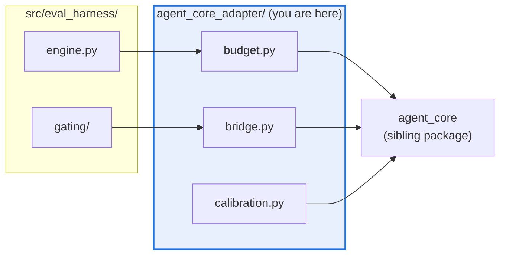

# Per-directory `AGENTS.md` coverage

> Give every directory where an agent makes a decision a short, local, mechanically
> checked `AGENTS.md` — and keep the total instruction budget *smaller* than it is today.

## In scope

- One `AGENTS.md` per **Tier 1** (component) and **Tier 2** (subpackage) directory — 46 files.
- A shared file template with a required **mermaid** diagram and a required **subagent routing** table.
- A mechanical guard (`scripts/check_agents_md.py`) so the set cannot rot silently.
- Trimming the root `AGENTS.md` back under the bloat ceiling by pushing local detail down.
- An amendment to `docs/STYLE.md`, whose `UPPERCASE.md` rule is currently scoped to the repo root
  and therefore does not sanction the files this plan adds.

## Out of scope (explicit non-goals)

- **An `AGENTS.md` in all 384 directories.** Rejected on evidence — see §1. Skills, data, fixture,
  cache, generated and test directories are covered by their parent and are listed in `COVERED_BY_PARENT`
  so their absence is a recorded decision rather than an oversight.
- **Renaming or replacing `README.md`.** READMEs address humans, `AGENTS.md` addresses agents. The
  `docs.yml` component-README gate is untouched.
- **Editing `architecture.mmd` by hand.** Diagrams in this plan are hand-authored *local* views. The
  repo-wide import-edge view stays generated from `architecture.yaml` (§5).
- **Touching `.github/**`.** It is a protected path; the one-line workflow wiring is specified in §7
  for a human to apply under the `eval-change-approved` label.

---

## 1. Why tiered, not universal

The instinct to put a file in every directory is the single most common way these files go wrong.
The evidence, current as of this writing:

| Source | Finding |
|---|---|
| [Configuration Smells in AGENTS.md Files](https://www.alphaxiv.org/abs/2606.15828) (dos Santos et al., 2026) | 91 of 100 popular repos carry at least one configuration smell. Six-smell catalog; **Context Bloat** detected at a **≥200-line** threshold. |
| [Claude Code memory docs](https://code.claude.com/docs/en/memory) | "target under 200 lines per CLAUDE.md file. Longer files consume more context and reduce adherence." |
| ETH Zurich / LogicStar, ICSE 2026 (via [agents-lint](https://github.com/giacomo/agents-lint)) | LLM-generated context files **reduced task success by 2–3% while increasing cost by over 20%**. |
| [AGENTS.md spec](https://github.com/agentsmd/agents.md) | Nested files are supported; **the file nearest the edited code wins**. |

The two findings pull in opposite directions only if every file loads at once. They don't.
Claude Code loads a subdirectory's `AGENTS.md` **lazily** — "when Claude opens a file there with the
Read tool" — so a nested file costs nothing until an agent is actually working in that directory.

That makes nesting the *cure* for bloat, not a cause of it, **provided each file is small and local**.
A file in all 384 directories would instead produce ~336 near-empty files whose only realistic future
is **Init Fossilization** (the paper's fifth smell: config written once and never updated; 24% of
sampled repos). So: nest widely, write briefly, and make the absence of a file a documented decision.

### The tiers

| Tier | Where | Count | Budget | Rule |
|---|---|---|---|---|
| **0** | Repo root | 1 | ≤200 lines, **shared** with any other eagerly-loaded file (§2.1) | Cross-cutting invariants only. Anything true of one directory moves down. |
| **1** | Top-level components | 17 | ≤100 lines | Package contract: what it owns, its gate command, its seams. |
| **2** | Source subpackages | 29 | ≤80 lines | Only what an agent editing *these files* needs and cannot infer. |
| **3** | Skills, data, fixtures, caches, generated output, test trees | ~337 | 0 lines | **Deliberately none.** Each reason recorded in the guard's `COVERED_BY_PARENT`. |

Two directories that looked like Tier 1 are deliberately **not**, and both reasons were found
by building the thing rather than by planning it:

- **`skills/*`** — a skill's `SKILL.md` already *is* its agent contract (preconditions,
  procedure, output contract, failure handling). A second instruction file beside it invites
  the two to disagree, which is the Conflicting Instructions smell. `skills/` gets one Tier 1
  file covering registration and the marketplace; the 19 skills keep `SKILL.md`.
- **`.claude/`** — see §2.1. It is the one directory where a nested `AGENTS.md` is *not* lazy.

---

## 2. Naming: `AGENTS.md`, not `Agent.md`

The requested filename was `Agent.md`. It should be **`AGENTS.md`** — plural, uppercase. Two
independent reasons, and no tool reads the singular form:

1. **The ecosystem spec** is `AGENTS.md`. It is read by 30+ agents and was donated to the Linux
   Foundation's Agentic AI Foundation in December 2025. Claude Code reads `AGENTS.md` natively
   (v2.1.277+); it has no resolution rule for `Agent.md`, so a singular file would be inert.
2. **This repo already says so.** `docs/STYLE.md` reserves `UPPERCASE.md` for standard files and
   names `AGENTS` in that list, and `openspec/AGENTS.md` is the existing nested precedent.

### 2.1 `.claude/AGENTS.md` is eagerly loaded — so it is not a directory doc

The most consequential finding in this work, and one that inverted a planned decision.

Claude Code reads, at session start, "every `AGENTS.md` **and `.claude/AGENTS.md`** in your
working directory and the directories above it." So `.claude/AGENTS.md` is not a lazily-loaded
directory doc like every other nested file — it is a **second root-level instruction file**.

Documenting `.claude/` there would have charged ~80 lines to every session in the repo whether
or not anyone went near the directory, taking the always-loaded total from 246 lines to 259 —
a *regression*, produced by a change whose entire purpose was to reduce it. `.claude/` is
therefore documented in **`.claude/README.md`**, which nothing auto-loads, and the guard
**fails** if a `.claude/AGENTS.md` reappears.

The guard enforces this with `check_eager_budget`, which holds the *sum* of the eagerly-loaded
files to the 200-line ceiling rather than budgeting each one separately. Budgeting them
separately would be self-deception: trimming the root while adding an eager sibling moves
lines around without reducing what a session pays.

### Two further hazards that follow from the loading rules

Both are consequences of Claude Code's documented resolution order, and both are fixed by this plan:

- **`claude-foundation/CLAUDE.md` suppresses the root `AGENTS.md`.** Under the default
  `claude-md-or-agents-md` setting, a `CLAUDE.md` "in your working directory or above it" means
  Claude reads `CLAUDE.md` files *only*. An agent working inside `claude-foundation/` therefore
  gets none of the root instructions today. **Fix:** `claude-foundation/CLAUDE.md` becomes a thin
  file that imports the sibling `AGENTS.md` (`@AGENTS.md`), which is the documented way to keep both.
- **Nothing under `.agents/` is ever read.** The docs are explicit: "Not read: `AGENTS.local.md`,
  `AGENTS.override.md`, or anything under a `.agents/` directory." The repo keeps agent and skill
  definitions there, some byte-identical to `.claude/` copies and some silently diverged
  (`explorer`, `test-runner`). **Fix:** `.agents/AGENTS.md` records that the directory is for
  non-Claude harnesses and names `.claude/` as authoritative for Claude Code.

---

## 3. The file template

Every Tier 1/2 file follows this skeleton. Section order is fixed so the guard can check it and so
an agent can skim to the section it needs.

```markdown
# AGENTS.md — <path/from/repo/root>

> <one-line purpose>

<Two or three sentences: what this directory owns and where its boundary is.>

## Map
| Path | Role |
|---|---|

## Diagram
​```mermaid
flowchart LR
  accTitle: <short title>
  accDescr: <one sentence a screen reader can use>
  ...
​```

## Rules that bite here
- <directory-local constraint an agent would otherwise get wrong>

## Verify
​```bash
<the exact command that proves a change here is good>
​```

## Subagents
| Task in this directory | Agent | Why |
|---|---|---|

## See also
| Doc | Read it when |
|---|---|
```

### What each section exists to prevent

Sections are chosen against the smell catalog, not for symmetry:

| Section | Smell it defeats |
|---|---|
| `See also` carries a **"Read it when"** column | **Blind Reference** — a bare path gets ignored; the agent needs the trigger, not the location. |
| `Rules that bite here` excludes anything ruff/mypy catches | **Lint Leakage** — the most common smell (62%). Style is a linter's job. |
| Tier 2 files hold the task-specific detail | **Skill Leakage** — rarely-needed instructions stay out of always-loaded context. |
| Line budgets, enforced by the guard | **Context Bloat** |
| `Verify` names one runnable command | Makes the file falsifiable; a stale command fails visibly. |

### Authoring rules

- **Local only.** If a statement is true repo-wide it belongs at the root. If it is true of one file
  it belongs in a docstring. `AGENTS.md` is for what is true of *this directory*.
- **No restating the linter.** `ruff==0.15.20` and `mypy==2.1.0` already enforce style. Naming,
  formatting, import order and line length must not appear.
- **Every relative link must resolve.** `docs.yml`'s link job rglobs every `*.md` in the repo.
- **Write the constraint, not the description.** "`from_dict` is strict; unknown keys raise
  `ConfigError`" beats "this module handles configuration".

---

## 4. Mermaid contract

One diagram per file, and it must earn its place: it shows a *relationship* an agent would otherwise
have to reconstruct by reading imports. A picture of the directory listing is not a diagram.

- **Fence:** ` ```mermaid ` — required by `docs/STYLE.md` and by the site's `pymdownx.superfences`.
- **Accessibility:** every diagram declares `accTitle` and `accDescr`. Mermaid's native a11y
  keywords; without them the diagram is opaque to a screen reader.
- **Size:** 5–15 nodes. Larger means the boundary is wrong, not that the diagram needs to be bigger.
- **You-are-here:** the current directory is highlighted via `classDef here` so the reader can orient
  in one glance.
- **Portability:** GitHub's renderer rejects emoji and some extended ASCII inside labels, and
  silently drops hyperlinks and tooltips. Labels stay plain ASCII; `<br/>` is the only markup.
- **Validation:** the guard parses every fence; CI fails on a malformed one.

Validated reference diagram (this is the `agent_core_adapter` seam, the only bridge from
`eval_harness` into `agent-core`):



---

## 5. Relationship to the generated architecture diagram

The repo already has a mermaid pipeline, and this plan must not collide with it.

`architecture.mmd` is **generated** from `architecture.yaml` and is drift-gated two ways: `drift_check.py`
fails on an undeclared import edge, and `mermaid_gen.py --check` fails when the committed `.mmd` is
stale. The root `AGENTS.md` already forbids hand-editing it.

The two kinds of diagram do not overlap and the distinction is stated in every file that carries one:

| | `architecture.mmd` | Per-directory diagrams |
|---|---|---|
| Scope | Repo-wide, C4 Component level | One directory and its immediate neighbours |
| Source | Generated from `architecture.yaml` | Hand-authored |
| Shows | Static Python import edges | Data flow, seams, lifecycle, ownership |
| Gate | `drift_check.py` + `mermaid_gen.py --check` | `check_agents_md.py` (syntax + budget) |

Per-directory diagrams **must not** restate import edges — that is the generated view's job, and a
hand-copy of it would drift. `architecture.yaml` is a protected path and is not touched.

---

## 6. Subagent routing

Every file carries a `## Subagents` table naming which of the repo's agents to reach for *in this
directory*, and why. This is the part the root file cannot do: "use `test-runner` for tests" is
useless, but "use `test-runner` here because this package's suite needs `pip install -e ./agent-core[dev]`
first and the failure signature is buried in 400 lines of hypothesis output" is not.

The repo has three agent locations, and the plan resolves their drift rather than documenting it twice:

| Location | Status after this plan |
|---|---|
| `.claude/agents/` | **Authoritative for Claude Code.** `explorer`, `narrow-critic`, `test-runner`, `merge-gate-auditor`. |
| `claude-foundation/agents/` | Plugin-scoped; lowest precedence. `explorer` and `test-runner` here **differ** from the `.claude/` copies (`model: haiku` vs `inherit`, `maxTurns` 30 vs 5). Documented as intentional plugin defaults in `claude-foundation/agents/AGENTS.md`. |
| `.agents/agents/` | **Never read by Claude Code.** For other harnesses. Recorded in `.agents/AGENTS.md`. |

Routing is written against each agent's real frontmatter — `explorer` is `tools: Read, Grep, Glob`
and `maxTurns: 5`, so routing a job needing `Bash` to it is a guaranteed stall.

---

## 7. The guard — `scripts/check_agents_md.py`

Without a guard this set rots into Init Fossilization within a quarter. The guard is declarative:
one `TIERS` table naming which directories require a file and at what budget.

Checks, all deterministic and offline:

1. **Coverage** — every Tier 1/2 directory has an `AGENTS.md`; no Tier 3 directory has one.
2. **Budget** — line count within tier (200 / 80 / 60). This is the Context Bloat heuristic.
3. **Sections** — the required headings are present and in order.
4. **Mermaid** — every ` ```mermaid ` fence closes, declares `accTitle` and `accDescr`, and holds a
   known diagram type. Non-ASCII in labels is rejected (GitHub renderer).
5. **Links** — every relative markdown link resolves from the file's own directory.
6. **Lint Leakage** — flags the style vocabulary (`snake_case`, `PascalCase`, `line length`,
   `indentation`, `import order`) that ruff already enforces.
7. **Blind Reference** — a `See also` row with a path but an empty "Read it when" cell fails.

Exit codes follow the repo's existing guards: `0` clean, `1` violation, `2` config error.
`--json` for machine use, `--fix-list` to print only the offending paths.

### Placement constraints (these dictated the design)

- `scripts/validations/**` is **protected** → the guard goes at `scripts/check_agents_md.py`.
- `scripts/` carries a **≥85% coverage floor** (F-031) with only `scripts/validations/*` omitted, so
  the guard **must** ship with tests or it drags the floor down and fails CI.
- `tests/**` is **protected** → `tests/test_check_agents_md.py` requires the **`eval-change-approved`**
  label on the PR. This is unavoidable, not a workaround: the alternative is an untested guard.
- `.github/**` is **protected** → this plan does **not** wire the guard into CI. A human adds one step
  to `quality-gates.yml` under the same label:
  ```yaml
  - name: AGENTS.md coverage and budget
    run: python scripts/check_agents_md.py
  ```
  Until then the guard runs only when invoked by hand; `make pre-pr` does not call it,
  because the `Makefile` is protected too. Wiring it into `scripts/verify_tier_a.py`
  (which is NOT protected) is the one route that needs no label -- see the hardening plan.
- `Makefile` is **protected** → the `make agents-md-check` target is specified here, not added.

---

## 8. Root `AGENTS.md` — the trim

The root file is **246 lines**, over the 200-line Context Bloat threshold. It loads on every session
in the repo, so it is the most expensive file here and the one where the tiering pays off.

| Section | Lines | Disposition |
|---|---|---|
| `Root documentation map` | ~30 | Keep — it *is* the cross-cutting index. |
| `Agents, skills, and hooks` | ~26 | **Move down** to `.claude/AGENTS.md`, per-hook detail with it. |
| `Entry points` | ~24 | **Trim** to the four commands used repo-wide; per-package rows move to Tier 1. |
| `Reasoning & Planning Skills` | ~11 | **Move down** to `skills/AGENTS.md`. Classic Skill Leakage: a three-skill research pipeline loaded into every session. |
| `Seams that must stay narrow` | ~22 | **Split** — the invariant stays, the per-seam detail moves to each Tier 2 file. |
| `Windows / cross-platform gotchas` | ~18 | **Move down** to `scripts/AGENTS.md` and `tests/`-adjacent Tier 1. |
| `Non-negotiable constraints` | ~16 | Keep. Genuinely cross-cutting and genuinely load-bearing. |

Target: **≤180 lines**, leaving headroom before the ceiling. Nothing is deleted — every moved
paragraph lands in the directory where it applies, which is where an agent will actually be when
it needs it.

---

## 9. Sequencing

1. `docs/STYLE.md` amendment — sanction per-directory `AGENTS.md` and give it a template row.
   Without this the plan violates the repo's own documented naming rule.
2. `scripts/check_agents_md.py` + `tests/test_check_agents_md.py`.
3. Tier 1 (17 files) → run guard.
4. Tier 2 (48 total) → run guard.
5. Root trim + `claude-foundation/CLAUDE.md` import fix + `.agents/AGENTS.md`.
6. `make pre-pr`, then PR with the `eval-change-approved` label requested.

## 10. Commands

```bash
# The new guard
python scripts/check_agents_md.py                 # 0 clean / 1 violation / 2 config error
python scripts/check_agents_md.py --json          # machine-readable findings

# Existing gates this change must not break
python scripts/verify_tier_a.py                   # 11 mechanical gates, <60s
python scripts/check_charter_drift.py             # charter links still resolve
make check-all                                    # root + all five sibling packages
make pre-pr                                       # the full local mirror of CI
```

## 11. Risks

| Risk | Mitigation |
|---|---|
| 48 files drift out of date — Init Fossilization at scale | The guard's coverage + link + budget checks fail on the drift that matters. Diagrams stay small enough to re-read. |
| Adding `**/*.md` files fires the whole `docs.yml` workflow | Expected. The advisory link job will go red on any unresolved relative link, which is the signal we want. |
| Per-directory diagrams drift from `architecture.mmd` | They describe different things by construction (§5), and must not restate import edges. |
| Guard needs the `eval-change-approved` label | Flagged on the PR. The label is required because `tests/**` is protected — shipping the guard untested to dodge it would be worse. |
| Tier 2 files become a dumping ground | Hard 60-line budget, mechanically enforced. |

## Links

- [`docs/STYLE.md`](../../STYLE.md) — documentation taxonomy this plan amends
- [`docs/CHARTER.md`](../../CHARTER.md) — §3 scope, §4 invariants
- [`AGENTS.md`](../../../AGENTS.md) — the root file this plan trims
- [`architecture.yaml`](../../../architecture.yaml) — generated-diagram manifest (protected; untouched)
