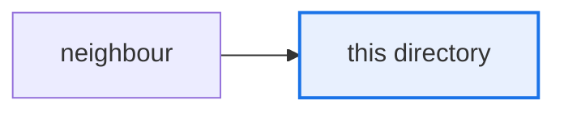

# `AGENTS.md` authoring template

The skeleton every per-directory `AGENTS.md` follows. Enforced by
`python scripts/check_agents_md.py`; run it before you call a file done.

## Skeleton

Section headings must appear **exactly** as written and **in this order**.

````markdown
# AGENTS.md — <path/from/repo/root>

> <one-line purpose, under 100 characters>

<Two or three sentences: what this directory owns, and where its boundary is.>

## Map

| Path | Role |
|---|---|
| `file.py` | <what it is for> |

## Diagram



## Rules that bite here

- **<the constraint>.** <why, and what breaks if ignored>

## Verify

```bash
<the one command that proves a change here is good>
```

## Subagents

| Task in this directory | Agent | Why |
|---|---|---|
| <concrete task> | `explorer` | <why this agent, given its real tool set> |

## See also

| Doc | Read it when |
|---|---|
| [`relative/path.md`](relative/path.md) | <the trigger that should send an agent there> |
````

## Budgets

| Tier | Ceiling |
|---|---|
| Repo root | 200 lines |
| Top-level component | 100 lines |
| Source subpackage | 80 lines |

## Hard rules

1. **Local only.** True repo-wide → it belongs at the root. True of one function → it belongs
   in a docstring. This file is for what is true of *this directory*.
2. **Never restate a linter.** `ruff` and `mypy` are pinned and enforce style already. The
   guard rejects the words `snake_case`, `PascalCase`, `camelCase`, `indentation`,
   `import order`, `line-length` and `trailing whitespace` outright.
3. **Every relative link must resolve** from this file's own directory. Verify the filename
   exists before writing it — guessing ADR numbers is the most common failure.
4. **Every "See also" row needs a trigger**, not just a path. A bare path gets ignored by the
   agent reading it; the "Read it when" cell is the load-bearing half.
5. **One mermaid diagram**, with `accTitle` and `accDescr`, 5–15 nodes, ASCII only (GitHub's
   renderer breaks on emoji and extended characters). Highlight the current directory with
   `classDef here`. `<br/>` is the only markup allowed inside a label.
6. **Do not restate import edges.** The repo-wide import graph is generated into
   `architecture.mmd` from `architecture.yaml` and is drift-gated. A hand-copy would drift.
   Diagrams here show data flow, seams, lifecycle or ownership instead.
7. **`Verify` names one runnable command** that actually exists in this repo — a real `make`
   target, a real script path, or a real `pytest` invocation.

## Agent roster for the `Subagents` table

Route against each agent's real capability. `explorer` has no `Bash`, so never route a job
that must run something to it.

| Agent | Tools | Turns | Good for |
|---|---|---|---|
| `explorer` | `Read, Grep, Glob` | 5 | Locating a symbol, seam or convention. Read-only. |
| `test-runner` | `Bash, Read, Grep, Glob` | 8 | Running a suite or gate and isolating the failure signature. |
| `narrow-critic` | `Read, Grep, Glob` | 5 | Reviewing a finished diff for security and style a linter cannot catch. |
| `merge-gate-auditor` | — | — | Merge-gate audit records only. Rarely the right answer. |

## Worked example

[`src/eval_harness/agent_core_adapter/AGENTS.md`](../../../src/eval_harness/agent_core_adapter/AGENTS.md)
is the reference instance. Match its density and its level of specificity.
