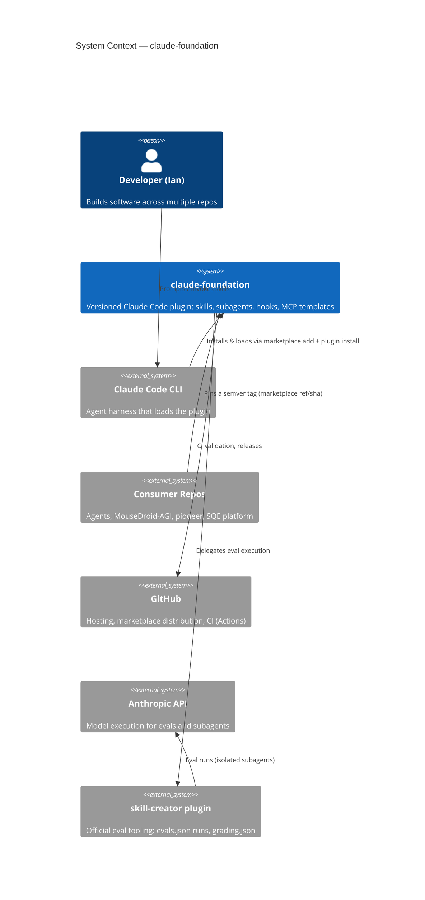
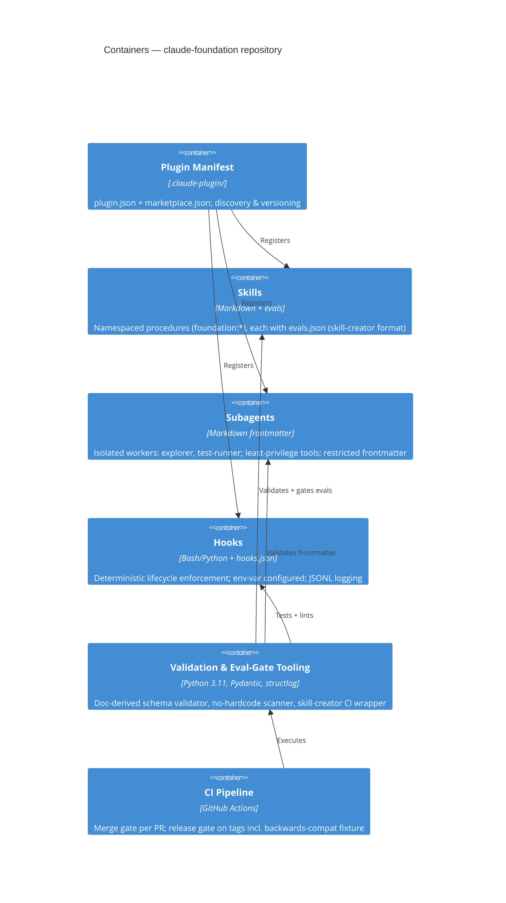
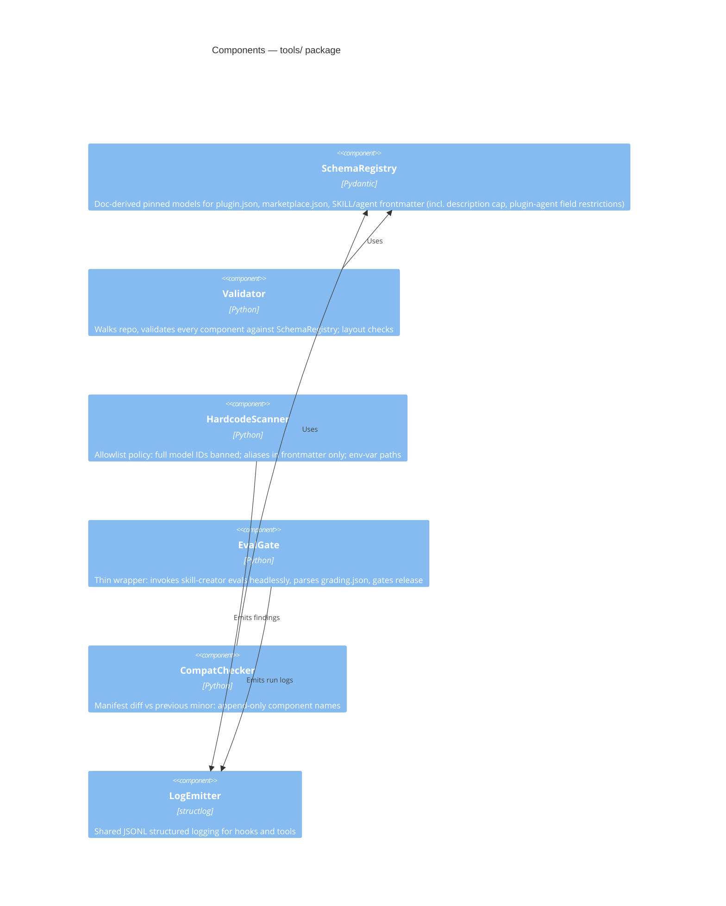

# Plan (Revised): `claude-foundation` — Reusable Claude Code Plugin Repository

> Instantiation of the Agentic Coding System Prompt Template (constraint-programming style).
> Deliverable: an independent GitHub repository, packaged as a **Claude Code plugin + self-hosted marketplace**, consumable by all other projects (`Agents`, `MouseDroid-AGI`, `piodeer`, SQE platform) via marketplace-add + install.
>
> **Revision note:** this version incorporates all findings from the peer review in [REVIEW.md](REVIEW.md) (F1–F7, m1–m6). Pinned doc references are in [sources.md](sources.md).

---

## SECTION 1: OBJECTIVE FUNCTION

### 1.1 System Intent

```
I am building: a versioned Claude Code plugin repository ("claude-foundation") that
packages reusable subagents, skills, hooks, and MCP configuration — with a full
validation/eval test suite — installable into any of my other repositories.
```

### 1.2 Success Criteria (Mechanically Verifiable)

Criteria are split into **merge-blocking** (deterministic, run per PR) and **release-blocking** (behavioral/costly, must pass before a version tag is cut). *(Review F1, F3, F5, F6.)*

```
MERGE-BLOCKING — this succeeds when:
- [ ] `claude plugin validate .` passes (official manifest/structure checker)
- [ ] Install smoke test passes in CI: `claude plugin marketplace add` (this repo) +
      `claude plugin install foundation@<marketplace>` into a fresh temp consumer repo,
      then one namespaced skill invoked headlessly; fast path per-PR uses
      `claude --plugin-dir .` session loading
- [ ] All SKILL.md / agent .md frontmatter passes schema validation (CI job:
      validate-frontmatter); schemas are hand-derived from official docs, pinned,
      and provenance-stamped in /docs/sources.md (no official schemas are published)
- [ ] Every hook script passes unit tests + shellcheck/ruff with zero findings
- [ ] Zero hardcoded values, per the allowlist policy in §2.1: full model IDs banned
      everywhere; model aliases permitted only in frontmatter `model:` fields; paths
      only via ${CLAUDE_PLUGIN_ROOT}/${CLAUDE_PLUGIN_DATA}/${CLAUDE_PROJECT_DIR}; no
      literal secrets/endpoints
- [ ] Structured JSONL logs are emitted by every hook when CLAUDE_FOUNDATION_LOG_DIR is set

RELEASE-BLOCKING — a version tag may be cut only when, additionally:
- [ ] Every skill has evals/evals.json (skill-creator format) with ≥3 test cases;
      the eval wrapper reports 100% assertion pass on the release candidate
- [ ] Backwards-compat job: the release candidate installs into a consumer fixture
      written against the PREVIOUS minor's public surface (component names, invocation
      namespaces, hook contracts) and that fixture's smoke test passes; a manifest
      diff confirms no released component name disappeared within the major version
```

### 1.3 Problem Description (Three Paragraphs)

```
Paragraph 1 — Problem & coordination logic:
Claude Code extension components (skills, subagents, hooks, MCP config) are about to
be needed across multiple repos; without a shared source of truth they will be
copy-pasted and drift. This repo establishes that single source of truth BEFORE the
duplication spreads: a plugin that namespaces its components (foundation:plan,
foundation:code-review, etc.) so consumer repos get identical behavior without
copy-paste. (The Agents repo already demonstrates the drift failure mode and a
counter-measure intra-repo: its vendored validate_skill.py + drift-guard CI, ADR 0009 —
prior art this repo supersedes for the cross-repo case.) The coordination logic is
Claude Code's own extension layering: skills define procedures, subagents isolate
heavy work, hooks enforce non-negotiables deterministically, plugin packaging
distributes all of it.

Paragraph 2 — Data flows & state:
Install flow: consumer repo → marketplace.json → plugin.json → component discovery.
Runtime flow: main session → skill invocation (in-context) or subagent fork (isolated
context) → summary back to main session; hooks intercept lifecycle events and read
config exclusively from environment variables and settings.json (never literals).
Persistent state: eval results (grading.json per skill), hook logs (JSONL), and
CLAUDE.md decision records. Versioned state: semver git tags; consumers pin a tag
via the marketplace entry's ref/sha fields.

Paragraph 3 — Failure modes & invariants:
Failure modes: frontmatter drift breaking auto-invocation; skill description budget
overflow (description + when_to_use > 1,536 chars); hook script errors silently
blocking tool use; breaking renames of namespaced skills; eval rot (skills changed,
evals not updated). Invariants:
(1) every released component validates against schema; (2) public component names
are append-only within a major version — renames/removals require a major bump;
(3) hooks fail open for advisory checks and fail closed only for security checks
    (fail-closed = exit 2 + stderr, or JSON hookSpecificOutput.permissionDecision: "deny");
(4) no component contains environment-specific literals.
```

---

## SECTION 2: FEASIBLE REGION (Constraints)

### 2.1 Hard Constraints (Violations = Failure)

```
- Runtime: Claude Code CLI (current stable); hook/tooling scripts in Python 3.11+ and/or Bash
  (note: Agents consumer CI matrix is 3.10–3.12 — relevant only if tooling is ever vendored)
- Plugin identity: plugin.json `name` = "foundation". The plugin name — not the repository
  name "claude-foundation" — sets the component namespace (foundation:*) and the install
  reference (`claude plugin install foundation@<marketplace>`)
- Structure: valid Claude Code plugin layout —
    .claude-plugin/plugin.json          (manifest; .claude-plugin/ holds ONLY the manifest
    .claude-plugin/marketplace.json      and, for this marketplace repo, marketplace.json)
    skills/<name>/SKILL.md              (at plugin ROOT, not under .claude-plugin/;
                                         + optional supporting files, evals/evals.json)
    agents/<name>.md                    (subagent definitions with frontmatter; plugin-shipped
                                         agents use ONLY name/description/tools/model/effort/
                                         maxTurns — hooks/mcpServers/permissionMode are ignored
                                         by the harness for plugin agents)
    hooks/hooks.json + hook scripts     (documented conventional location)
    .mcp.json                           (plugin root; MCP server definitions, env-var driven)
  Validator enforces this layout; `claude plugin validate` is CI job #0
- Skill description budget: description + when_to_use combined ≤ 1,536 characters
  (validator-enforced, not advisory)
- No hardcoded values — explicit scanner policy:
    * full model IDs (e.g. claude-*-<version> patterns): banned everywhere
    * model aliases (haiku/sonnet/opus/inherit): permitted ONLY in frontmatter `model:` fields
    * paths: only via ${CLAUDE_PLUGIN_ROOT} / ${CLAUDE_PLUGIN_DATA} / ${CLAUDE_PROJECT_DIR}
    * secrets/endpoints: env vars only
- Security: hooks never read .env files; no secrets in repo; shellcheck clean; input validation
  on every hook script argument
- Compatibility: semver tags; namespaced components (foundation:*); consumers pin versions
  via marketplace ref/sha
- Testing: deterministic checks (pytest for Python, bats for Bash, schema validation,
  `claude plugin validate`, install smoke) required before merge; behavioral skill evals
  required before release tags (see §1.2 split)
```

### 2.2 Soft Constraints (Preferences)

```
- Python: Pydantic models for all config parsing; structlog for logging; asyncio where
  I/O-bound; full type hints; ruff + mypy strict
- Skills: concise SKILL.md bodies (loaded content is a recurring token cost); progressive
  disclosure via supporting files; description field written for trigger accuracy
- Subagents: cheapest adequate model per agent via frontmatter alias (e.g., haiku for
  read-only explorers); minimal allowed-tools per agent (least privilege)
- Docs: C4 diagrams as Mermaid in /docs/architecture (renderable on GitHub)
- Coverage: >80% on hook scripts and CI-wrapper core logic
```

### 2.3 Anti-Constraints (Explicit Freedoms)

```
You ARE permitted to:
- Choose the initial component set and names (proposed baseline below, not binding)
- Add PyPI/npm dev-dependencies for validation and testing
- Restructure /tools and /docs layout
- Write additional skills discovered to be useful during dogfooding
- Decide bats vs. pytest-subprocess for Bash hook testing
- Hand-derive pinned JSON Schemas from official docs (none are officially published;
  record derivation date + doc snapshot in /docs/sources.md)
```

**Proposed baseline component set** (v1.0 scope — deliberately small):

| Type | Name | Purpose |
|---|---|---|
| Skill | `foundation:plan` | Instantiates the constraint-programming template for a new task |
| Skill | `foundation:code-review` | Security + quality review checklist, runs in forked subagent |
| Skill | `foundation:test-first` | Enforces write-tests-before-implementation workflow |
| Skill | `foundation:c4-docs` | Generates/updates C4 Mermaid diagrams for the host repo |
| Subagent | `explorer` | Read-only codebase scanner, cheap model alias, Read/Grep only |
| Subagent | `test-runner` | Runs verification loop in isolation, returns summary |
| Hook | `pre-tool-guard` | PreToolUse: blocks .env reads, out-of-scope writes — fail closed via exit 2 + stderr or JSON `hookSpecificOutput.permissionDecision: "deny"` |
| Hook | `post-edit-verify` | PostToolUse: lint/typecheck touched files (fail open: exit 0, findings as `additionalContext`; logs) |
| Hook | `session-logger` | Structured JSONL audit log of tool calls when enabled |
| MCP | (template only) | .mcp.json.example with env-var placeholders, no live servers |

---

## SECTION 3: PERMISSION ARCHITECTURE

### 3.1 Scope

```
IN SCOPE:
- Entire new repository (greenfield)
- /skills, /agents, /hooks, /tools (validation + eval CI wrapper), /docs, /tests,
  .claude-plugin/, .github/workflows/, CLAUDE.md

OUT OF SCOPE:
- Any consumer repository (Agents, MouseDroid-AGI, etc.) — integration is a separate task
  (and for Agents specifically requires the reconciliation ADR in M7)
- Live MCP server credentials or endpoints
- Publishing to any third-party marketplace
```

### 3.2 Autonomy Level

```
AUTONOMOUS:
- File creation, test writing, dependency installation, running verification
- Component naming within the foundation: namespace
- Refactoring for consistency

CONFIRM FIRST:
- Any deviation from the plugin layout in §2.1
- Adding a component type not in the baseline table (e.g., Agent Teams config)
- Any hook that fails closed (blocks tool use) beyond pre-tool-guard
- Dropping any success criterion from §1.2
- Building a custom eval runner instead of the skill-creator integration (see M5) —
  permitted only if skill-creator proves non-scriptable in CI, recorded as an ADR

PROHIBITED:
- Hardcoded paths, secrets, full model IDs, or endpoints anywhere outside config/env
  (per §2.1 scanner policy)
- Skills or hooks that call external APIs with side effects during tests
- Commits directly to main (PR + green CI required)
```

### 3.3 Resource Budget

```
- Max iterations on a failing check before reporting analysis: 3
- Max files modified per pass: 25 — applies AFTER the M0 walking skeleton;
  scaffolding milestones (M0–M1) are exempt
- Research time-box: 15 min against official Claude Code docs
  (code.claude.com/docs — skills, subagents, hooks, plugins references) before asking
```

---

## SECTION 4: FEEDBACK LOOP SPECIFICATION

### 4.1 Verification Commands

```
MERGE GATE (per PR):
0. claude plugin validate .            # official manifest/structure checker
1. ruff check tools/ tests/ && ruff format --check tools/ tests/
2. mypy --strict tools/
3. shellcheck hooks/**/*.sh
4. python -m tools.validate            # frontmatter (incl. 1,536-char description cap,
                                       # plugin-agent frontmatter restrictions) +
                                       # plugin.json/marketplace.json vs pinned doc-derived schemas
5. python -m tools.no_hardcode_scan    # per §2.1 allowlist policy
6. pytest tests/ -v && bats tests/hooks/  # hook unit tests, validator tests, wrapper tests
7. bash tests/smoke/install_smoke.sh   # fast path: `claude --plugin-dir .` + invoke one skill;
                                       # full path (also in release gate): marketplace add +
                                       # plugin install into a temp consumer repo

RELEASE GATE (before tagging; also nightly):
8. python -m tools.eval_gate --all     # thin wrapper: run skill-creator evals headlessly,
                                       # gate on grading.json — 100% assertion pass required
9. bash tests/compat/backcompat.sh     # install candidate into previous-minor consumer fixture;
                                       # manifest diff: no component name removed within major
```

### 4.2 Error Handling Protocol

```
ON LINT/TYPE FAILURE     → fix, re-run
ON SCHEMA FAILURE        → fix the component, never loosen the schema without CONFIRM FIRST
ON HOOK TEST FAILURE     → fix script; if the test encodes wrong behavior, fix test with rationale
ON EVAL FAILURE          → determine whether skill regressed or eval is stale; update the one
                           that is wrong; record decision in CLAUDE.md
ON SMOKE TEST FAILURE    → treat as release-blocking; never skip
ON SAME ERROR 3x         → stop, report root-cause analysis, request guidance
```

### 4.3 Success Verification

```
Before reporting completion:
1. All merge-gate commands pass locally and in CI; release-gate commands pass on the candidate
2. Manual smoke: install into a scratch repo via marketplace add + plugin install,
   invoke foundation:plan and foundation:code-review
3. Backwards-compat job passes against the previous-minor fixture (from v1.1 onward)
4. Summary of changes + updated CHANGELOG.md (Keep a Changelog format, semver)
```

---

## SECTION 5: CONTEXT PERSISTENCE

### 5.1 CLAUDE.md (repo root)

```
# CLAUDE.md
## Build/Test Commands
- make validate / make test / make evals / make smoke  (thin wrappers over §4.1)
## Architecture Decisions
- [date]: Packaged as plugin + self-hosted marketplace, not a copy-template: [rationale]
- [date]: Hooks fail-open vs fail-closed policy: [rationale]
- [date]: skill-creator eval integration vs custom runner: [outcome + rationale]
## Known Issues
- [issue]: [workaround]
## Compatibility Contract
- Component names are append-only within a major version
```

### 5.2 Preserve Across Sessions
- Working install/test commands; schema derivation provenance (doc snapshot dates); eval grading history; ADRs (one file per decision in /docs/adr)

### 5.3 Re-derivable
- File tree, dependency versions (lockfiles), current eval pass/fail (re-run)

---

## SECTION 6: EXECUTION PROTOCOL

### 6.1 Initial Actions
```
1. Read CLAUDE.md if present
2. Fetch and pin current official references: skills frontmatter spec, plugin.json field
   reference, hooks event list, subagent frontmatter (record versions/dates in
   /docs/sources.md) — seed from the sources.md accompanying this plan
3. Scaffold plugin layout; commit empty-but-valid manifest first (walking skeleton);
   `claude plugin validate .` green before anything else
4. Establish CI baseline: validation jobs green on the skeleton before any components exist
```

### 6.2 Implementation Order (milestones)
```
M0  Walking skeleton: plugin.json + marketplace.json + `claude plugin validate` green in CI
    + install smoke test (--plugin-dir fast path)
M1  Tooling: doc-derived schema validator, no-hardcode scanner (allowlist policy),
    structured logging lib for hooks
M2  Hooks: pre-tool-guard, post-edit-verify, session-logger — each with unit tests first;
    blocking mechanics per §2.1 baseline table
M3  Subagents: explorer, test-runner — least-privilege tool lists, model alias via
    frontmatter, restricted frontmatter fields only (plugin-agent limitations)
M4  Skills: plan, code-review, test-first, c4-docs — each shipped WITH its evals.json
    (skill-creator format, ≥3 cases)
M5  Eval integration: install skill-creator; build thin CI wrapper (headless run +
    grading.json gate) — NOT a custom eval framework. Fallback to custom runner only
    if skill-creator is non-scriptable in CI; ADR either way
M6  Docs: C4 diagrams, README quickstart, ADRs; CHANGELOG; release gate green; tag v1.0.0
M7  Dogfood: install into ianshank/Agents as first consumer. PRE-REQUISITE ADR —
    reconcile with Agents' existing custom skill system (skills/marketplace.yaml,
    validate_skill.py, drift-guard CI, ADR 0009). Recommended resolution: Agents keeps
    its 4 domain skills (application code, 95% coverage gates) in its own format;
    foundation supplies only the generic layer (plan/code-review/test-first/c4-docs,
    explorer/test-runner, hook guards). File issues; patch release.
```

### 6.3 Completion Checklist
```
□ All §1.2 merge-blocking criteria enforced per-PR in CI; release-blocking criteria
  enforced on tags (not just passing once)
□ v1.0.0 tagged; consumer install verified in Agents repo (post-reconciliation-ADR)
□ CLAUDE.md + ADRs current
□ Known limitations documented (e.g., eval gate requires API access + credits;
  hooks OS assumptions; behavioral evals are non-deterministic → release gate only)
```

---

## C4 ARCHITECTURE

### Level 1 — System Context



### Level 2 — Containers



### Level 3 — Components (Validation & Eval-Gate Tooling)



### Level 4 — Code (contract sketch, EvalGate)

```python
class GradingReader(Protocol):
    def read(self, skill: SkillRef) -> GradeReport: ...   # parses grading.json

class EvalInvoker(Protocol):
    async def run(self, skill: SkillRef) -> None: ...     # headless skill-creator invocation

class EvalGate:
    def __init__(self, invoker: EvalInvoker, reader: GradingReader, log: BoundLogger): ...
    async def gate_all(self, skills: Iterable[SkillRef]) -> Summary: ...  # nonzero exit on any fail
```

---

## USAGE NOTE (deviations from the source template, with rationale)

1. **"Use all subagents/skills/tools" was rewritten as a layering rule, not a mandate.** Each primitive is used only where it is the correct layer (skills = procedures, subagents = isolation, hooks = enforcement). Mandating "all" violates the template's own Usage Note 1.
2. **Packaging decision made explicit.** "Independent repo my other projects can use" is implemented as plugin + self-hosted marketplace, because that is the distribution mechanism Claude Code provides for exactly this; copy-template repos drift.
3. **"Full test suite" defined concretely** for a mostly-markdown repo: schema validation, static scanning, hook unit tests, and behavioral evals per skill — with the deterministic subset gating merges and the behavioral subset gating releases. "It has tests" is not verifiable; §4.1's command list is.
4. **(New in revision) Build vs. buy resolved toward buy for evals.** The official skill-creator plugin already implements the eval convention; this repo wraps it rather than reimplementing it (REVIEW.md F2).
