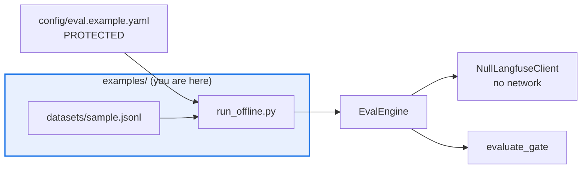

# AGENTS.md — examples

> One runnable offline snippet. It has no README on purpose, and no gate watching it.

The smallest complete use of the harness as a library: load a config, run the engine
against a null client, evaluate the gate. It exists to be copied into a user's own script,
so it must stay short, offline and dependency-free. Nothing here ships, and nothing here is
imported by the package.

## Map

| Path | Role |
|---|---|
| `run_offline.py` | The whole example: `load_config`, `EvalEngine.from_config`, `evaluate_gate` |
| `datasets/sample.jsonl` | The minimal dataset, and the precedent for harness-loadable data outside a package |

## Diagram



## Rules that bite here

- **The absence of a `README.md` is a decision.** `examples` sits in the documented exempt
  set of the component-README job in `.github/workflows/docs.yml`, with the reason
  "runnable snippets, documented from the root README". Nothing is failing; do not add one
  to quiet a gate that is not firing.
- **This example reads a protected file it cannot protect.** `run_offline.py` loads
  `../config/eval.example.yaml`. That config is in the protected set and this directory is
  not, so a reviewed change there can break this example and no reviewer is obliged to
  notice. Run it after any change to that config.
- **It must stay offline and import-clean.** `NullLangfuseClient` is the point: no SDK, no
  credential, no network. An example that needs a key is not an example.
- **Keep it one file.** The value here is that a reader sees the whole flow at once. New
  surface belongs in a test or in `../demo/`, which already has an orchestrated script.

## Verify

```bash
python examples/run_offline.py
```

## Subagents

| Task in this directory | Agent | Why |
|---|---|---|
| Check whether a renamed public symbol is still used here | `explorer` | Read-only; this file is outside the suite so a rename breaks it silently |
| Run the example after a config or engine change | `test-runner` | Has `Bash`; no gate runs this, so someone has to invoke it deliberately |
| Review an added dependency before it lands | `narrow-critic` | An import that needs a credential turns the example into a live call |

## See also

| Doc | Read it when |
|---|---|
| [`../config/README.md`](../config/README.md) | You need to know what `eval.example.yaml` declares before changing it |
| [`../config/AGENTS.md`](../config/AGENTS.md) | You are editing the config this example loads and need the approval obligation |
| [`../demo/AGENTS.md`](../demo/AGENTS.md) | You want an orchestrated multi-beat walkthrough rather than one snippet |
| [`../corpora/README.md`](../corpora/README.md) | You are adding data and need the versioned, manifested form of this precedent |
| [`../src/eval_harness/README.md`](../src/eval_harness/README.md) | You need the library surface this example is demonstrating |
