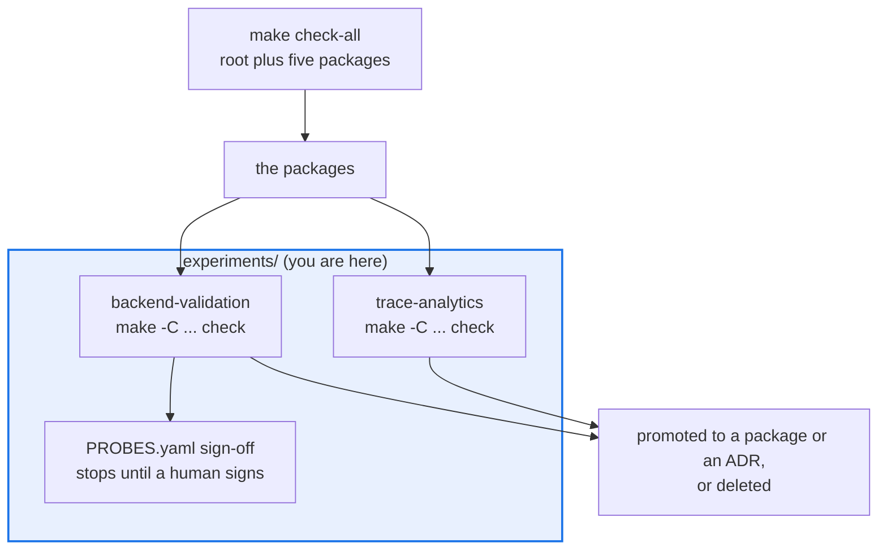

# AGENTS.md — experiments

> Temporary subtrees outside the main quality bar. Each owns its gate; none is in `check-all`.

An experiment consumes the monorepo's packages to answer one empirical question, then gets
promoted or deleted. [`README.md`](README.md) states the policy and how to add one. This
file is what an agent needs when working *inside* an experiment: what isolation means here,
and which gate actually runs.

## Map

| Path | Role |
|---|---|
| `backend-validation/` | Claimed-versus-observed evidence for the eval-backend decision; own `pyproject.toml`, own gate, ships unsigned |
| `backend-validation/PROBES.yaml`, `RUBRIC.md` | Live probes, gated behind an explicit human sign-off that stops the phase chain |
| `trace-analytics/` | Offline SQL sketches over fixture JSONL using the standard library only |
| `trace-analytics/expected.json` | The golden file `check_offline.py --update` rewrites |

## Diagram



## Rules that bite here

- **Nothing here is in `make check-all`.** The root gate will stay green while an experiment
  is broken, so run the experiment's own gate yourself. That isolation is the point, not an
  oversight.
- **The dependency arrow points one way.** An experiment may depend on the harness and the
  packages; the root and the packages must never depend on an experiment. An experiment that
  something imports is a package, and should be promoted rather than imported.
- **Zero writes outside the subtree.** `backend-validation` has a PR-scoped isolation check
  for exactly this, and `trace-analytics` states it as an invariant.
- **`trace-analytics` deliberately has no `pyproject.toml`.** A manifest there would pull in
  dependency and coverage obligations the experiment does not have. Do not add one to make
  tooling happy.
- **Keep `README.md`'s experiment table in sync.** Both `backend-validation` and
  `trace-analytics` must appear there when present on disk; add a row when you introduce
  an experiment rather than leaving the index to drift.
- **Live probes are sign-off gated.** `backend-validation`'s preflight phase stops with a
  distinct exit code until a human sign-off file exists. Do not route around it.

## Verify

```bash
make -C experiments/trace-analytics check
make -C experiments/backend-validation check
```

## Subagents

| Task in this directory | Agent | Why |
|---|---|---|
| Confirm nothing in the packages imports an experiment | `explorer` | Read-only `Grep`; the one-way dependency rule has no CI check at the root |
| Run one experiment's own gate and isolate the failure | `test-runner` | Has `Bash`; each experiment has a different `make check` and its own floor |
| Review an experiment before promoting it into a package | `narrow-critic` | Promotion imports unsigned code into the protected quality bar |

## See also

| Doc | Read it when |
|---|---|
| [`README.md`](README.md) | You are adding an experiment and need the policy and the exit criteria |
| [`backend-validation/README.md`](backend-validation/README.md) | You are running the backend validation phases or its sign-off chain |
| [`trace-analytics/README.md`](trace-analytics/README.md) | You are touching the SQL sketches or regenerating the golden file |
| [`../docs/CHARTER.md`](../docs/CHARTER.md) | An experiment is edging toward a declared non-goal and needs escalation |
| [`../docs/AGENTS.md`](../docs/AGENTS.md) | The experiment has served its purpose and its result belongs in an ADR |
