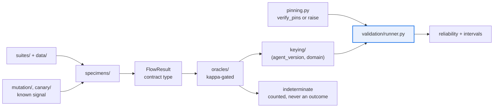

# AGENTS.md — flow-corpus

> The calibration population. Synthetic, deterministic, and firewalled from the harness by design.

This directory owns the flow specimens, task suites, oracles, mutation engine, version keying,
holdout rotation, discrimination canary and validation runner. Its top-level facade exposes
only the version pins; everything else is reached through a subpackage with its own contract.

## Map

| Path | Role |
|---|---|
| `flow_corpus/__init__.py` | Facade — version pins and `verify_pins` only, on purpose |
| `flow_corpus/version.py`, `pinning.py` | The two-way pins and the skew tripwire that raises on drift |
| `flow_corpus/config.py` | `CorpusConfig` — typed thresholds, with finite-value guards |
| `flow_corpus/specimens/`, `suites/` | The flow variants and the task instances they run |
| `flow_corpus/mutation/`, `canary/` | Injected known regressions and known nulls |
| `flow_corpus/oracles/` | Verdict oracles plus the kappa and power gate |
| `flow_corpus/partition.py`, `holdout/`, `keying/` | Deterministic, keyed train and holdout splits |
| `flow_corpus/validation/` | The runner, resampling, reliability and metrics |
| `data/suites/sdlc.jsonl` | Committed suite data the runner reads |

## Diagram



## Rules that bite here

- **Never import `eval_harness`, in any module, for any reason.** This package may reach
  `flow_protocol` and `agent_core` and nothing else. The absence of that edge in
  `architecture.yaml` *is* the airgap, and `drift_check.py` fails the PR the moment it appears.
- **The version pins are a tripwire, not bookkeeping.** `PROTOCOL_VERSION_PIN` and
  `HARNESS_VERSION_PIN` in `version.py` are compared against the live packages, and a mismatch
  raises `PinMismatchError` so the build dies before it produces keyed stats against an
  unexpected contract. When a bump breaks it, that is the gate working — adopt the new version
  deliberately, with a passing `verify_pins()`, rather than syncing the pin to make red go away.
- **Outcomes are keyed by `(agent_version, domain)` and the task instance is deliberately not
  part of the key.** Task variation is the population being measured over that key; folding it
  in collapses the very distribution the corpus exists to characterise.
- **An indeterminate verdict is counted, never converted.** The runner routes abstentions to
  the audit path and keeps them out of the outcome stream, so the gate is never fed a guess.
- **A non-finite config value deletes a floor silently.** Every comparison against NaN is
  false, so `config.py` rejects NaN and infinity up front — `_require_finite` exists because a
  NaN power threshold once made an under-powered sample gate-eligible. Keep new fields guarded.
- **The facade stays narrow.** Adding a convenience re-export to `flow_corpus/__init__.py`
  bypasses the subpackage contracts that each hold the real local constraint.

## Verify

```bash
make -C flow-corpus check
```

## Subagents

| Task in this directory | Agent | Why |
|---|---|---|
| Find which subpackage owns a concept before adding a module | `explorer` | Read-only; ten subpackages, so locating the owner beats guessing |
| Run the gate and isolate a pin mismatch or coverage failure | `test-runner` | Has `Bash`; `PinMismatchError` names versions that must be read back |
| Review a change that touches keying or the oracle path | `narrow-critic` | A changed key or a converted abstention is silent to the linters |

## See also

| Doc | Read it when |
|---|---|
| [`README.md`](README.md) | You need the area-by-module inventory and the install order |
| [`GAP_ANALYSIS.md`](GAP_ANALYSIS.md) | You need to know whether something is built, seamed or deliberately absent |
| [`../flow-protocol/README.md`](../flow-protocol/README.md) | You are about to change what crosses the airgap rather than what happens inside it |
| [`../architecture.yaml`](../architecture.yaml) | You are adding an import and need the declared component edges for this package |
| [`../docs/CHARTER.md`](../docs/CHARTER.md) | A change looks like it widens scope past what the corpus is allowed to do |
| [`../docs/c4_architecture.md`](../docs/c4_architecture.md) | You need runtime and call semantics rather than the package-level view |
| [`../coverage-floors.yaml`](../coverage-floors.yaml) | A coverage number is in your diff and you need to know which anchors must agree |
