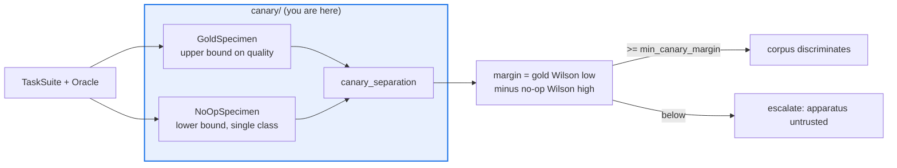

# AGENTS.md — flow-corpus/flow_corpus/canary

> Proves the corpus can still tell a good agent from a bad one. If it cannot, nothing gates.

A gold agent and a no-op agent are run through the full path and their pass rates compared
with Wilson bounds. The canary is load-bearing, not diagnostic: when separation fails, the
apparatus is untrusted and the downstream gate escalates rather than shipping a verdict.

## Map

| Path | Role |
|---|---|
| `separation.py` | `canary_separation`, `SeparationReport` — the Wilson-bounded pass-rate margin |
| `specimens.py` | `GoldSpecimen`, `NoOpSpecimen`, `RandomSpecimen` — deterministic reference agents |

## Diagram



## Rules that bite here

- **Pass-rate gap, never AUROC.** `NoOpSpecimen` is single-class by construction and
  `agent_core.calibration.auroc` is undefined on a single class. Swapping the statistic in
  turns the canary into a crash or a silent nan exactly when it is most needed.
- **Compare bounds, not point estimates.** The margin uses the gold lower bound against the
  no-op upper bound so it stays honest at the small N the corpus actually runs.
- **Canary specimens bypass the policy seam on purpose.** They are reference agents, not
  models; injecting a real policy would make the bounds depend on the thing under test.
- **A failing canary is a stop, not a warning.** Treat it as an escalation signal for the
  gate (ADR 0006) rather than lowering `min_canary_margin` to make the run go green.

## Verify

```bash
python -m pytest flow-corpus/tests/test_canary.py -q
```

## Subagents

| Task in this directory | Agent | Why |
|---|---|---|
| Check every caller of `canary_separation` before changing the report | `explorer` | Read-only sweep; `behavioral_regression` consumes the same idea |
| Run the canary suite and read the failing margin | `test-runner` | Has `Bash`; the failure is a bound, not a stack trace |
| Review a bound or threshold change before pushing | `narrow-critic` | Spots a point estimate quietly replacing an interval |

## See also

| Doc | Read it when |
|---|---|
| [`../../../docs/decisions/0006-behavioral-regression-detection.md`](../../../docs/decisions/0006-behavioral-regression-detection.md) | You need why a canary failure escalates instead of holding |
| [`../specimens/AGENTS.md`](../specimens/AGENTS.md) | Your reference agent needs the shared keying and result assembly |
| [`../config.py`](../config.py) | You want to move `min_canary_margin` or `wilson_z` |
| [`../../AGENTS.md`](../../AGENTS.md) | You need the corpus-wide contract rather than this package's |
