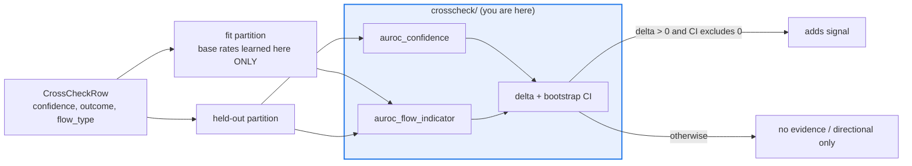

# AGENTS.md — flow-corpus/flow_corpus/crosscheck

> Does a flow's confidence beat a bare flow-type indicator? One question, one module.

The worry this package answers (spec defect S6): confidence may look predictive only because
it encodes *which* flow produced it. The cross-check runs the ablation on a held-out
partition and puts a bootstrap interval on the difference before calling it signal.

## Map

| Path | Role |
|---|---|
| `confidence.py` | `confidence_cross_check`, `CrossCheckRow`, `CrossCheckReport` — AUROC ablation plus CI |

## Diagram



## Rules that bite here

- **The indicator's base rates are learned on the fit partition only.** Fitting them on the
  held-out rows lets the ablation see its own answer, and the comparison stops meaning
  anything — which is the entire reason this module exists.
- **A positive delta alone is not a result.** Confidence "adds signal" only when the seeded
  bootstrap CI from `validation/resampling.py` also excludes zero.
- **An unseen flow type in the fit partition scores the neutral `0.5`, never dropped.**
  Dropping those rows would quietly shrink the held-out sample and inflate the delta.
- **Below `CorpusConfig.power_min_sample` held-out rows the report is directional only** and
  cannot gate a phase, no matter how wide the gap looks.

## Verify

```bash
python -m pytest flow-corpus/tests/test_crosscheck.py -q
```

## Subagents

| Task in this directory | Agent | Why |
|---|---|---|
| Confirm no fit-side statistic is computed from held-out rows | `explorer` | Read-only read of one module; leakage is visible in the flow of data |
| Run the cross-check suite and isolate a CI regression | `test-runner` | Has `Bash`; the seeded bootstrap must reproduce exactly |
| Review an estimator change before pushing | `narrow-critic` | Catches a swapped partition or an unseeded resample in the diff |

## See also

| Doc | Read it when |
|---|---|
| [`../validation/AGENTS.md`](../validation/AGENTS.md) | You need `bootstrap_delta_ci` or the shared power rule |
| [`../partition.py`](../partition.py) | You are changing how rows land in fit versus held-out |
| [`../../../docs/decisions/0006-behavioral-regression-detection.md`](../../../docs/decisions/0006-behavioral-regression-detection.md) | You need why corroboration is separate from the oracle verdict |
| [`../../AGENTS.md`](../../AGENTS.md) | You need the corpus-wide contract rather than this package's |
