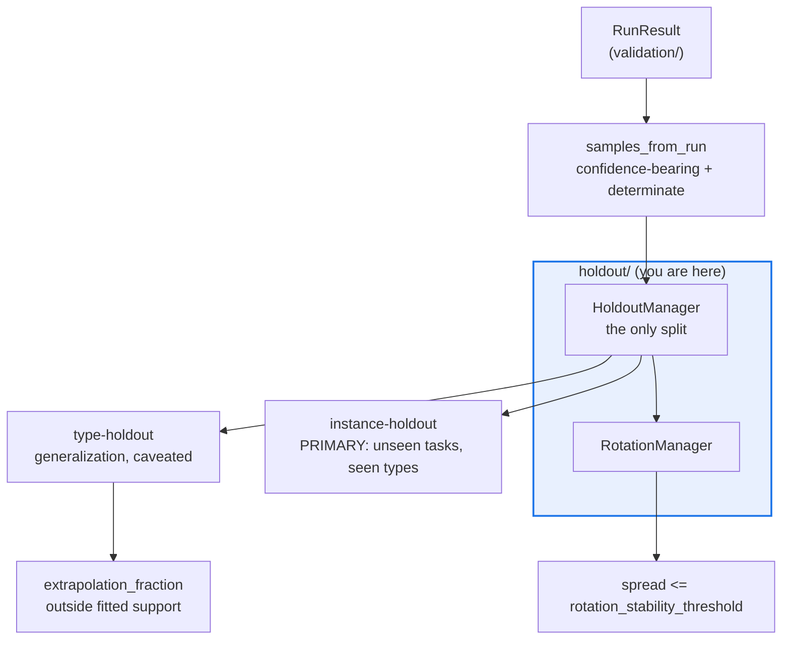

# AGENTS.md — flow-corpus/flow_corpus/holdout

> The single split authority. Two holdouts are reported, and they are never merged.

`HoldoutManager` owns the one place a corpus run is partitioned; `RotationManager` rotates
that partition across folds to prove the primary metric is a property of the agent and not
of a lucky split. Instance-holdout is the honest number; type-holdout is caveated.

## Map

| Path | Role |
|---|---|
| `manager.py` | `HoldoutManager.evaluate`, `HoldoutReport`, `Sample`, `samples_from_run` |
| `rotation.py` | `RotationManager.rotate`, `RotationReport` — k folds and the stability spread |

## Diagram



## Rules that bite here

- **Split exactly once.** `HoldoutManager._measured_instances` is the only partition in a
  run. A second split downstream compounds the folds and shrinks the already-scarce per-unit
  sample (spec defect M4) — rotation re-seeds this manager rather than re-splitting.
- **Never average the two holdouts into one number.** Instance-holdout answers "unseen tasks,
  seen flow shapes"; type-holdout answers "an unseen flow shape". Merging them hides which
  question the gate actually answered.
- **A type-holdout figure ships with `extrapolation_fraction`.** A recalibrator fitted on the
  seen types clamps outside its confidence support, so the bare reliability number flatters.
- **Bucketing comes from `flow_corpus.partition.bucket`,** the corpus-owned hash. Reaching
  into a harness private helper re-crosses the airgap and changes every historical partition.

## Verify

```bash
python -m pytest flow-corpus/tests/test_holdout.py -q
```

## Subagents

| Task in this directory | Agent | Why |
|---|---|---|
| Prove no second split exists before adding a fold | `explorer` | Read-only `Grep` for `bucket(` and slice sites across the package |
| Run the holdout suite and isolate an unstable fold | `test-runner` | Has `Bash`; the failure is a spread value, not a file |
| Review a split change before pushing | `narrow-critic` | Sees fold leakage in a finished diff that a linter cannot |

## See also

| Doc | Read it when |
|---|---|
| [`../partition.py`](../partition.py) | You need the exact bucketing formula before changing a seed |
| [`../validation/AGENTS.md`](../validation/AGENTS.md) | You need the reliability metric or the power rule these reports carry |
| [`../../tests/test_holdout.py`](../../tests/test_holdout.py) | You are changing report fields; this suite is a protected path |
| [`../../AGENTS.md`](../../AGENTS.md) | You need the corpus-wide contract rather than this package's |
