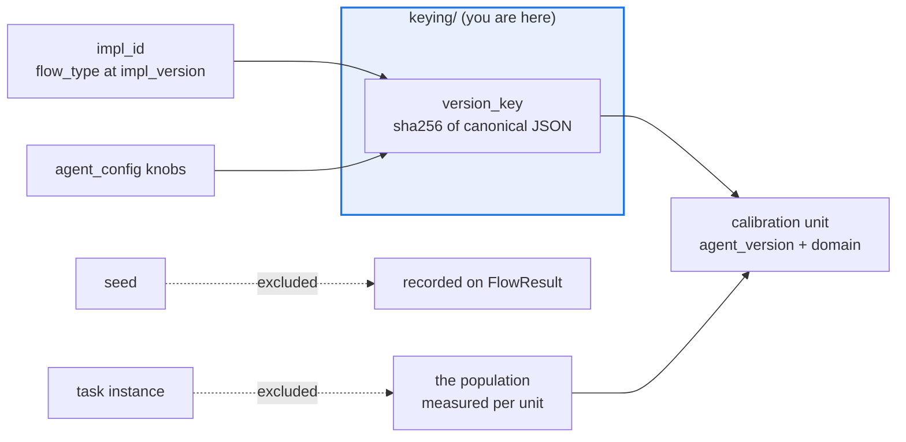

# AGENTS.md — flow-corpus/flow_corpus/keying

> One function, one decision: the calibration unit is `(agent_version, domain)`. No task.

`version_key(impl, agent_config)` is the identity of a calibration unit — a SHA-256 over
canonical JSON, truncated to 16 hex characters. What it leaves out is the whole design: the
task instance and the stochastic seed are both excluded, on purpose.

## Map

| Path | Role |
|---|---|
| `version_key.py` | `version_key` plus its canonicalisation of `agent_config` |

## Diagram



## Rules that bite here

- **The task is excluded, and that is the point.** Task variation is the population a single
  unit is measured over. Folding an instance into the key would give every unit a sample of
  one, and no reliability, Wilson interval or holdout number would mean anything again.
- **The seed is excluded too.** It is recorded on the `FlowResult` so a run stays replayable,
  but two seeds of the same agent are the same calibration unit.
- **Changing the key format re-keys the world.** These strings are written into
  `agent_core.outcome_store.OutcomeRecord` and persisted; a new format silently orphans every
  accumulated outcome instead of failing loudly. Treat it as a migration, not a refactor.
- **Canonical JSON with sorted keys, always.** Two configs that differ only in insertion
  order must produce the same key, matching the hashing discipline in `partition.py`.

## Verify

```bash
python -m pytest flow-corpus/tests/test_keying.py flow-corpus/tests/test_property.py -q
```

## Subagents

| Task in this directory | Agent | Why |
|---|---|---|
| Find everything that stores or compares an `agent_version` | `explorer` | Read-only sweep; the key escapes into records and reports |
| Run the keying and property suites after a hashing change | `test-runner` | Has `Bash`; stability is a Hypothesis property, not a review item |
| Review a key-format change before pushing | `narrow-critic` | Flags a silent re-key that no test would fail on |

## See also

| Doc | Read it when |
|---|---|
| [`../partition.py`](../partition.py) | You need the sibling hash used for splits and why they match |
| [`../mutation/AGENTS.md`](../mutation/AGENTS.md) | You need why perturbing a task does not re-key an agent |
| [`../../../agent-core/agent_core/outcome_store.py`](../../../agent-core/agent_core/outcome_store.py) | You need where these keys are persisted downstream |
| [`../../AGENTS.md`](../../AGENTS.md) | You need the corpus-wide contract rather than this package's |
