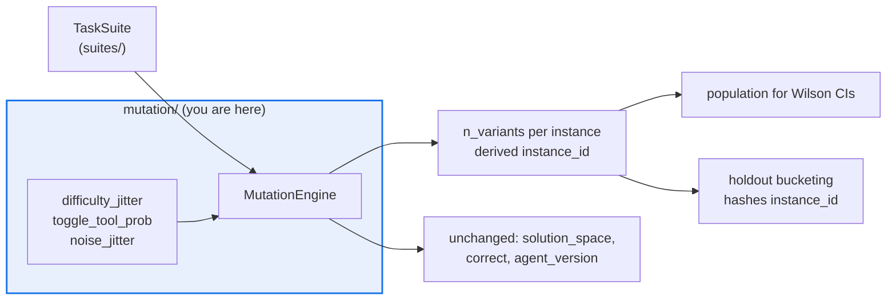

# AGENTS.md — flow-corpus/flow_corpus/mutation

> Turns a fixed task suite into an instance distribution. It perturbs tasks, never agents.

`MutationEngine` spawns perturbed copies of each base instance so calibration metrics have a
population to be measured over with meaningful Wilson intervals. The perturbation axis is
deliberately the task side of the run, because that is the axis the version key excludes.

## Map

| Path | Role |
|---|---|
| `engine.py` | `MutationEngine.mutate_instance` / `.mutate_suite`; the jitter and toggle knobs |

## Diagram



## Rules that bite here

- **Mutate the task, never the agent.** A mutated instance keeps its `solution_space` and
  `correct` set; only difficulty, tool availability and noise move. Touching the agent side
  would re-key the calibration unit and destroy the population the metrics are measured over.
- **The derived `instance_id` must stay unique and stable.** `holdout/` and `crosscheck/`
  bucket on that string, so a collision silently merges two instances across a split and a
  rename reshuffles every historical partition.
- **Deterministic from the seed, or it is not a corpus.** Every draw goes through the seeded
  `random.Random`; the same (suite, seed, knobs) must rebuild the same variants byte for byte.
- **Knobs are config, not literals.** The jitter defaults live on `MutationEngine` fields;
  call sites pass a value, they do not restate one.

## Verify

```bash
python -m pytest flow-corpus/tests/test_mutation.py -q
```

## Subagents

| Task in this directory | Agent | Why |
|---|---|---|
| Find every consumer of a derived `instance_id` before changing its shape | `explorer` | Read-only `Grep` across holdout, cross-check and suites |
| Run the mutation suite and confirm reproducibility | `test-runner` | Has `Bash`; determinism only shows up when the suite actually runs |
| Review a new perturbation before pushing | `narrow-critic` | Checks the diff does not leak into the agent side of the run |

## See also

| Doc | Read it when |
|---|---|
| [`../keying/AGENTS.md`](../keying/AGENTS.md) | You need why task variation is population rather than identity |
| [`../suites/AGENTS.md`](../suites/AGENTS.md) | You are adding a field a mutation would have to carry |
| [`../holdout/AGENTS.md`](../holdout/AGENTS.md) | Your change affects how instances land on either side of a split |
| [`../../AGENTS.md`](../../AGENTS.md) | You need the corpus-wide contract rather than this package's |
