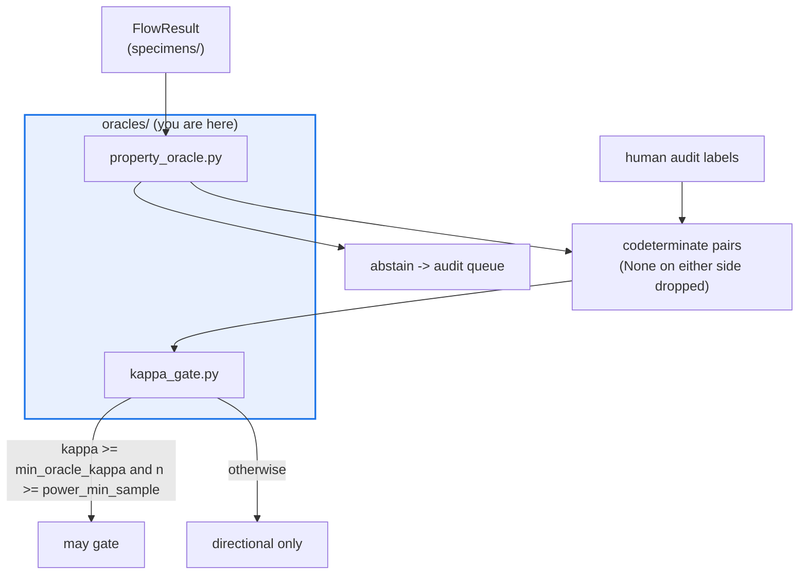

# AGENTS.md — flow-corpus/flow_corpus/oracles

> Verdict oracles, and the kappa gate that decides whether a tier is allowed to gate at all.

An oracle judges a `FlowResult` against its instance and returns a `flow_protocol.OracleResult`.
Nothing here trusts itself: a tier only earns gating rights by agreeing with a human-audit
sample, and `kappa_gate.py` is the one symbol `behavioral_regression` reuses verbatim.

## Map

| Path | Role |
|---|---|
| `base.py` | The `Oracle` protocol; verdict is `True` / `False` / `None` (abstain) |
| `kappa_gate.py` | `validate_oracle` / `KappaReport` — Cohen's kappa vs human audit, plus the power gate |
| `property_oracle.py` | `PropertyOracle` for the SDLC domain: a pure predicate over candidate and instance |

## Diagram



## Rules that bite here

- **`KappaReport` and `validate_oracle` are cross-package surface.** `behavioral_regression`
  imports them in `oracle.py`, `gate.py` and `report.py`. Reshaping either breaks a sibling
  package whose tests are not in this package's gate — run both.
- **`None` is a verdict, not a missing value.** Coercing it to `False` invents agreement:
  kappa is computed over co-determinate pairs only, and abstentions belong in the audit queue.
- **A point estimate never gates on its own.** Below `CorpusConfig.power_min_sample`
  co-determinate pairs the tier is directional only, however good the kappa looks.
- **Oracles are pure.** No clock, network, or RNG — a flaky oracle injects exactly the
  oracle-error the kappa gate exists to detect, and one kappa measurement cannot see it.

## Verify

```bash
python -m pytest flow-corpus/tests/test_oracles.py behavioral-regression/tests/test_oracle.py -q
```

## Subagents

| Task in this directory | Agent | Why |
|---|---|---|
| Find every consumer of `validate_oracle` / `KappaReport` | `explorer` | Read-only sweep across two packages before a signature change |
| Run both packages' oracle suites and isolate a failure | `test-runner` | Has `Bash`; the break usually lands in the sibling, not here |
| Review a new oracle tier before pushing | `narrow-critic` | Checks the abstain path and purity a linter cannot see |

## See also

| Doc | Read it when |
|---|---|
| [`../../../docs/decisions/0006-behavioral-regression-detection.md`](../../../docs/decisions/0006-behavioral-regression-detection.md) | You are changing what an unvalidated oracle is allowed to do |
| [`../validation/AGENTS.md`](../validation/AGENTS.md) | You need the shared `is_directional_only` power rule |
| [`../config.py`](../config.py) | You are about to hardcode a threshold instead of reading `CorpusConfig` |
| [`../../AGENTS.md`](../../AGENTS.md) | You need the corpus-wide contract rather than this package's |
