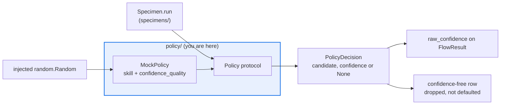

# AGENTS.md — flow-corpus/flow_corpus/policy

> The seam by which a specimen decides on a candidate. Offline and seeded by construction.

A policy returns one `PolicyDecision` per query; a specimen composes one or many into a flow
shape. The seam exists so flows run deterministically offline with `MockPolicy` while
staying swappable for a model-backed policy without touching any flow logic.

## Map

| Path | Role |
|---|---|
| `base.py` | `Policy` protocol and the frozen `PolicyDecision` (candidate plus optional confidence) |
| `mock.py` | `MockPolicy` — a parametrised agent: `skill` and `confidence_quality` |

## Diagram



## Rules that bite here

- **`MockPolicy` stays the default, and it stays offline.** A model-backed policy may be
  added behind this protocol, but it must not become the default path and must not import
  the harness's judge — that edge does not exist in `architecture.yaml` and must not.
- **Randomness arrives as an argument.** `decide` draws only from the injected
  `random.Random`, so a run is byte-reproducible from (config, seed). No module-level RNG.
- **`confidence_quality` is the signal the corpus measures.** A policy whose confidence is
  constant makes the reliability term degenerate, and every calibration report goes flat.
- **`confidence=None` is legitimate, not missing data.** Confidence-free flows exist; the
  runner and holdout drop those rows instead of substituting a neutral value.

## Verify

```bash
python -m pytest flow-corpus/tests/test_specimens.py flow-corpus/tests/test_validation.py -q
```

## Subagents

| Task in this directory | Agent | Why |
|---|---|---|
| Find every `Policy` implementation and injection site | `explorer` | Read-only `Grep`; the protocol is satisfied structurally, not by subclassing |
| Run the specimen and validation suites after a seam change | `test-runner` | Has `Bash`; policy behaviour only surfaces through flows |
| Review a new policy before pushing | `narrow-critic` | Catches network, clock or global RNG entering an offline seam |

## See also

| Doc | Read it when |
|---|---|
| [`../specimens/AGENTS.md`](../specimens/AGENTS.md) | You need how a flow consumes decisions and keys itself |
| [`../../../architecture.yaml`](../../../architecture.yaml) | A real policy tempts you into a new cross-package import |
| [`../validation/AGENTS.md`](../validation/AGENTS.md) | You need what happens to a decision with no confidence |
| [`../../AGENTS.md`](../../AGENTS.md) | You need the corpus-wide contract rather than this package's |
