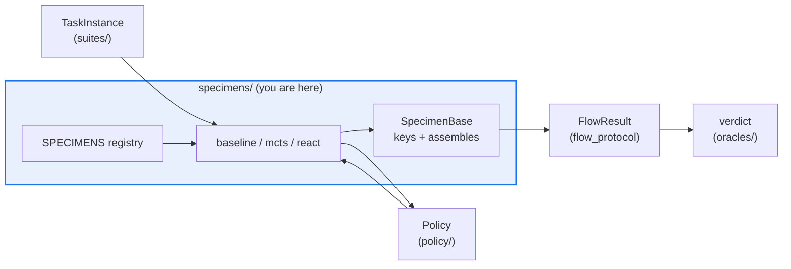

# AGENTS.md — flow-corpus/flow_corpus/specimens

> The flow variants under test, plus the registry that lets config pick one by name.

A specimen is one agentic flow shape: it runs a `TaskInstance` against an injected policy and
emits a `flow_protocol.FlowResult`. This is the corpus's heaviest consumer of that contract,
so every field a specimen fills is cross-airgap surface.

## Map

| Path | Role |
|---|---|
| `base.py` | `Specimen` protocol, `SpecimenBase` (keys the unit, assembles the result), generic `Registry` |
| `baseline.py` | `BaselineSpecimen` — one policy query reported verbatim; the mandatory control |
| `mcts.py` | `MCTSSpecimen` — majority vote over `n_rollouts`; vote-fraction confidence |
| `react.py` | `ReActSpecimen` — the type-holdout flow; reports final-step confidence |
| `__init__.py` | The `SPECIMENS` registry; a new flow is registered here, never auto-discovered |

## Diagram



## Rules that bite here

- **`flow_protocol` is the only type system allowed out of here.** A specimen must never
  import `eval_harness`; the absence of that edge in `architecture.yaml` *is* the airgap, and
  `skills/architecture-drift-guard/scripts/drift_check.py` fails the PR that adds it.
- **`agent_version` is `hash(impl_id + agent_config)`.** Editing `flow_type`, `impl_version`
  or a config knob re-keys the calibration unit and orphans every outcome already
  accumulated against it. Bump `impl_version` deliberately, not to tidy a name.
- **All randomness comes from the injected `random.Random`**, and the seed is recorded on
  the `FlowResult`, never folded into the key. A module-level `random` call costs the corpus
  its byte-reproducibility from (config, seed).
- **Registering a specimen widens the frozen public surface.** Refresh
  `tests/public_surface_baseline.json`; `flow-corpus/tests/**` needs `eval-change-approved`.

## Verify

```bash
python -m pytest flow-corpus/tests/test_specimens.py flow-corpus/tests/test_public_surface.py -q
```

## Subagents

| Task in this directory | Agent | Why |
|---|---|---|
| Trace every `SPECIMENS` / `agent_version` use before adding a flow | `explorer` | Read-only `Grep` sweep; `maxTurns: 5` covers one symbol |
| Run the specimen suite plus the surface guard | `test-runner` | Has `Bash`; the surface diff names symbols, not files |
| Review a new specimen before pushing | `narrow-critic` | Catches a stray global RNG or a leaked harness type |

## See also

| Doc | Read it when |
|---|---|
| [`../policy/AGENTS.md`](../policy/AGENTS.md) | Your specimen needs a decision seam other than `MockPolicy` |
| [`../../../flow-protocol/flow_protocol/contract.py`](../../../flow-protocol/flow_protocol/contract.py) | You are adding or reading a field on the emitted `FlowResult` |
| [`../../../architecture.yaml`](../../../architecture.yaml) | You think this package needs a new cross-package import |
| [`../../AGENTS.md`](../../AGENTS.md) | You need the corpus-wide contract rather than this package's |
