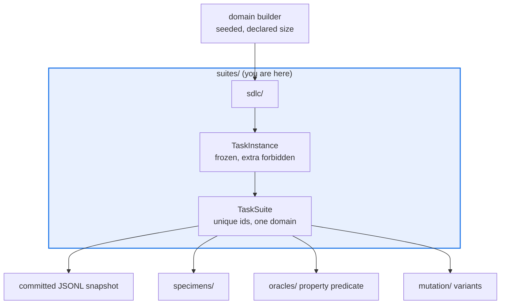

# AGENTS.md — flow-corpus/flow_corpus/suites

> Populations of task instances, one subpackage per domain. Abstract on purpose.

`base.py` holds the two frozen models every domain shares; each subdirectory is one domain
with its own deterministic builder and committed snapshot. An instance presents a discrete
`solution_space` of which a subset is `correct` — never code to execute.

## Map

| Path | Role |
|---|---|
| `base.py` | `TaskInstance` and `TaskSuite` — frozen pydantic v2 models with cross-field validators |
| `sdlc/` | The SDLC test-pass domain; the first cheap property-oracle suite |

## Diagram



## Rules that bite here

- **A domain is a subdirectory, not a flag.** New domain means a new package beside `sdlc/`
  with its own builder, snapshot and oracle — not a branch inside an existing builder.
- **Instances stay abstract: no code execution, no network, no filesystem at judge time.**
  That is what keeps a corpus run offline and byte-reproducible, and what lets the property
  oracle remain a pure predicate over `(candidate, instance)`.
- **The models are frozen and reject unknown fields.** Adding a field is a data-format change:
  every committed JSONL snapshot must still validate, so update the snapshot in the same PR.
- **The validators are load-bearing.** `correct` inside `solution_space`, unique instance ids,
  one domain per suite. Relaxing any of them makes every downstream verdict uninterpretable.

## Verify

```bash
python -m pytest flow-corpus/tests/test_suites.py -q
```

## Subagents

| Task in this directory | Agent | Why |
|---|---|---|
| Find every reader of a `TaskInstance` field before adding one | `explorer` | Read-only `Grep`; specimens, oracles and mutation all destructure it |
| Run the suite tests after a model or snapshot change | `test-runner` | Has `Bash`; snapshot round-trip only fails when executed |
| Review a model change before pushing | `narrow-critic` | Catches a widened model that would accept an invalid population |

## See also

| Doc | Read it when |
|---|---|
| [`sdlc/AGENTS.md`](sdlc/AGENTS.md) | You are touching the SDLC domain or its committed snapshot |
| [`../oracles/AGENTS.md`](../oracles/AGENTS.md) | Your new domain needs a verdict oracle and a kappa validation path |
| [`../mutation/AGENTS.md`](../mutation/AGENTS.md) | You need how instances become a measurable population |
| [`../../AGENTS.md`](../../AGENTS.md) | You need the corpus-wide contract rather than this package's |
