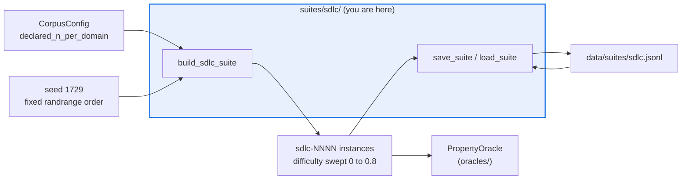

# AGENTS.md — flow-corpus/flow_corpus/suites/sdlc

> The SDLC test-pass domain: the first suite cheap enough to judge with a property oracle.

Each instance offers candidate work products, exactly one of which passes the instance's
tests. The population is generated deterministically from a seed and snapshotted at
`flow-corpus/data/suites/sdlc.jsonl`, which is provenance, not a cache.

## Map

| Path | Role |
|---|---|
| `__init__.py` | `DOMAIN`, `build_sdlc_suite`, `save_suite`, `load_suite`, and the generator defaults |
| [`../../../data/suites/sdlc.jsonl`](../../../data/suites/sdlc.jsonl) | The committed snapshot the loader round-trips |

## Diagram



## Rules that bite here

- **Regeneration must be byte-identical.** The `rng.randrange` call order and the defaults
  (`space_size=4`, `max_difficulty=0.8`, `seed=1729`) are preserved deliberately. Touching any
  of them rewrites every instance id and correct answer, orphaning accumulated outcomes.
- **The population size is declared, not guessed.** It comes from
  `CorpusConfig.declared_n_per_domain`; do not pass a literal count at a call site.
- **The difficulty sweep exists to keep outcomes mixed.** An all-pass or all-fail population
  has no spread, and the reliability term the corpus gates on becomes unmeasurable.
- **Save and load must round-trip.** `save_suite` writes sorted-key JSONL one instance per
  line; if you add a field to `TaskInstance`, regenerate the snapshot in the same change.

## Verify

```bash
python -m pytest flow-corpus/tests/test_suites.py -q
```

## Subagents

| Task in this directory | Agent | Why |
|---|---|---|
| Confirm nothing else pins the generator defaults before changing one | `explorer` | Read-only `Grep` over tests, oracle and config |
| Regenerate and diff the snapshot after a generator change | `test-runner` | Has `Bash`; byte-identity is only provable by running it |
| Review a generator change before pushing | `narrow-critic` | Spots a reordered draw that silently repopulates the corpus |

## See also

| Doc | Read it when |
|---|---|
| [`../AGENTS.md`](../AGENTS.md) | You are adding a domain rather than editing this one |
| [`../../oracles/AGENTS.md`](../../oracles/AGENTS.md) | You need how this domain's verdicts earn gating rights |
| [`../../config.py`](../../config.py) | You need the declared size or another corpus-level threshold |
| [`../../../tests/test_suites.py`](../../../tests/test_suites.py) | You changed the snapshot; this protected suite asserts the round-trip |
