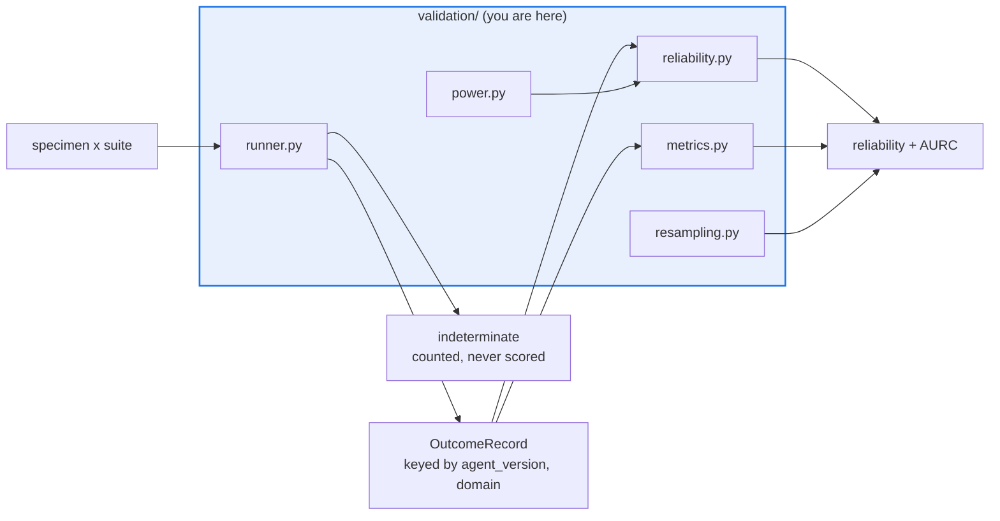

# AGENTS.md — flow-corpus/flow_corpus/validation

> Reliability is the primary metric here. Everything else in this package supports it.

This package turns a specimen-by-suite run into keyed outcomes and then into calibration
numbers. `power.py` and `resampling.py` are also imported by `behavioral_regression`, so
their contracts outlive this package's own callers.

## Map

| Path | Role |
|---|---|
| `runner.py` | `run_suite` — instance to specimen to oracle to `OutcomeRecord`; `RunResult` |
| `reliability.py` | `brier_reliability` — the Murphy reliability term, the primary metric |
| `power.py` | `is_directional_only` — the single definition of "too small to gate" |
| `resampling.py` | Seeded percentile bootstrap (`bootstrap_delta_ci`, `BootstrapCI`) |
| `metrics.py` | `aurc` over `agent_core.calibration.selective_risk_coverage` points |

## Diagram



## Rules that bite here

- **The primary number is the reliability term, not the scalar Brier and not ECE.** It comes
  from `agent_core.calibration.brier_decomposition` directly; routing through an aggregate
  report would silently swap the metric the whole corpus is gated on.
- **`power.py` and `resampling.py` have a second consumer.** `behavioral_regression.detector`
  imports both. Keep `resampling.py` stdlib-only so it can still migrate into `agent_core`.
- **Indeterminate verdicts are counted but never become outcomes.** `RunResult` tracks the
  rate for the derived cap; turning one into a pass or fail feeds the gate a guess.
- **A number on fewer than `power_min_sample` resolved outcomes is directional only** — report
  it, never gate on it. The rule is centralised here so every caller agrees.

## Verify

```bash
python -m pytest flow-corpus/tests/test_validation.py behavioral-regression/tests/test_detector.py -q
```

## Subagents

| Task in this directory | Agent | Why |
|---|---|---|
| Locate every caller of `is_directional_only` / `bootstrap_delta_ci` | `explorer` | Read-only sweep spanning two packages before a signature change |
| Run the validation suite and pin the failing metric | `test-runner` | Has `Bash`; the assertion names a statistic, not a file |
| Review a metric change before pushing | `narrow-critic` | Catches a silently swapped estimator in a finished diff |

## See also

| Doc | Read it when |
|---|---|
| [`../../../docs/decisions/0006-behavioral-regression-detection.md`](../../../docs/decisions/0006-behavioral-regression-detection.md) | You need why these primitives live here rather than in `agent_core` |
| [`../holdout/AGENTS.md`](../holdout/AGENTS.md) | You are about to split samples inside the runner |
| [`../config.py`](../config.py) | A new threshold is needed; it belongs on `CorpusConfig` |
| [`../../AGENTS.md`](../../AGENTS.md) | You need the corpus-wide contract rather than this package's |
