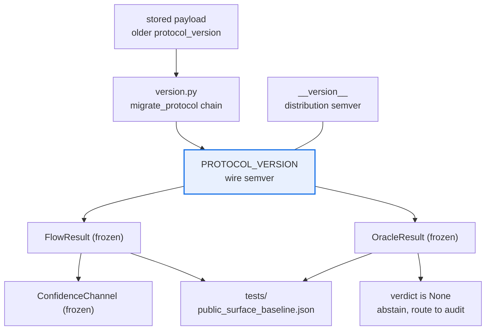

# AGENTS.md — flow-protocol

> Three modules, 186 lines, one dependency. Everything that crosses the airgap crosses here.

This directory owns the frozen data contract the corpus produces and the downstream layers
consume, plus the wire version that contract is stamped with. It is the smallest package in
the monorepo deliberately: every type added here becomes a promise both sides must keep.

## Map

| Path | Role |
|---|---|
| `flow_protocol/__init__.py` | The whole public surface: seven names, nothing else |
| `flow_protocol/contract.py` | `FlowResult`, `OracleResult`, `ConfidenceChannel`, `OracleTier` |
| `flow_protocol/version.py` | `PROTOCOL_VERSION`, `__version__`, `MIGRATIONS`, `migrate_protocol` |
| `tests/public_surface_baseline.json` | The frozen export list a removal or rename is checked against |
| `pyproject.toml` | The one runtime dependency, and the 95 floor |

## Diagram



## Rules that bite here

- **Small is the feature.** A type only one side needs does not belong here — it widens the
  surface the airgap is supposed to narrow. Ask whether the corpus *and* a consumer both have
  to agree on it; if only one does, it belongs in that package.
- **`PROTOCOL_VERSION` and `__version__` are separate tracks and must stay separate.** A
  packaging release does not imply a contract change, and a contract change does not wait for
  one. Bump the wire version only with a matching `MIGRATIONS` entry, or a genuinely additive
  optional field that old payloads still validate against by default.
- **The migration chain raises rather than guesses.** A payload at a version with no path to
  the current one is an error, not a best effort. `MIGRATIONS` is empty today, so the first
  bump is the one that has to get this right.
- **Models are frozen and reject unknown keys.** An unexpected field raises at construction,
  which means a stale payload must be migrated, never patched into shape at the call site.
- **`OracleResult.verdict` is three-valued and `raw_confidence` is optional.** `None` means
  the oracle abstained and belongs in the audit queue; coercing it to `False` fabricates a
  verdict. Outcome-only flows have no self-reported confidence and must not invent one.
- **`pydantic>=2` is the only runtime dependency.** Anything added here is installed by every
  consumer on both sides of the airgap, including `agent_core`-adjacent leaves that carry none.
- **The migration-chain walker is duplicated on purpose** across this package, `agent_core`,
  `behavioral_regression` and the harness config. The `version.py` docstring cites ADR 0034
  for the deliberate-duplication rationale; do not consolidate it into a shared helper.

## Verify

```bash
make -C flow-protocol check
```

## Subagents

| Task in this directory | Agent | Why |
|---|---|---|
| Find every construction site of a contract model before changing a field | `explorer` | Read-only and cross-package; the consumers live in sibling directories |
| Run the gate and isolate a frozen-surface or coverage failure | `test-runner` | Has `Bash`; the baseline diff has to be read, not inferred |
| Review a contract or version change before pushing | `narrow-critic` | A field default that quietly rescues an old payload is invisible to the linters |

## See also

| Doc | Read it when |
|---|---|
| [`README.md`](README.md) | You need the type-by-type description and the design notes behind each field |
| [`CHANGELOG.md`](CHANGELOG.md) | You are bumping a version and need what the last contract change looked like |
| [`../flow-corpus/README.md`](../flow-corpus/README.md) | You need to see who produces these types before changing their shape |
| [`../architecture.yaml`](../architecture.yaml) | You need the declared component edges that make this package the only crossing |
| [`../docs/decisions/0034-tool-version-lockstep.md`](../docs/decisions/0034-tool-version-lockstep.md) | You are tempted to consolidate something this repo duplicates on purpose |
| [`../docs/CHARTER.md`](../docs/CHARTER.md) | A proposed type looks like it moves scope across the airgap |
| [`../coverage-floors.yaml`](../coverage-floors.yaml) | A coverage number is in your diff and you need to know which anchors must agree |
