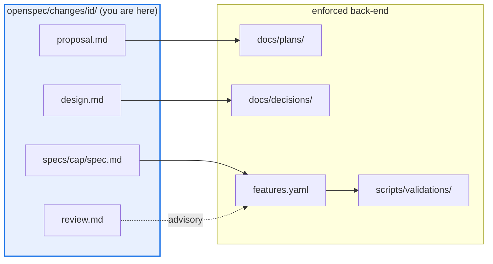

# AGENTS.md — openspec

> The fleet coordination contract: how an OpenSpec change compiles down to the enforced back-end.

OpenSpec is a thin, reversible authoring front-end over the repo's real spec system. It is
**not** a source of truth — deleting `openspec/` leaves `features.yaml`, the `F_0NN.py`
proofs and the ADRs fully intact. Every phase below has a compile-down target that CI
actually checks; the OpenSpec document is the draft, the target is the artifact.

## Map

| OpenSpec phase | Compiles down to | Owner | Gate |
|---|---|---|---|
| `propose` (`proposal.md`) | `docs/plans/<topic>/PLAN.md` | `foundation:plan` skill | human sign-off |
| `design` (`design.md`) | a numbered ADR in `docs/decisions/` | **Plan** sub-agent | human (ADR accept) |
| spec delta (`specs/<cap>/spec.md`) | `features.yaml` F-ID rows | **general-purpose** sub-agent | `eval-change-approved` label |
| each scenario | a `scripts/validations/F_0NN.py` proof | `foundation:test-first` | `scripts/validate.py` in CI |
| `apply` | source under the owning package | **general-purpose** sub-agent | `foundation:code-review` |
| `verify` | `make -C <pkg> check` | `test-runner` sub-agent | package CI |
| `review` (conformance) | `changes/<id>/review.md` | `spec-guardian` sub-agent | advisory, never CI-blocking |
| `review` (adversarial) | `changes/<id>/review.md` | `peer-reviewer` sub-agent | advisory, never CI-blocking |
| `archive` | `features.yaml` `status: done` + `implemented_in:<sha>` | **general-purpose** sub-agent | `quality-gates.yml` |

## Diagram



## Rules that bite here

- **The document is never the artifact.** A change is not done because `tasks.md` is ticked;
  it is done when `features.yaml` carries `status: done` and the `F_0NN.py` proof passes.
- **Every change directory must be linked from `openspec/README.md`** as a real markdown link.
  `docs.yml` fails the build otherwise, and an archived change must be linked as
  `changes/archive/<name>/` and **not** still as `changes/<name>/`.
- **Archive with the script, never by hand.** `python scripts/openspec_archive.py` does the
  `git mv` *and* rewrites outbound relative links, which is what keeps that gate green.
- **Review is advisory by design:** `spec-guardian` / `peer-reviewer` output is a checklist item, never a merge blocker. Do not wire it into CI.
- **The `foundation:*` fleet is staged, not installed** (ADR 0028): dispatching it needs a
  session started with `claude --plugin-dir claude-foundation`. Without that, the row degrades
  to a `general-purpose` sub-agent inlining the same method — degrade deliberately rather than
  failing to find the agent.
- **The runtime is the subject, not an executor.** `agent_core`'s `LoopController` /
  `AsyncLoopController` / `ParallelClaimRunner`, the calibrated merge gate
  (`merge_gate.decide()`, `merge_gate_ci`) and the `(agent_version, domain)` calibration cells
  are what a change *measures and tunes*. **Do not route change-execution through them** —
  doing so contaminates the very signal the change exists to read.
- **Guards run under every action, whatever the phase:** `architecture-drift-guard` blocks an
  undeclared import edge; when the plugin is staged, `foundation:pre-tool-guard` is fail-closed
  on secret reads and out-of-project writes.

## Verify

```bash
python scripts/validate.py --tier fast --strict-git
```

## Subagents

| Task in this directory | Agent | Why |
|---|---|---|
| Locate the F-ID rows or ADR a change compiles down to | `explorer` | Read-only `Grep` sweep; no execution needed |
| Run the validator battery for a change's proofs | `test-runner` | Has `Bash`; `validate.py` output names the failing F-ID |
| Conformance-check an implementation against its own spec | `spec-guardian` | Read-only; needs `--plugin-dir claude-foundation` |
| Adversarial second pass before archiving | `peer-reviewer` | Two-pass fact-check; same staging precondition |

## See also

| Doc | Read it when |
|---|---|
| [`README.md`](README.md) | You need the directory layout and the change index you must update |
| [`project.md`](project.md) | You need the authoritative back-end this front-end defers to |
| [`../docs/openspec-spike.md`](../docs/openspec-spike.md) | You are deciding whether OpenSpec should stay; it records the reversibility argument |
| [`../AGENTS.md`](../AGENTS.md) | You need repo-wide constraints rather than this lifecycle |
