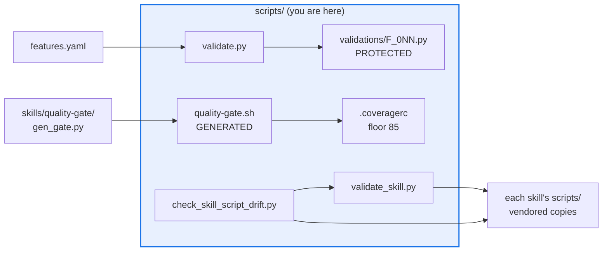

# AGENTS.md — scripts

> Operational tooling and CI guards. Nothing here ships; everything here can fail a merge.

This directory is the repository's enforcement surface: feature proofs, drift guards, corpus
generators and the merge-gate seeding pipeline. It is not part of any installed package and
carries its own gate. [`README.md`](README.md) indexes every script by purpose; this file is
what that index does not tell an agent about to edit one.

## Map

| Path | Role |
|---|---|
| `validate.py` | Drives `features.yaml`; runs the tier-filtered `F_0NN.py` proofs |
| `validations/` | 69 one-shot feature proofs. PROTECTED; a gate, not an editable surface |
| `quality-gate.sh` | GENERATED. Hand extensions only in `do_extra()` below the marker |
| `validate_skill.py` | Canonical copy; vendored byte-identically into every skill |
| `eval_protected_paths.py` | Single source of truth for the protected-path globs |
| `.coveragerc` | This directory's own coverage floor of 85 |
| `_cli.py`, `_config.py`, `_provenance.py`, `_*_corpus_lib.py` | Shared libraries; no entry points |

## Diagram



## Rules that bite here

- **`validations/` is protected.** Changes there need the `eval-change-approved` label and a
  code owner. The files are one-shot proofs a feature stayed true, invoked by `validate.py`
  from `features.yaml` — not unit tests, which is why `.coveragerc` omits them from the floor.
- **`quality-gate.sh` is generated; never hand-edit above the marker.** Regenerate with
  `python skills/quality-gate/scripts/gen_gate.py --root . --typecheck-path src/eval_harness
  --typecheck-path scripts --typecheck-path tests`. Only `do_extra()` below the marker
  survives a regeneration, and that is where the F-031 scripts-coverage stage lives.
- **`validate_skill.py` exists in many copies.** Editing the canonical one without copying it
  into every `skills/<name>/scripts/` fails [`check_skill_script_drift.py`](check_skill_script_drift.py).
- **This directory has its own floor of 85**, read from `.coveragerc` by the gate's
  `do_extra()` stage. `.coveragerc` is itself protected and pinned in
  [`../coverage-floors.yaml`](../coverage-floors.yaml); lowering it is a reviewed act.
- **Invoke mypy as `python3 -m mypy`, never a bare `mypy` from `PATH`.** A stray install
  shadows the pinned one, runs without this repo's dependencies, and reports missing-import
  errors that look like real defects and vanish under the correct interpreter.

## Verify

```bash
./scripts/quality-gate.sh all
```

## Subagents

| Task in this directory | Agent | Why |
|---|---|---|
| Find every call site of a guard before changing its signature | `explorer` | Read-only `Grep` sweep; these modules are imported by tests, hooks and workflows alike |
| Run the gate and isolate which stage failed | `test-runner` | Has `Bash`; the gate has four stages and only names the failing one in its own output |
| Review a guard change before pushing | `narrow-critic` | A guard that fails open is a security defect a linter cannot see |

## See also

| Doc | Read it when |
|---|---|
| [`README.md`](README.md) | You need to know what an unfamiliar script in this directory does |
| [`eval_protected_paths.py`](eval_protected_paths.py) | You are about to edit a file and need to know whether it needs the approval label |
| [`../coverage-floors.yaml`](../coverage-floors.yaml) | A coverage floor is in your way and you are tempted to lower it |
| [`../docs/decisions/0019-size-budget-gate.md`](../docs/decisions/0019-size-budget-gate.md) | A script here is nearing 500 lines and you need the split rule |
| [`../skills/AGENTS.md`](../skills/AGENTS.md) | Your change touches a vendored skill script or the marketplace |
