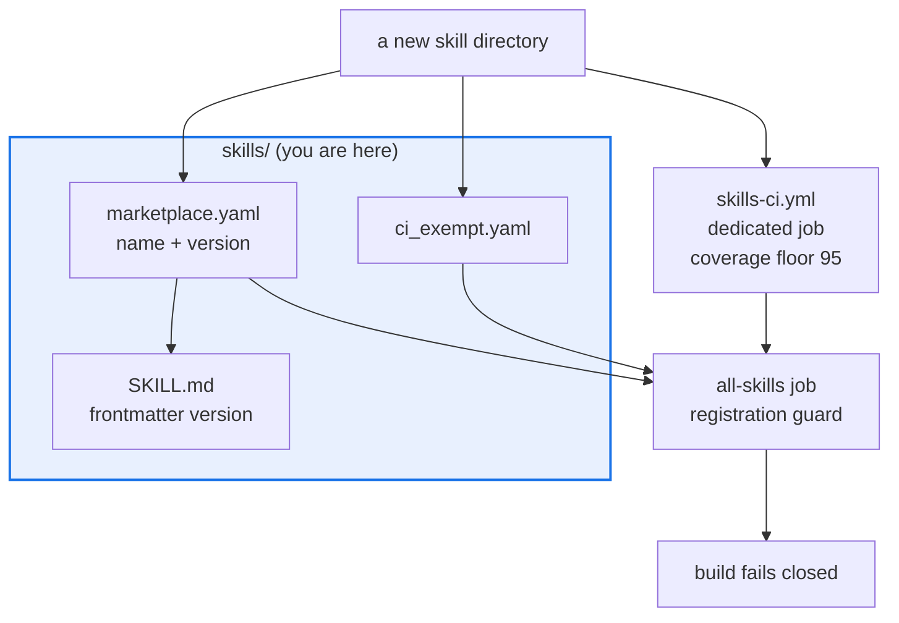

# AGENTS.md — skills

> A schema-validated marketplace of vendored skills. Registration is a CI gate, not a habit.

Each skill is self-contained: its own `SKILL.md` contract, scripts, tests and evals. This
directory owns registration and the CI tiering; a skill's own behaviour is owned by its
`SKILL.md`. [`README.md`](README.md) is the human overview of what each skill does — read it
for orientation, but treat [`marketplace.yaml`](marketplace.yaml) as the authority.

## Map

| Path | Role |
|---|---|
| `marketplace.yaml` | The registry: name, version and path of every skill. Authoritative |
| `marketplace.schema.json` | Schema `marketplace.yaml` is validated against |
| `ci_exempt.yaml` | ADR 0030 exemptions for skills with no library code. Single source |
| `common/` | Shared validator library backing every vendored `validate_skill.py`. Not a skill |
| `_generator_utils.py` | Shared helpers for the deterministic generator skills |
| `<skill>/SKILL.md` | That skill's agent contract: preconditions, procedure, output, failures |

## Diagram



## Rules that bite here

- **A skill's contract file is `SKILL.md`, never `README.md`.** That is the skill convention
  and it is deliberate. For the same reason no `AGENTS.md` may be added inside a skill
  directory: `scripts/check_agents_md.py` fails if one appears, because two instruction files
  beside each other invite disagreement. This file covers all of them.
- **Registration is fail-closed (ADR 0030).** Every `skills/<name>/` must appear in
  `marketplace.yaml` *and* must have either a dedicated job in `.github/workflows/skills-ci.yml`
  or a documented entry in [`ci_exempt.yaml`](ci_exempt.yaml). Missing either fails the
  `all-skills` job. A skill with library code carries a coverage floor of 95.
- **The semver in `SKILL.md` frontmatter must equal the one in `marketplace.yaml`.** Bump both
  in the same commit or `skill_marketplace.py validate` fails.
- **`README.md`'s table is hand-maintained and is currently stale.** As of this writing it
  omits `corpus-guardian`, `e2e-matrix-sentinel` and `refactoring-decomposer`, and lists
  `quality-gate` at 1.2.0 where the registry says 1.3.0. Never derive a fact about a skill
  from that table; read `marketplace.yaml`.
- **The research skills compose in one order.** `hierarchical-recursive-brainstorm` expands a
  question into a pruned tree; `openspec-quality-plan` turns the strongest leaves into an
  OpenSpec package; `openspec-peer-review` critiques and rewrites it. Running them out of
  order produces a package with nothing behind its claims.

## Verify

```bash
python scripts/skill_marketplace.py validate
```

## Subagents

| Task in this directory | Agent | Why |
|---|---|---|
| Find which skills declare a given helper or frontmatter field | `explorer` | Read-only sweep over 19 directories; `maxTurns: 5` covers one field |
| Run one skill's structural and behavioral validation | `test-runner` | Has `Bash`; `validate_skill.py --tier structural,behavioral` names the failing check |
| Review a new `SKILL.md` before registering it | `narrow-critic` | Contract gaps and unsafe shell in a procedure are not lintable |

## See also

| Doc | Read it when |
|---|---|
| [`marketplace.yaml`](marketplace.yaml) | You need a skill's real name, version or path — always prefer it over the README table |
| [`ci_exempt.yaml`](ci_exempt.yaml) | Your new skill ships no library code and CI is demanding a job for it |
| [`../docs/decisions/0030-skill-ci-tiers.md`](../docs/decisions/0030-skill-ci-tiers.md) | You are deciding which CI tier a skill belongs in, or why an exemption exists |
| [`../docs/SKILL_TEMPLATE.md`](../docs/SKILL_TEMPLATE.md) | You are scaffolding a new skill and need the `SKILL.md` shape |
| [`../scripts/AGENTS.md`](../scripts/AGENTS.md) | You edited the canonical `validate_skill.py` and the drift guard is failing |
