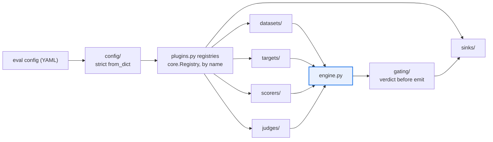

# AGENTS.md — src/eval_harness

> The top of the dependency DAG. Nothing in this repo imports it, so every edge points outward.

This directory owns `langfuse-eval-harness`: config loading, the plugin registries, the run
engine, the gate and the CLI. Components are resolved **by name at runtime**, not by import,
which is why the package facade is two symbols wide and the real surface lives in subpackages.

## Map

| Path | Role |
|---|---|
| `__init__.py` | Facade — exports `SCHEMA_VERSION` and `__version__` only |
| `version.py` | Single source for `SCHEMA_VERSION`; distribution version via metadata |
| `plugins.py` | The six registries plus `eval_harness.plugins` entry-point discovery |
| `engine.py` | Orchestration: load, run, score, gate, emit |
| `cli.py` | The `eval-harness` entry point (`run`, `replay`) |
| `core/`, `config/` | Types, `Registry`, trust-boundary gates; versioned config + migrations |
| `agent_core_adapter/` | The only sanctioned crossing into `agent_core` — has its own file |
| `gating/`, `scorers/`, `judges/` | Protected subtrees; a change here needs a label |

## Diagram



## Rules that bite here

- **The airgap is structural: never import `flow_corpus` from anywhere under this tree.**
  The two packages must not reach each other in either direction. `drift_check.py` fails the
  PR on the undeclared edge, and no amount of local convenience buys the exception back.
- **`agent_core` is reachable only through `agent_core_adapter/`.** A direct import elsewhere
  is the same drift failure. Read that subpackage's own file before widening the seam.
- **The engine resolves components, it does not import them.** Register with
  `@REGISTRY.register("name")` and exercise the registered name in tests — that is the path
  the real run takes. A new top-level re-export in `__init__.py` widens a facade nothing uses.
- **`SCHEMA_VERSION` does not move on a feature branch.** It is single-sourced in
  `version.py`; a bump is a release commit plus migration code in `config/migrations.py`.
- **`from_dict` is strict.** An unknown key raises `ConfigError`. A permissive fallback here
  silently accepts a typo'd threshold, which is the failure mode the strictness exists for.
- **The 96 floor is declared twice** — `pyproject.toml` and `scripts/quality-gate.sh` — and
  both anchors are pinned by `coverage-floors.yaml`. Change one and the guards disagree.

## Verify

```bash
./scripts/quality-gate.sh all
```

## Subagents

| Task in this directory | Agent | Why |
|---|---|---|
| Locate where a registered component name is resolved | `explorer` | Read-only `Grep` sweep; the name is a string, so grep beats reading the call graph |
| Run the gate and isolate which stage failed | `test-runner` | Has `Bash`; the gate is four stages and the failure signature names the stage |
| Review a change to a protected subtree before pushing | `narrow-critic` | Reads the finished diff for what the linters cannot catch |

## See also

| Doc | Read it when |
|---|---|
| [`README.md`](README.md) | You need the sub-package inventory — what each directory holds |
| [`agent_core_adapter/AGENTS.md`](agent_core_adapter/AGENTS.md) | You are about to touch anything that crosses into `agent_core` |
| [`../../architecture.yaml`](../../architecture.yaml) | You are adding or removing an import edge and need the declared component graph |
| [`../../docs/decisions/0039-callable-target-allowlist.md`](../../docs/decisions/0039-callable-target-allowlist.md) | A config value is about to become an import or a filesystem path |
| [`../../docs/decisions/0032-matrix-completeness-policy.md`](../../docs/decisions/0032-matrix-completeness-policy.md) | You registered a new component and need its matrix obligation |
| [`../../coverage-floors.yaml`](../../coverage-floors.yaml) | A coverage number is in your diff and you need to know which anchors must agree |
| [`../../AGENTS.md`](../../AGENTS.md) | You need repo-wide constraints rather than this package's |
