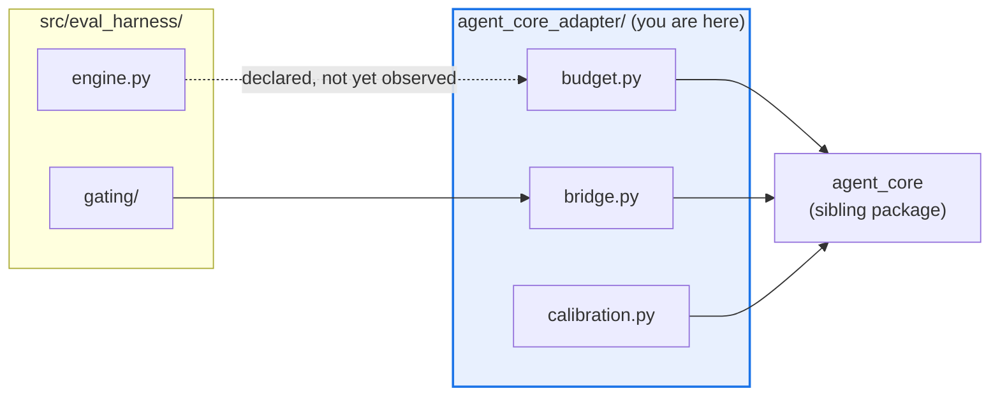

# AGENTS.md — src/eval_harness/agent_core_adapter

> The only bridge from `eval_harness` into `agent-core`. Every crossing goes through here.

This package exists so the rest of the harness never imports `agent_core` directly. It
translates between the two type systems and owns the cost ledger that caps judge spend.

## Map

| Path | Role |
|---|---|
| `budget.py` | `BudgetLedger` wrapper and the `BudgetedJudge` cost cap |
| `bridge.py` | `CycleResult` / `CycleState` translation across the seam |
| `calibration.py` | Surfaces `JudgeCalibrationReport` to the harness |
| `gate_authorization.py` | Authorizes a gate verdict against the ledger |
| `config.py` | The adapter's own `*Config` dataclasses; defaults live here, not at call sites |

## Diagram



## Rules that bite here

- **This is the only sanctioned `agent_core` import site.** A direct import elsewhere in
  `eval_harness` adds an undeclared component edge and `drift_check.py` fails the PR.
- **A new crossing needs a manifest edge** in `architecture.yaml` (a protected path, so the
  `eval-change-approved` label applies), then a regenerated `architecture.mmd`.
- **`agent_core` has zero runtime dependencies** and must stay that way — do not push a
  harness dependency across the seam to make a translation easier.

## Verify

```bash
python skills/architecture-drift-guard/scripts/drift_check.py --manifest architecture.yaml
```

## Subagents

| Task in this directory | Agent | Why |
|---|---|---|
| Find every `agent_core` import before widening the seam | `explorer` | Read-only, `Grep`-scoped; `maxTurns: 5` is enough for one symbol sweep |
| Run the drift gate and isolate the failing edge | `test-runner` | Has `Bash`; the drift output names edges, not files |
| Review a seam change before pushing | `narrow-critic` | Reads the completed diff for what the linters cannot catch |

## See also

| Doc | Read it when |
|---|---|
| [`../../../architecture.yaml`](../../../architecture.yaml) | You are adding or removing an import edge and need the declared component graph |
| [`../../../docs/decisions/0036-decompose-engine-and-agent-core-adapter.md`](../../../docs/decisions/0036-decompose-engine-and-agent-core-adapter.md) | This package is being reshaped; it records why the adapter was split out of the engine |
| [`../AGENTS.md`](../AGENTS.md) | You need the harness-wide contract rather than this seam's |
