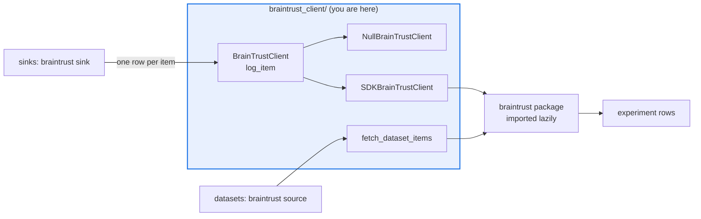

# AGENTS.md — src/eval_harness/braintrust_client

> The BrainTrust seam. Per-item writes, not per-score — the one place it diverges from its siblings.

Mirrors `phoenix_client` and `langfuse_client`: the vendor package is imported lazily so the
harness installs and the offline suite runs with zero external dependencies. What differs is
the shape of the write, because BrainTrust's native path logs a whole item at once.

## Map

| Path | Role |
|---|---|
| `__init__.py` | The whole seam |
| `BrainTrustClient` | The abstract surface, whose one write method is `log_item` |
| `NullBrainTrustClient` | Offline implementation that records calls in memory for assertions |
| `SDKBrainTrustClient` | Wraps a real experiment handle |
| `build_client`, `_init_experiment` | Constructor plus the narrow `init(project, experiment)` call |
| `fetch_dataset_items` | The read side used by the `braintrust` dataset source |
| `INSTALL_HINT` | The operator-facing extra name shown when export is requested without the SDK |

## Diagram



## Rules that bite here

- **The write is per item, so keep `log_item` the only write method.** BrainTrust's native path carries input, output, expected, every score and the metadata in one row; the sink folds an
  item's score results into one mapping before calling. A per-score method here would fan one row into many and misrepresent the experiment.
- **The vendor package is pre-1.0, so bind only to the narrowest documented surface.** `init(project=, experiment=)` and `experiment.log(...)` with named scores in zero to one. Reaching into
  a newer or internal module is how this seam starts breaking on upgrades.
- **The vendor import stays inside the function that needs it**, and export degrades to a no-op when the package is absent or the network is unreachable. An evaluation run must finish either
  way.
- **Credentials are read by the SDK from the environment.** `BRAINTRUST_API_KEY`, and optionally `BRAINTRUST_API_URL` for a self-hosted stack. Nothing is passed or stored here.
- **Test the SDK-absent path by injecting into `sys.modules`.** A patch decorator aimed at a missing module raises at patch time, and this checkout installs every extra.

## Verify

```bash
python -m pytest tests/test_braintrust_client.py tests/test_braintrust_sink.py tests/test_braintrust_dataset.py -q
```

## Subagents

| Task in this directory | Agent | Why |
|---|---|---|
| Find both consumers before changing the client surface | `explorer` | The sink writes and the dataset source reads; a read-only sweep covers both halves |
| Run the client, sink and dataset suites after a seam change | `test-runner` | Has `Bash`; the degraded no-op branch only appears in a real collection |
| Review a widening of the vendor surface | `narrow-critic` | Binding to an internal module is the regression that survives every linter |

## See also

| Doc | Read it when |
|---|---|
| [`../../../docs/braintrust-spike.md`](../../../docs/braintrust-spike.md) | You are extending the integration and need the adoption case and the surface it committed to |
| [`../sinks/AGENTS.md`](../sinks/AGENTS.md) | You are changing `log_item` and need the caller that assembles the row |
| [`../phoenix_client/AGENTS.md`](../phoenix_client/AGENTS.md) | You want the sibling seam this one mirrors, and where the per-score shape differs |
| [`../AGENTS.md`](../AGENTS.md) | You need the harness-wide contract rather than this directory's |
