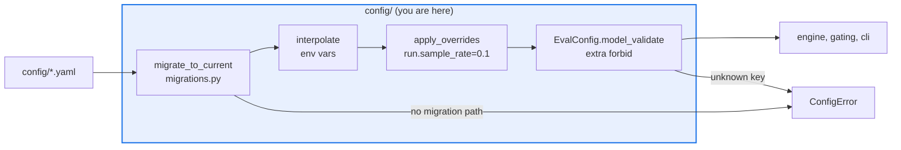

# AGENTS.md — src/eval_harness/config

> Turns a YAML file into a validated `EvalConfig`. Every behavioural default is declared here.

This package owns the whole load pipeline — migrate, interpolate, override, validate — and
the models that carry every threshold and parameter. Nothing in the engine holds a
behavioural literal; if a number drives behaviour, its default belongs on a field here.

## Map

| Path | Role |
|---|---|
| `__init__.py` | `load_config` / `load_config_dict`, `${VAR}` interpolation, dotted-path `apply_overrides` |
| `models.py` | `EvalConfig` and every nested model: `RunSettings`, `GateConfig`, `GateRule`, `JudgeBudgetConfig`, `JudgeCalibrationGateConfig`, `ComparisonConfig`, `PhoenixConfig` |
| `migrations.py` | `ConfigError`, the `@migration(from, to)` registry, and the `migrate_to_current` chain walker |

## Diagram



## Rules that bite here

- **Loading is strict: `model_config = ConfigDict(extra="forbid")`.** An unknown key raises
  `ConfigError` rather than being ignored. Do not add a permissive fallback to make an old
  config load — add a migration, which is the mechanism that already exists for that.
- **`SCHEMA_VERSION` is single-sourced in `../version.py` and is not touched on a feature
  branch.** A bump happens in a dedicated release commit and requires a registered
  `@migration` here; `migrate_to_current` walks the chain and raises on a cycle or a gap.
- **A config is untrusted input, not data.** Fields that become an import or a filesystem
  path must route through `core/_imports.py` or `core/_paths.py`. Do not add a new
  config-driven path or import that bypasses both gates.
- **No behavioural literal at a call site.** A default goes on the field, documented in its
  `description`, so an operator can override it without a code change (ADR 0009).

## Verify

```bash
python -m pytest tests/test_config.py tests/test_backwards_compat_config.py -q
```

## Subagents

| Task in this directory | Agent | Why |
|---|---|---|
| Find every reader of a config field before renaming it | `explorer` | Fields are read by name across engine, gating and sinks; read-only `Grep` is enough |
| Run the config and backwards-compatibility suites after a model change | `test-runner` | Has `Bash`; the failure names the rejected key, which the diff then explains |
| Review a new field for a hard-coded default or an ungated path | `narrow-critic` | Reads the finished diff for exactly the two smells this package exists to prevent |

## See also

| Doc | Read it when |
|---|---|
| [`../version.py`](../version.py) | You think a schema bump is needed; this is the only place `SCHEMA_VERSION` is defined |
| [`../../../config/README.md`](../../../config/README.md) | You are adding a field and want to see the shipped configs that will need it |
| [`../../../docs/decisions/0009-tech-debt-audit-and-compat-surface.md`](../../../docs/decisions/0009-tech-debt-audit-and-compat-surface.md) | You are about to hard-code a default or a credential and need the baseline that forbids it |
| [`../AGENTS.md`](../AGENTS.md) | You need the harness-wide contract rather than this directory's |
