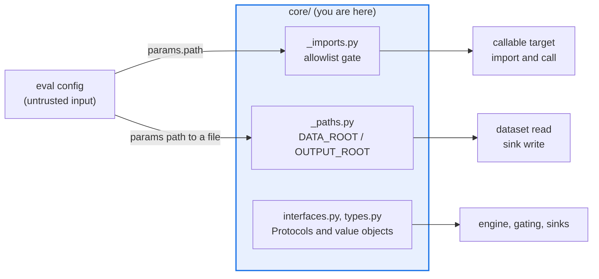

# AGENTS.md — src/eval_harness/core

> The dependency-free center: value types, the six Protocols, and the two trust-boundary gates.

The highest fan-in directory in the package — 33 other modules import it — and it imports
nothing outside the standard library. It owns the shapes everything else passes around, plus
the two gates between a config file and the interpreter or the disk.

## Map

| Path | Role |
|---|---|
| `types.py` | `EvalItem`, `TargetOutput`, `ScoreResult`, `ItemResult`, `RunResult`, `GateDecision`, `AgentTrajectory` |
| `interfaces.py`, `registry.py` | The six Protocols plus `StateResetError`/`StateSnapshotError`; the generic name-to-class `Registry`, with aliases so a renamed component keeps resolving |
| `_imports.py` | Allowlist gate for the config-driven dynamic import |
| `_paths.py` | `DATA_ROOT`/`OUTPUT_ROOT` containment for config-driven file paths |
| `_execution_strategies.py`, `_state_lifecycle.py` | Sequential and threaded per-item execution, and the state-adapter attempt lifecycle, both extracted from `engine.py` |
| `_trajectory.py`, `_serialize.py`, `_reliability_diagnostics.py` | Pure canonicalization, stable text rendering, run-level caveats |

## Diagram



## Rules that bite here

- **`core` declares no dependencies in `architecture.yaml`.** Importing `EvalConfig` or
  `EvalEngine` here — even under `TYPE_CHECKING` — adds an undeclared component edge and
  fails the drift gate. Take leaf parameters and injected callables instead.
- **The six Protocols must stay `typing.Protocol`.** `check_charter_invariants.py` asserts it
  for `DatasetSource`, `TargetRunner`, `ResultSink`, `Judge`, `Scorer` and `StateAdapter`; a
  return to `abc.ABC` is a hard finding, and a `@property` is invisible to `runtime_checkable`.
- **Both gates decide on resolved values, never a string prefix.** `_imports.py` matches
  dotted-component boundaries; `_paths.py` uses `is_relative_to` on resolved paths. A prefix
  test lets an entry of `tests` admit `tests_evil`, and `/srv/data` admit `/srv/data-secrets`.
- **`types.py` grows additively.** `RunResult.to_dict()` omits `gate` and `reliability` when
  unset, so an ungated single-attempt run still serializes byte-identically (ADR 0031).

## Verify

```bash
python scripts/check_charter_invariants.py
```

## Subagents

| Task in this directory | Agent | Why |
|---|---|---|
| Find every reader of a type before reshaping it | `explorer` | 33 modules import `core`; a `Grep` sweep is the cheap way to size the blast radius |
| Run the invariant and drift gates after a Protocol edit | `test-runner` | Has `Bash`; the findings name classes, not files |
| Review a change to `_imports.py` or `_paths.py` | `narrow-critic` | This is the trust boundary, and a prefix regression reads as a one-word change |

## See also

| Doc | Read it when |
|---|---|
| [`../../../docs/CHARTER.md`](../../../docs/CHARTER.md) | You are changing an interface and need §4 invariant 3, the rule the Protocol check enforces |
| [`../../../docs/decisions/0039-callable-target-allowlist.md`](../../../docs/decisions/0039-callable-target-allowlist.md) | You are touching `_imports.py` and need the threat model behind deny-by-default |
| [`../../../architecture.yaml`](../../../architecture.yaml) | You want to add an import to `core` and need to see that it declares no edges at all |
| [`../AGENTS.md`](../AGENTS.md) | You need the harness-wide contract rather than this directory's |
