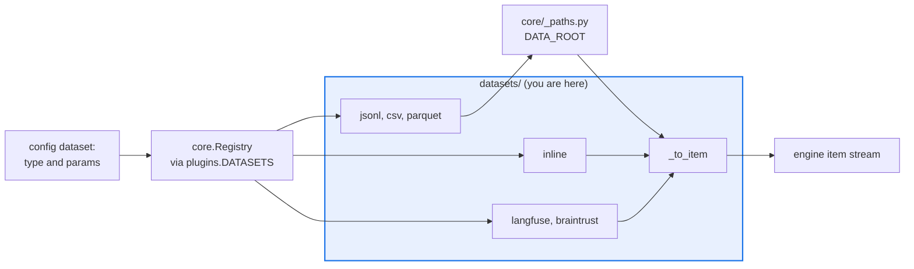

# AGENTS.md — src/eval_harness/datasets

> The only read path into a run. Every file read here is confined by `DATA_ROOT`.

A dataset source yields `EvalItem`s and nothing else. Six sources ship: two in-process, two
file-backed, two remote. The file-backed ones take a path straight from an untrusted config,
which is why the confinement helper is the first thing every one of them calls.

## Map

| Path | Role |
|---|---|
| `__init__.py` | The whole package: six registered sources plus `_to_item` and `_validate_dataset_path` |
| `InlineDataset` | `inline` — items written directly in the config, for wiring tests |
| `JsonlDataset`, `CsvDataset`, `ParquetDataset` | `jsonl` / `csv` / `parquet` — file-backed, confined |
| `LangfuseDataset`, `BrainTrustDataset` | `langfuse` / `braintrust` — remote pulls through the SDK-optional client seams |

## Diagram



## Rules that bite here

- **Every config-supplied read path goes through `_validate_dataset_path`.** Containment is decided by `is_relative_to` on the resolved path, never by comparing text: with a root of
  `/srv/data`, a plain text comparison also admits `/srv/data-secrets`. With `DATA_ROOT` unset the read stays unconfined and logs one warning.
- **A missing id and a present-but-null id both fall back to the positional index.** `dict.get("id", fallback)` does not fire on a key whose value is `None`, which is exactly what remote
  sources emit — without the explicit check every such item collides on `"None"`.
- **An optional backend fails fast with an install hint.** `parquet` and `braintrust` live behind extras; a missing SDK must raise a message naming the extra, never quietly yield an empty
  item stream that reads downstream as a dataset with nothing in it.
- **Nothing imports this package by name.** Its only inbound edge is `plugins.py` importing it so the decorators run; selection is by registered string. A new source's name must appear in
  the README tables or `python scripts/extract_registries.py --check` reports drift.

## Verify

```bash
python -m pytest tests/test_csv_parquet_datasets.py tests/test_path_confinement.py tests/test_components.py -q
```

## Subagents

| Task in this directory | Agent | Why |
|---|---|---|
| Check whether a new source reaches the filesystem unguarded | `explorer` | Read-only `Grep` for the confinement helper answers it without a run |
| Run the dataset and path-confinement suites after a read-path change | `test-runner` | Has `Bash`; confinement is only provable by resolving real paths |
| Review a new remote source for credentials and failure modes | `narrow-critic` | Reads the finished diff for a swallowed import error that looks like an empty dataset |

## See also

| Doc | Read it when |
|---|---|
| [`../core/_paths.py`](../core/_paths.py) | You are adding a reader and need the containment rule and the two-root split |
| [`../../../README.md`](../../../README.md) | You added a source and need the registry table that `extract_registries.py` checks against |
| [`../../../docs/braintrust-spike.md`](../../../docs/braintrust-spike.md) | You are adding a remote source and want the SDK-optional pattern to copy |
| [`../AGENTS.md`](../AGENTS.md) | You need the harness-wide contract rather than this directory's |
