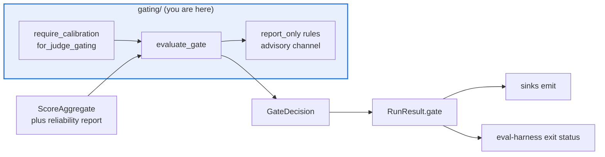

# AGENTS.md — src/eval_harness/gating

> Turns aggregate scores into a pass or fail verdict. Protected path: needs `eval-change-approved`.

Every threshold comes from `GateConfig`; there are no cutoffs in this code. The verdict is
computed inside the engine's run, before any sink emits, so the exported artifacts and the
CI exit status can never disagree about whether a run passed.

## Map

| Path | Role |
|---|---|
| `__init__.py` | The whole package |
| `evaluate_gate` | Applies every rule and returns a `GateResult`; a rule marked `report_only` is filed as advisory |
| `default_gate_evaluator` | The engine's entry point, producing the `GateDecision` attached to `RunResult.gate` |
| `require_calibration_for_judge_gating` | Refuses a config where a judge-backed scorer can block without a resolved calibration report |
| `_reliability_rate`, `_item_error_failures` | `pass_at_k` / `pass_power_k` lookups and the degraded-sample refusal |

## Diagram



## Rules that bite here

- **Protected path.** `src/eval_harness/gating/**` is in `scripts/eval_protected_paths.py`, so a pull request touching this directory needs the `eval-change-approved` label. Lowering a gate
  is the cheapest way to make a failing evaluation pass, which is the point of the label.
- **No baked-in cutoff, ever.** A threshold belongs on `GateConfig` or `GateRule`. A literal here would be invisible to the operator whose run it silently decides.
- **Order is load-bearing: gate before sinks.** The verdict is attached to `RunResult.gate` first so every exported artifact carries it (F-062). `gating` depends on `config`, `core` and
  `reliability` and never on `engine` — keep that acyclic.
- **Only a blocking rule counts as gating.** `report_only` rules are evaluated on the identical path and filed as advisory, which is how an uncalibrated threshold soaks inside a live gate.
  Demanding a calibration artifact before a judge may merely be *measured* would make calibration unreachable, since the labelled corpus comes from those advisory runs.
- **A judge-backed rule that can block needs a resolved report.** An opaque `calibration_artifact_id` alone is refused; resolve a real `JudgeCalibrationReport` first.
- **A degraded denominator is refused, not averaged.** When items errored, `allow_item_errors` decides whether a gate may be evaluated over the smaller sample at all.

## Verify

```bash
python -m pytest tests/test_gate_decision_provenance.py tests/test_judge_gate_authorization.py -q
```

## Subagents

| Task in this directory | Agent | Why |
|---|---|---|
| Find every caller of the gate before changing its signature | `explorer` | Engine and command line both call in; a read-only sweep is enough |
| Run the gate-provenance and authorization suites | `test-runner` | Has `Bash`; the ordering guarantee is only observable in a real run's output |
| Review a threshold or rule-semantics change before requesting the label | `narrow-critic` | A gate quietly made easier to pass is the exact class of change a reviewer must catch |

## See also

| Doc | Read it when |
|---|---|
| [`../../../docs/decisions/0042-gate-decision-provenance.md`](../../../docs/decisions/0042-gate-decision-provenance.md) | You are changing what the verdict records or when it is attached |
| [`../../../docs/decisions/0005-calibrated-merge-gate.md`](../../../docs/decisions/0005-calibrated-merge-gate.md) | You are touching the calibration requirement for judge-backed rules |
| [`../../../docs/decisions/0038-item-error-policy.md`](../../../docs/decisions/0038-item-error-policy.md) | You are deciding how a run with failed items should be gated |
| [`../AGENTS.md`](../AGENTS.md) | You need the harness-wide contract rather than this directory's |
