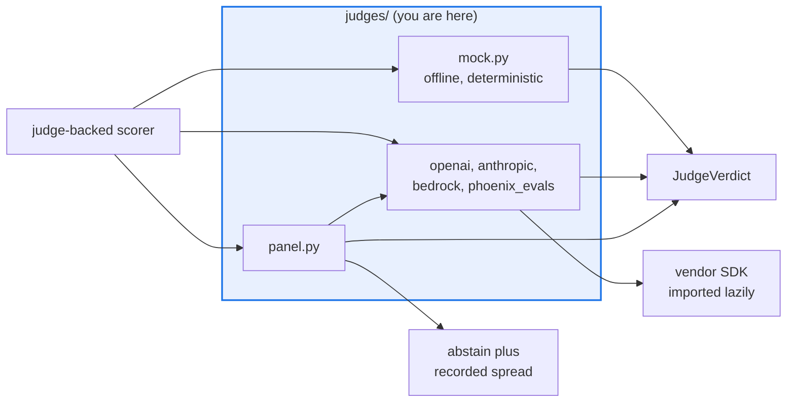

# AGENTS.md — src/eval_harness/judges

> One module per judge, all behind one `Judge` Protocol. Protected path: needs `eval-change-approved`.

A judge takes a prompt and returns a `JudgeVerdict`. Four reach a real provider, `panel` aggregates
members honestly, and `mock` is the deterministic offline default wherever the suite runs without credentials.

## Map

| Path | Role |
|---|---|
| `mock.py` | `mock` (alias `deterministic`) — config-driven substring rules, no network |
| `openai.py` | `openai` — OpenAI-compatible endpoints, including Nemotron and LM Studio; owns the retry constants |
| `anthropic.py` | `anthropic` (alias `claude`) — the Messages API |
| `bedrock.py`, `phoenix_evals.py` | `bedrock` (Amazon Bedrock) and `phoenix_evals` (the Phoenix `ClassificationEvaluator`) |
| `panel.py` | `panel` — N members, one verdict, with disagreement surfaced |
| `__init__.py` | Re-exports the public names; imports `panel` for its registration side effect |

## Diagram



## Rules that bite here

- **Protected path.** `src/eval_harness/judges/**` is in `scripts/eval_protected_paths.py`, so a pull request touching this directory needs the `eval-change-approved` label. Swapping a real
  judge for the deterministic mock is a known way to make a failing evaluation pass.
- **Never quote a metric from `mock` as if it were a measurement.** It returns whatever its config says. A number produced by a deterministic fake belongs in a wiring test, not in a report,
  a changelog entry or a gate discussion.
- **Every vendor import stays lazy and inside the method that needs it.** The package must install and the offline suite must run with zero external dependencies. Exercise the SDK-absent
  path by injecting into `sys.modules`, not with a patch decorator — the decorator itself raises at patch time when the module is genuinely missing.
- **A panel surfaces disagreement instead of averaging it away.** Wide spread between members is evidence about the judging machinery; the honest response is to abstain and record it. A
  member that failed is excluded, never counted as a zero vote.
- **One module per judge.** The package sits under the 500-line file ceiling only because implementations are siblings re-exported from `__init__.py`; add a new judge the same way.

## Verify

```bash
python -m pytest tests/test_panel_judge.py tests/test_openai_judge.py tests/test_anthropic_judge.py tests/test_phoenix_eval_judge.py -q
```

## Subagents

| Task in this directory | Agent | Why |
|---|---|---|
| Find every caller of a judge before changing the verdict shape | `explorer` | Scorers, the panel and the budget wrapper all call in; read-only `Grep` covers it |
| Run the judge suites with the SDKs absent and present | `test-runner` | Has `Bash`; the absent-SDK path only shows up in a real collection |
| Review a new provider judge before requesting the label | `narrow-critic` | A leaked credential or an eager vendor import is what a reviewer catches here |

## See also

| Doc | Read it when |
|---|---|
| [`../../../docs/decisions/0035-panel-judge.md`](../../../docs/decisions/0035-panel-judge.md) | You are changing how member verdicts combine or when the panel abstains |
| [`../../../docs/decisions/0016-time-windowed-judge-rate-limit.md`](../../../docs/decisions/0016-time-windowed-judge-rate-limit.md) | You are touching retry or backoff behaviour on a provider judge |
| [`../agent_core_adapter/AGENTS.md`](../agent_core_adapter/AGENTS.md) | You need the cost cap and the calibration report that decide whether a judge may gate |
| [`../AGENTS.md`](../AGENTS.md) | You need the harness-wide contract rather than this directory's |
