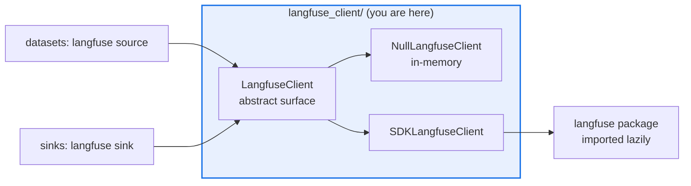

# AGENTS.md — src/eval_harness/langfuse_client

> The Langfuse seam. The engine and the sinks see an abstract client; the SDK is imported lazily.

Langfuse access is narrowed to one small abstract class so the package installs and the
offline suite runs with zero external dependencies. The null implementation records calls in
memory, which is what makes the tracing path assertable without a network.

## Map

| Path | Role |
|---|---|
| `__init__.py` | The whole seam |
| `LangfuseClient` | The abstract surface: `get_dataset_items`, `log_score`, `link_dataset_item`, `flush`, `get_prompt` |
| `NullLangfuseClient` | Offline implementation that records calls in memory for assertions |
| `SDKLangfuseClient` | The real client; raises a clear error when the SDK is absent |
| `observe` | Overloaded decorator that preserves the wrapped callable's signature |
| `SafeLangfuseContext` | Context manager that degrades to a no-op without the SDK |

## Diagram



## Rules that bite here

- **The vendor import stays inside the method that needs it.** A module-level `import langfuse` would make the whole package unimportable without the extra installed, and the offline suite's
  zero-dependency property is the thing this seam exists to preserve.
- **Test the SDK-absent path by injecting into `sys.modules`.** A patch decorator aimed at a missing module raises at patch time, so it cannot express "the SDK is not installed" — and in
  this checkout every extra *is* installed, so the injection is the only way to reach it.
- **`observe` must not erase the signature it decorates.** The bare form returns the same callable type, deliberately, so a decorated function stays typed; widening it to a generic callable
  silently untypes every function it touches.
- **Credentials come from `LANGFUSE_*` environment variables only.** Nothing here stores a key, and nothing in a config file should carry one.
- **Per-item trace linking is unavailable with more than one worker.** That is a documented limitation of the parallel path, not a bug to route around with a thread-local.
- **Keep the surface narrow.** Every method added here becomes a method the null implementation and every test fake must also carry.

## Verify

```bash
python -m pytest tests/test_langfuse_integration.py tests/test_langfuse_prompts.py tests/test_langfuse_smoke.py -q
```

## Subagents

| Task in this directory | Agent | Why |
|---|---|---|
| Find every consumer before adding or renaming a client method | `explorer` | Only datasets and sinks call in; a read-only sweep confirms the surface is still narrow |
| Run the Langfuse suites and prove the SDK-absent path still passes | `test-runner` | Has `Bash`; the absent-module case only appears in a real collection |
| Review a seam widening before it ships | `narrow-critic` | An eager vendor import or a stored credential is what a reviewer catches here |

## See also

| Doc | Read it when |
|---|---|
| [`../../../docs/decisions/0003-langfuse-integration.md`](../../../docs/decisions/0003-langfuse-integration.md) | You are changing what the seam exposes or how tracing is wired |
| [`../../../docs/decisions/0010-langfuse-prompt-management.md`](../../../docs/decisions/0010-langfuse-prompt-management.md) | You are touching `get_prompt` or managed prompt resolution |
| [`../phoenix_client/AGENTS.md`](../phoenix_client/AGENTS.md) | You are adding a new observability integration and want the mirrored seam to copy |
| [`../AGENTS.md`](../AGENTS.md) | You need the harness-wide contract rather than this directory's |
