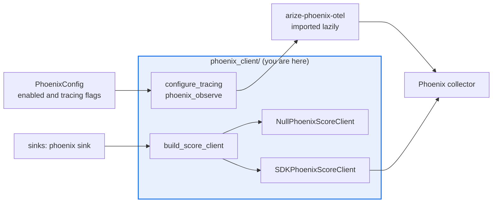

# AGENTS.md — src/eval_harness/phoenix_client

> The Phoenix seam. Two concerns, two lifecycles, one rule: the SDK import stays lazy.

Mirrors `langfuse_client` deliberately — it is the worked example of the reversible-adoption
pattern. Tracing and score export live here side by side but stay separate, because they map
to two different Phoenix distributions with two different failure modes.

## Map

| Path | Role |
|---|---|
| `__init__.py` | The whole seam |
| `configure_tracing`, `phoenix_observe`, `_otel_tracer` | Process-global OpenTelemetry and OpenInference instrumentation |
| `PhoenixScoreClient` | The abstract per-run score-export surface the `phoenix` sink writes through |
| `NullPhoenixScoreClient`, `SDKPhoenixScoreClient` | Offline no-op and the real exporter |
| `build_score_client` | The single constructor; picks null or real from the enabled flag |
| `INSTALL_HINT`, `ENV_COLLECTOR_ENDPOINT` | The operator-facing extra name and the collector variable |

## Diagram



## Rules that bite here

- **The vendor import stays inside the function that needs it.** A module-level import makes the package unimportable without the extra, which is exactly the coupling this seam removes.
- **Every entry point fails safe and never raises.** A missing package or an unreachable collector degrades to `None` or to a no-op client and the evaluation run continues. Telemetry is not
  allowed to decide whether an evaluation completes.
- **Keep tracing and score export apart.** They come from different distributions, are enabled by different config flags, and fail independently; folding them into one object makes a tracing
  outage look like a score-export outage.
- **The endpoint and the key are read from the environment, never stored in config.** `PHOENIX_COLLECTOR_ENDPOINT` and `PHOENIX_API_KEY` are the only sources.
- **Test the SDK-absent path by injecting into `sys.modules`.** A patch decorator aimed at a missing module raises at patch time, and this checkout installs every extra, so injection is the
  only way to exercise the degraded branch.
- **Name the extra when you refuse.** `INSTALL_HINT` exists so an operator sees the exact install command rather than a bare import error.

## Verify

```bash
python -m pytest tests/test_phoenix_tracing.py tests/test_phoenix_sink.py tests/test_phoenix_config.py tests/test_phoenix_smoke.py -q
```

## Subagents

| Task in this directory | Agent | Why |
|---|---|---|
| Find every consumer before adding a method to the score client | `explorer` | Only the sink and the command line call in; a read-only sweep keeps the surface narrow |
| Run the Phoenix suites with the extras present and absent | `test-runner` | Has `Bash`; the degraded branch only appears in a real collection |
| Review a seam change for an eager import or a raised telemetry error | `narrow-critic` | Both are one-line regressions that break a property the whole suite depends on |

## See also

| Doc | Read it when |
|---|---|
| [`../../../docs/phoenix-spike.md`](../../../docs/phoenix-spike.md) | You are adding any SDK-optional integration; this is the reference reversible-adoption pattern |
| [`../config/models.py`](../config/models.py) | You are adding a Phoenix setting and need the model that carries it |
| [`../langfuse_client/AGENTS.md`](../langfuse_client/AGENTS.md) | You want the seam this one deliberately mirrors, including the decorator typing rule |
| [`../AGENTS.md`](../AGENTS.md) | You need the harness-wide contract rather than this directory's |
