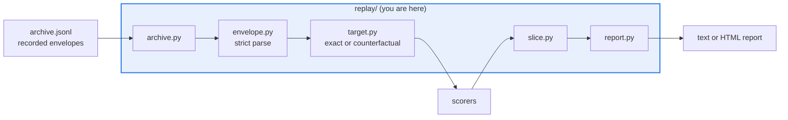

# AGENTS.md — src/eval_harness/replay

> Offline replay of recorded trajectory envelopes. Counterfactual is a target, never a scorer.

Re-scores recorded `AgentTrajectory` envelopes from a JSONL archive, in `exact` mode or with
a counterfactual observation swap. The journey is
`eval-harness replay --archive demo/replay/baseline.jsonl --mode exact --offline`.

## Map

| Path | Role |
|---|---|
| `envelope.py` | `ReplayEnvelope` / `ReplayConfig` — the versioned wrapper, with strict parsing |
| `archive.py` | `ReplayArchive` — append-only JSONL, confined by `DATA_ROOT` / `OUTPUT_ROOT` |
| `target.py` | The registered `replay` target: exact re-score or observation swap |
| `slice.py` | `SliceRow` and per-tag pass-rates, so a global aggregate cannot hide a regression |
| `report.py` | First failing step plus the text and HTML renderers |
| `cli.py` | Argument parsing for `eval-harness replay`, dispatched from `cli.py` |
| `__init__.py` | Imports `target` for the registration side effect and nothing else |

## Diagram



## Rules that bite here

- **The counterfactual swap is a `TargetRunner`, not a scorer.** Scorers stay pure functions of an item and an output; a scorer that rewrote observations would make the thing it grades.
- **Three schema versions are independent.** The envelope version is not the config `SCHEMA_VERSION` and not `TRAJECTORY_SCHEMA_VERSION`. Bumping one does not bump the others.
- **Envelope parsing is strict: an unknown key raises.** A silently ignored field is a replay that quietly stopped honouring part of the recording.
- **The archive is confined like any other file path**, through `DATA_ROOT` for reads and `OUTPUT_ROOT` for writes. A duplicate `item_id` is last-write-wins by design.
- **Slice before you conclude.** A global pass-rate can stay flat while one tag collapses, which is the whole reason `slice.py` exists; report both.
- **Archive content is untrusted text.** The renderer strips terminal escape sequences so a recorded field cannot forge extra command-line output. Keep that filter on any new renderer.
- **The engine never rebuilds a trajectory from a vendor span.** Langfuse and Phoenix stay sinks; replay reads the archive.

## Verify

```bash
python -m pytest tests/test_replay.py tests/test_matrix_replay.py -q
```

## Subagents

| Task in this directory | Agent | Why |
|---|---|---|
| Trace which envelope fields a mode actually reads | `explorer` | Envelope, target and report each touch a subset; a read-only sweep maps them |
| Run the replay suites and the command-line journey | `test-runner` | Has `Bash`; the archive path and the exit status need a real invocation |
| Review a new mode or renderer before it ships | `narrow-critic` | An unescaped recorded field reaching a terminal is the failure to catch here |

## See also

| Doc | Read it when |
|---|---|
| [`../../../docs/decisions/0049-fixture-replay-target.md`](../../../docs/decisions/0049-fixture-replay-target.md) | You are adding a mode or changing the envelope shape |
| [`../../../docs/decisions/0046-rca-eval-matrix.md`](../../../docs/decisions/0046-rca-eval-matrix.md) | You are tempted to put counterfactual logic in a scorer; this records why it is a target |
| [`../../../demo/README.md`](../../../demo/README.md) | You need a working archive and the exact command to replay it |
| [`../AGENTS.md`](../AGENTS.md) | You need the harness-wide contract rather than this directory's |
