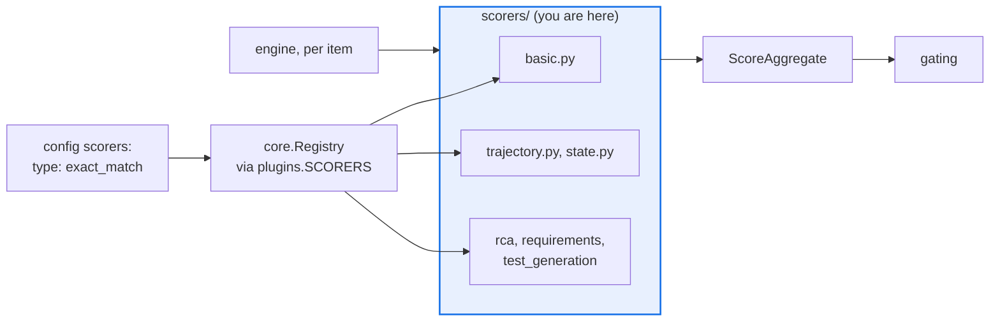

# AGENTS.md — src/eval_harness/scorers

> Pure per-item verdicts. Protected path: a change here needs the `eval-change-approved` label.

A scorer maps `(item, output, ctx)` to one `ScoreResult` and nothing else: no I/O, clock or RNG. That purity is what lets `repetitions > 1` measure the *target's* variance.

## Map

| Path | Role |
|---|---|
| `basic.py` | `exact_match`, `regex_match`, `contains`, `json_keys`, `weighted`, `llm_judge`, `autoevals` |
| `trajectory.py` | The seven agent-trajectory scorers (exact, in-order, any-order, precision/recall, step efficiency, loop detection, recovery) |
| `state.py` | `state_transition`, `policy_violation` — readers of the engine's per-attempt `StateEvaluation` |
| `rca/`, `requirements/`, `test_generation/` | Capability matrices, each with its own `AGENTS.md` |
| `__init__.py` | Re-exports public names; imports the siblings for their registration side effect |

## Diagram



## Rules that bite here

- **Protected path.** `src/eval_harness/scorers/**` is in `scripts/eval_protected_paths.py`,
  so a change needs the `eval-change-approved` label: loosening a scorer is the cheapest way
  to make a failing evaluation pass.
- **Nothing imports this package by name.** Its only inbound edge is `plugins.py` importing
  it so the decorators run; every real use goes through a registered string.
- **A registered name must appear in the README tables**, or
  `python scripts/extract_registries.py --check` reports drift against the decorators.
- **Absent evidence is `passed=None`, never `0.0`.** The mean still sees the value, but
  `pass_rate` excludes it, so an infrastructure gap stays distinct from a real failure.
- **Declare `uses_judge()` on anything judge-backed.** The engine orders those scorers last
  and skips them once a programmatic one has failed the item; `gating` reads the same signal.

## Verify

```bash
python -m pytest tests/test_scorers.py tests/test_trajectory_scorers.py tests/test_composite_scorer.py -q
```

## Subagents

| Task in this directory | Agent | Why |
|---|---|---|
| Locate the registered name a config uses and the class behind it | `explorer` | Registration is by decorator string; `Grep` for `SCORERS.register` resolves it in one pass |
| Run the scorer suites plus the registry drift check | `test-runner` | Has `Bash`; drift output names registry entries, not files |
| Review a scorer change before requesting the approval label | `narrow-critic` | A loosened threshold or a swallowed exception is exactly what a reviewer must catch here |

## See also

| Doc | Read it when |
|---|---|
| [`../../../scripts/eval_protected_paths.py`](../../../scripts/eval_protected_paths.py) | You want the authoritative protected-path list before opening a pull request |
| [`../../../docs/agent-trajectory-evaluation.md`](../../../docs/agent-trajectory-evaluation.md) | You are changing `trajectory.py` and need the canonicalization contract it depends on |
| [`../../../docs/decisions/0032-matrix-completeness-policy.md`](../../../docs/decisions/0032-matrix-completeness-policy.md) | You added a scorer and need the matrix rows it now owes |
| [`../AGENTS.md`](../AGENTS.md) | You need the harness-wide contract rather than this directory's |
