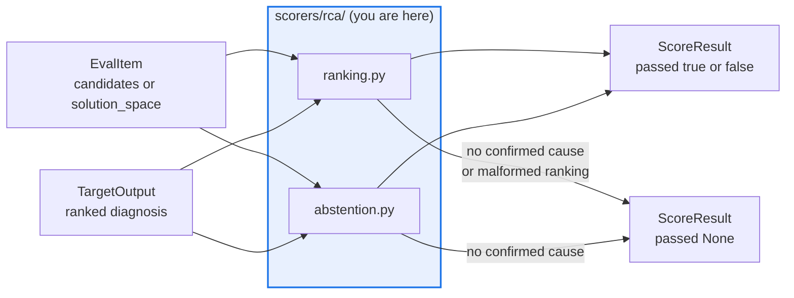

# AGENTS.md — src/eval_harness/scorers/rca

> Five root-cause scorers over a finite candidate set. Abstention is a first-class outcome.

These grade a ranked diagnosis against the item's declared candidate causes: pure, offline, no
judge. The `rca_maxz` baseline is graded on this identical path, which is what makes it an
honest floor rather than a number quoted from a leaderboard.

## Map

| Path | Role |
|---|---|
| `__init__.py` | Shared readers (`read_candidates`, `not_applicable`), the `DEFAULT_KS` cut-offs, and the comment constants a results file is searched by |
| `ranking.py` | `rca_ac_at_k`, `rca_component_match` — accuracy of the ranked diagnosis |
| `abstention.py` | `rca_onset_within_tolerance`, `rca_abstention_correctness`, `rca_false_accusation_rate` |

## Diagram



## Rules that bite here

- **Protected path.** `src/eval_harness/scorers/**` is in `scripts/eval_protected_paths.py`,
  so a pull request touching this directory needs the `eval-change-approved` label.
- **An unanswerable item is `passed=None`, not a zero.** An item with an empty `correct` set
  has no ranked accuracy to report; collapsing that to `0.0` makes a corpus gap look like a
  wrong diagnosis. The same holds for a malformed ranking.
- **Never invent a candidate set.** `read_candidates` takes `candidates` or `solution_space`
  from `inputs` then `metadata`, and never builds one out of `correct` — the answer it grades.
- **The shape is copied, the package is not.** The fixture reuses the flow corpus's
  `solution_space`/`correct` shape, but `flow_protocol` is the only shared surface across
  that airgap; do not import `flow_corpus` to avoid a duplicate.
- **Cut-offs are configured on the scorer.** `DEFAULT_KS` is its default; a gate rule names
  the emitted score, it does not redefine `k`.

## Verify

```bash
python -m pytest tests/test_rca_ranking_scorers.py tests/test_rca_abstention_scorers.py tests/test_matrix_rca_scorers.py -q
```

## Subagents

| Task in this directory | Agent | Why |
|---|---|---|
| Find which corpus fields a scorer reads before changing a fixture | `explorer` | The readers are a handful of functions; read-only `Grep` resolves them without a run |
| Run the RCA suites plus the matrix rows the scorers owe | `test-runner` | Has `Bash`; the matrix failure names the missing dimension |
| Review a threshold or tolerance change before requesting the label | `narrow-critic` | Reads the finished diff for the loosening a linter cannot see |

## See also

| Doc | Read it when |
|---|---|
| [`../../../../docs/decisions/0046-rca-eval-matrix.md`](../../../../docs/decisions/0046-rca-eval-matrix.md) | You are adding or reshaping a measure and need why ranking and abstention are split |
| [`../../../../config/rca_eval.yaml`](../../../../config/rca_eval.yaml) | You want to see the live wiring: which scorers run, against which corpus, with which advisory gates |
| [`../../targets/rca_baseline.py`](../../targets/rca_baseline.py) | You need the deterministic baseline these scorers grade, to sanity-check a new measure |
| [`../AGENTS.md`](../AGENTS.md) | You need the package-wide scorer contract rather than this matrix's |
